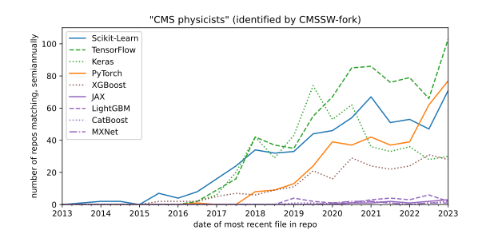
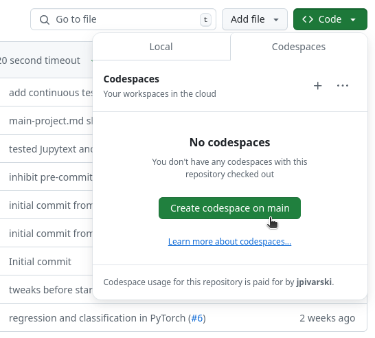

# Deep learning for particle physicists

This book is an introduction to modern neural networks (deep learning), intended for particle physicists. Most particle physicists need to use machine learning for data analysis or detector studies, and the unique combination of mathematical and statistical knowledge that physicists have puts them in a position to understand the topic deeply. However, most introductions to deep learning can't assume that their readers have this background, and advanced courses assume specialized knowledge that physics audiences may not have.

This book is "introductory" because it emphasizes the foundations of what neural networks are, how they work, _why_ they work, and it provides practical steps to train neural networks of any topology. It does not get into the (changing) world of network topologies or designing new kinds of machine learning algorithms to fit new problems.

The material in this book was first presented at [CoDaS-HEP](https://codas-hep.org/) in 2024: [jpivarski-talks/2024-07-24-codas-hep-ml](https://github.com/jpivarski-talks/2024-07-24-codas-hep-ml). I am writing it in book format, rather than simply depositing my slide PDFs and Jupyter notebooks in [https://hsf-training.org/](https://hsf-training.org/), because the original format assumes that I'll verbally fill in the gaps. This format is good for two purposes:

* offline self-study by a student without a teacher, and
* for teachers preparing new course slides and notebooks (without having to read my mind).

The course materials include some inline problems, intended for active learning during a lecture, and a large project designed for students to work on for about 2 hours. (In practice, experienced students finished it in an hour and beginners could have used a little more time.)

## Software for the course

This course uses [Scikit-Learn](https://scikit-learn.org/) and [PyTorch](https://pytorch.org/) for examples and problem sets. [TensorFlow](https://www.tensorflow.org/) is also a popular machine learning library, but its functionality is mostly the same as PyTorch, and I didn't want to hide the concepts behind incidental differences in software interfaces. (I _did_ include Scikit-Learn because its interface is much simpler than PyTorch. When I want to emphasize issues that surround fitting in general, I'll use Scikit-Learn because the fit itself is just two lines of code, and when I want to emphasize the details of the machine learning model, I'll use PyTorch, which expands the fit into tens of lines of code and allows for more control.)

I didn't take the choice of PyTorch over TensorFlow lightly. I verified that PyTorch is about as popular as TensorFlow among CMS physicists using the plot below (derived using the methodology in [this GitHub repo](https://github.com/jpivarski-talks/2023-05-09-chep23-analysis-of-physicists) and [this talk](https://indico.jlab.org/event/459/contributions/11547/)). Other choices, such as [JAX](https://jax.readthedocs.io/), would be a mistake because a reader of this tutorial would not be prepared to collaborate with machine learning as it is currently practiced in particle physics.

{. width="100%"}

Moreover, PyTorch seems to be more future-proof than TensorFlow. By examining the use of both outside of particle physics, we see that <a href="https://trends.google.com/trends/explore?q=%2Fm%2F0h97pvq,%2Fg%2F11bwp1s2k3,%2Fg%2F11gd3905v1&date=2014-08-14%202024-08-14">Google search volume</a> is increasing for PyTorch at the expense of TensorFlow ("JAX" is a common word with meanings beyond machine learning, making it impossible to compare), and PyTorch is much more frequently used by [machine learning competition winners](https://mlcontests.com/state-of-competitive-machine-learning-2023/#deep-learning) in the past few years.

## To run everything in GitHub Codespaces

Launch a Codespace from the [hsf-training/deep-learning-intro-for-hep](https://github.com/hsf-training/deep-learning-intro-for-hep) repository:

{. width="60%"}

The first time, it will take a few minutes to install all the software. When you get a terminal prompt, convert all of these pages into notebooks by running the following command in the terminal:

```shell
python -m venv venv
source venv/bin/activate
source make-notebooks.sh
```

and navigate to the `notebooks` directory in the left side-bar. Once you evaluate a cell in the notebook, Codespaces will ask you if you want to install the Python extension (yes, you do) and will ask which kernel to use: you want the recommended option, `venv/bin/python`.

The pages are formatted better for reading on the web, but being able to run the code cells is also useful!

## To run everything on your own computer

Make sure that you have the following packages installed with [conda](https://scikit-hep.org/user/installing-conda) (or pip, uv, pixi, etc.):

```{include} ../environment.yml
:literal: true
:start-after: "  # packages we'll use\n"
```

If you're using pip, see [PyTorch's documentation](https://pytorch.org/get-started/locally/) for instructions. The name `pytorch-cpu` is only for conda.

The packages labeled "used in very few sections (optional)" are only used in the sections _after_ the main project, which is a tour of neural networks beyond supervised regression and classification. You only need to install these if you're working on those sections. The `torch_geometric` package is pip-only. You can get it in conda with the `pyg` package, but only in the `pyg` channel.

The exercises are all small enough that you won't need a GPU, but if you want to use PyTorch with your GPU, you'll have to install the GPU drivers (only) outside of conda and then `conda install 'cuda-version>=12' pytorch pytorch-cuda`. If you're using pip, note that you have to install CUDA outside of pip.

To get all of these pages in Jupyter notebook form, download the repository:

```shell
git clone https://github.com/hsf-training/deep-learning-intro-for-hep.git
cd deep-learning-intro-for-hep
```

Install the `jupytext` package (conda, pip, uv, pixi, etc.) and run the following command:

```shell
source make-notebooks.sh
```

The notebooks are in the new `notebooks` directory.

## Table of contents

```{tableofcontents}
```
