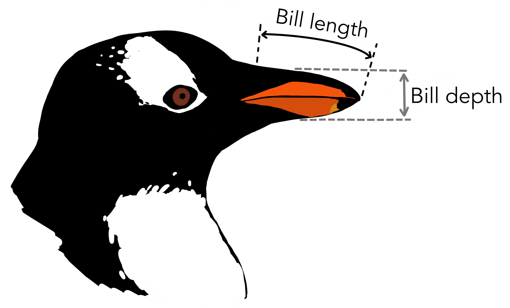

---
jupytext:
  cell_metadata_filter: -all
  formats: md:myst
  text_representation:
    extension: .md
    format_name: myst
    format_version: 0.13
    jupytext_version: 1.16.4
kernelspec:
  display_name: Python 3 (ipykernel)
  language: python
  name: python3
---

# Regression in PyTorch

+++

This and the [next section](09-classification.md) introduce PyTorch so that we can use it for the remainder of the course. Whereas Scikit-Learn gives you a function for just about [every type of machine learning model](https://scikit-learn.org/stable/machine_learning_map.html), PyTorch gives you the pieces and expects you to build it yourself. (The [JAX](https://jax.readthedocs.io/) library is even more extreme in providing only the fundamental pieces. PyTorch's level of abstraction is between JAX and Scikit-Learn.)

I'll use the two types of problems we've seen so far—regression and classification—to show Scikit-Learn and PyTorch side-by-side. First, though, let's get a dataset that will provide us with realistic regression and classification problems.

```{code-cell} ipython3
import numpy as np
import pandas as pd
import matplotlib.pyplot as plt
```

## Penguins!

+++

This is my new favorite dataset: basic measurements on 3 species of penguins. You can get the data as a CSV file from the [original source](https://www.kaggle.com/code/parulpandey/penguin-dataset-the-new-iris) or from GitHub: [deep-learning-intro-for-hep/data/penguins.csv](https://github.com/hsf-training/deep-learning-intro-for-hep/blob/main/deep-learning-intro-for-hep/data/penguins.csv). If you're using Codespaces or cloned the repository, it's already in the `data` directory.

{. width="50%"}

Replace `data/penguins.csv` with the file path where you saved the file after downloading it.

```{code-cell} ipython3
penguins_df = pd.read_csv("data/penguins.csv")
penguins_df
```

This dataset has numerical features, such as `bill_length_mm`, `bill_depth_mm`, `flipper_length_mm`, `body_mass_g` and `year` of data-taking, and it has categorical features like `species`, `island`, and `sex`. Some of the measurements are missing (`NaN`), but we'll ignore them with [pd.DataFrame.dropna](https://pandas.pydata.org/docs/reference/api/pandas.DataFrame.dropna.html).

For our regression problem, let's ask, "Given a flipper length (mm), what is the penguin's most likely body mass (g)?"

```{code-cell} ipython3
regression_features, regression_targets = penguins_df.dropna()[["flipper_length_mm", "body_mass_g"]].values.T
```

```{code-cell} ipython3
fig, ax = plt.subplots()

def plot_regression_problem(ax, xlow=170, xhigh=235, ylow=2400, yhigh=6500):
    ax.scatter(regression_features, regression_targets, marker=".")
    ax.set_xlim(xlow, xhigh)
    ax.set_ylim(ylow, yhigh)
    ax.set_xlabel("flipper length (mm)")
    ax.set_ylabel("body mass (g)")

plot_regression_problem(ax)

plt.show()
```

## Scikit-Learn

+++

In keeping with the principle that a linear fit is the simplest kind of neural network, we can use Scikit-Learn's `LinearRegression` as a single-layer, no-activation neural network:

```{code-cell} ipython3
from sklearn.linear_model import LinearRegression
```

```{code-cell} ipython3
best_fit = LinearRegression().fit(regression_features[:, np.newaxis], regression_targets)
```

```{code-cell} ipython3
fig, ax = plt.subplots()

def plot_regression_solution(ax, model, xlow=170, xhigh=235):
    model_x = np.linspace(xlow, xhigh, 1000)
    model_y = model(model_x)
    ax.plot(model_x, model_y, color="tab:orange")

plot_regression_solution(ax, lambda x: best_fit.predict(x[:, np.newaxis]))
plot_regression_problem(ax)

plt.show()
```

Next, let's add a layer of ReLU functions using Scikit-Learn's [MLPRegressor](https://scikit-learn.org/stable/modules/generated/sklearn.neural_network.MLPRegressor.html). ("MLP" stands for "Multi Layer Perceptron.") The reason we set `alpha=0` is because its regularization is not off by default, and we haven't talked about [regularization](16-regularization.md) yet. The `solver="lbfgs"` picks a more robust optimization method for this low-dimension problem.

```{code-cell} ipython3
from sklearn.neural_network import MLPRegressor
```

```{code-cell} ipython3
best_fit = MLPRegressor(
    activation="relu", hidden_layer_sizes=(5,), solver="lbfgs", max_iter=1000, alpha=0, random_state=123
).fit(regression_features[:, np.newaxis], regression_targets)
```

```{code-cell} ipython3
fig, ax = plt.subplots()

plot_regression_solution(ax, lambda x: best_fit.predict(x[:, np.newaxis]))
plot_regression_problem(ax)

plt.show()
```

## PyTorch

+++

Now let's do the same in PyTorch. First, the linear model: `nn.Linear(1, 1)` means a linear transformation from a 1-dimensional space to a 1-dimensional space.

```{code-cell} ipython3
import torch
from torch import nn, optim
```

```{code-cell} ipython3
model = nn.Linear(1, 1)
model
```

A model has parameters that the optimizer will vary in the fit. When you create a model, they're already given random values (one slope and one intercept, in this case). `requires_grad` refers to the fact that the derivatives of the parameters are also tracked, for the optimization methods that use derivatives.

```{code-cell} ipython3
list(model.parameters())
```

We can't pass NumPy arrays directly into PyTorch—they have to be converted into PyTorch's own array type (which can reside on CPU or GPU), [torch.Tensor](https://pytorch.org/docs/stable/tensors.html).

PyTorch's functions are very sensitive to the exact data types of these tensors: the difference between integers and floating-point can make PyTorch run a different algorithm! For floating-point numbers, PyTorch prefers 32-bit.

```{code-cell} ipython3
tensor_features = torch.tensor(regression_features[:, np.newaxis], dtype=torch.float32)
tensor_targets = torch.tensor(regression_targets[:, np.newaxis], dtype=torch.float32)
```

Now we need to say _how_ we're going to train the model.

* What will the loss function be? For a regression problem, it would usually be $\chi^2$, or mean squared error: [nn.MSELoss](https://pytorch.org/docs/stable/generated/torch.nn.MSELoss.html)
* Which optimizer should we choose? (This is the equivalent of `solver="lbfgs"` in Scikit-Learn.) We'll talk more about in an [upcoming section](11-minimizers.md), and the right choice will usually be [nn.Adam](https://pytorch.org/docs/stable/generated/torch.optim.Adam.html#torch.optim.Adam), but not for this linear problem. For now, we'll use [nn.Rprop](https://pytorch.org/docs/stable/generated/torch.optim.Rprop.html#torch.optim.Rprop).

The optimizer has access to the model's parameters, and it will modify them in-place.

```{code-cell} ipython3
loss_function = nn.MSELoss()

optimizer = optim.Rprop(model.parameters())
```

To actually train the model, you have to write your own loop! The code you'll write is more verbose, but you get to control what happens and debug it.

One step in optimization is called an "epoch." In Scikit-Learn, we set `max_iter=1000` to get 1000 epochs. In PyTorch, we write,

```{code-cell} ipython3
for epoch in range(1000):
    # tell the optimizer to begin an optimization step
    optimizer.zero_grad()

    # use the model as a prediction function: features → prediction
    predictions = model(tensor_features)

    # compute the loss (χ²) between these predictions and the intended targets
    loss = loss_function(predictions, tensor_targets)

    # tell the loss function and optimizer to end an optimization step
    loss.backward()
    optimizer.step()
```

The [optim.Optimizer.zero_grad](https://pytorch.org/docs/stable/generated/torch.optim.Optimizer.zero_grad.html), [torch.Tensor.backward](https://pytorch.org/docs/stable/generated/torch.Tensor.backward.html), and [optim.Optimizer.step](https://pytorch.org/docs/stable/generated/torch.optim.Optimizer.step.html) calls change the state of the optimizer and the model parameters, but you can think of them just as the beginning and end of an optimization step.

There are other state-changing functions, like [nn.Module.train](https://pytorch.org/docs/stable/generated/torch.nn.Module.html#torch.nn.Module.train) (to tell it we're going to start training) and [nn.Module.eval](https://pytorch.org/docs/stable/generated/torch.nn.Module.html#torch.nn.Module.eval) (to tell it we're going to start using it for inference), but these only matter for a few techniques, such as dropout regularization, [discussed later](16-regularization.md).

Now, to draw a plot with this model, we'll have to turn the NumPy `x` positions into a [torch.Tensor](https://pytorch.org/docs/stable/tensors.html), run it through the model, and then convert the model's output back into a NumPy array. The output has derivatives as well as values, so those will need to be detached.

* NumPy `x` to Torch: `torch.tensor(x, dtype=torch.float32)` (or other dtype)
* Torch `y` to NumPy: `y.detach().numpy()`

```{code-cell} ipython3
fig, ax = plt.subplots()

def numpy_model(x):
    tensor_x = torch.tensor(x[:, np.newaxis], dtype=torch.float32)
    return model(tensor_x).detach().numpy()

plot_regression_solution(ax, numpy_model)
plot_regression_problem(ax)

plt.show()
```

A layered neural network in PyTorch is usually represented by a class, such as this:

```{code-cell} ipython3
class NeuralNetworkWithReLU(nn.Module):
    def __init__(self, hidden_layer_size):
        super().__init__()   # let PyTorch do its initialization first

        self.step1 = nn.Linear(1, hidden_layer_size)  # 1D input → 5D
        self.step2 = nn.ReLU()                        # 5D ReLU
        self.step3 = nn.Linear(hidden_layer_size, 1)  # 5D → 1D output

    def forward(self, x):
        return self.step3(self.step2(self.step1(x)))

model = NeuralNetworkWithReLU(5)
model
```

```{code-cell} ipython3
list(model.parameters())
```

You can initialize it with as many sub-models as you want and then implement what they do to features `x` in the `forward` method.

However, I like [nn.Sequential](https://pytorch.org/docs/stable/generated/torch.nn.Sequential.html) better for models that are simple sequences of layers.

```{code-cell} ipython3
model = nn.Sequential(
    nn.Linear(1, 5),
    nn.ReLU(),
    nn.Linear(5, 1),
)
model
```

```{code-cell} ipython3
list(model.parameters())
```

Let's fit this one the same way we fit the single-layer model:

```{code-cell} ipython3
loss_function = nn.MSELoss()
optimizer = optim.Rprop(model.parameters())

for epoch in range(1000):
    # tell the optimizer to begin an optimization step
    optimizer.zero_grad()

    # use the model as a prediction function: features → prediction
    predictions = model(tensor_features)

    # compute the loss (χ²) between these predictions and the intended targets
    loss = loss_function(predictions, tensor_targets)

    # tell the loss function and optimizer to end an optimization step
    loss.backward()
    optimizer.step()
```

```{code-cell} ipython3
fig, ax = plt.subplots()

plot_regression_solution(ax, numpy_model)
plot_regression_problem(ax)

plt.show()
```

Chances are, you don't see any evidence of the ReLU and the above is just a straight line.

Scroll back up to the initial model parameters. Then, look at them after the fit:

```{code-cell} ipython3
list(model.parameters())
```

Initially, the model parameters are all random numbers between $-1$ and $1$. After fitting, _some_ of the parameters are in the few-hundred range.

Now look at the $x$ and $y$ ranges on the plot: flipper lengths are hundreds of millimeters and body masses are thousands of grams. The optimizer had to gradually increase parameters of order 1 up to order 100‒1000, and it takes small steps to avoid jumping over the solution. In the end, the optimizer found a reasonably good fit by scaling just a few parameters up and effectively performed a purely linear fit.

We should have scaled the inputs and outputs so that the values the fitter sees are _all_ of order 1. This is something that PyTorch _assumes_ you will do.

In many applications, I've seen people scale the data independently of the model. However, I'd like to make the scaling a part of the model, so that it's easier to keep track of when it's been applied and when it hasn't. We could add a `nn.Linear(1, 1)` to multiply and shift by two parameters, but the optimizer would again have problems with a parameter that needs to be very large. Instead, I'll use PyTorch's [nn.Module.register_buffer](https://pytorch.org/docs/stable/generated/torch.nn.Module.html#torch.nn.Module.register_buffer) to add a fixed, untunable constant to the model (which it would save if it saves the model to a file).

```{code-cell} ipython3
class AddConstant(nn.Module):
    def __init__(self, constant):
        super().__init__()   # let PyTorch do its initialization first

        self.register_buffer("constant", torch.tensor([constant], dtype=torch.float32))

    def __repr__(self):
        return f"{type(self).__name__}({self.constant.item():g})"

    def forward(self, x):
        return x + self.constant

class MultiplyByConstant(nn.Module):
    def __init__(self, constant):
        super().__init__()   # let PyTorch do its initialization first

        self.register_buffer("constant", torch.tensor([constant], dtype=torch.float32))

    def __repr__(self):
        return f"{type(self).__name__}({self.constant.item():g})"

    def forward(self, x):
        return x * self.constant
```

Now we can build this into the model.

```{code-cell} ipython3
model = nn.Sequential(
    AddConstant(-200),         # shift the mean to 0
    MultiplyByConstant(1/10),  # scale the variance to 1
    nn.Linear(1, 5),
    nn.ReLU(),
    nn.Linear(5, 1),
    MultiplyByConstant(800),   # scale the variance to 800
    AddConstant(4200),         # shift the mean to 4200
)
model
```

```{code-cell} ipython3
list(model.parameters())
```

Even in its untrained state, the model will return values of the right order of magnitude.

```{code-cell} ipython3
model(200)
```

```{code-cell} ipython3
loss_function = nn.MSELoss()
optimizer = optim.Rprop(model.parameters())

for epoch in range(1000):
    # tell the optimizer to begin an optimization step
    optimizer.zero_grad()

    # use the model as a prediction function: features → prediction
    predictions = model(tensor_features)

    # compute the loss (χ²) between these predictions and the intended targets
    loss = loss_function(predictions, tensor_targets)

    # tell the loss function and optimizer to end an optimization step
    loss.backward()
    optimizer.step()
```

```{code-cell} ipython3
fig, ax = plt.subplots()

plot_regression_solution(ax, numpy_model)
plot_regression_problem(ax)

plt.show()
```

This time, we see the effect of the ReLU steps because the data and the model parameters have the same order of magnitude.

+++

## Conclusion

+++

I think this illustrates an important point about working with neural networks: you cannot treat them as black boxes—you have to understand the internal parts to figure out why it is or isn't fitting the way you want it to. Nothing told us that the ReLU parameters were effectively being ignored because the data were at the wrong scale. We had to step through the pieces to find that out.

Hand-written code, called "craftsmanship" in the [Overview](01-overview.md), is generally designed to be more compartmentalized than this. If you're coming from a programming background, look out for these interdependencies! Andrej Karpathy's excellent [recipe for training neural networks](https://karpathy.github.io/2019/04/25/recipe/) starts with the warning that neural network training is a "[leaky abstraction](https://www.joelonsoftware.com/2002/11/11/the-law-of-leaky-abstractions/)," which is to say, you have to understand its inner workings to use it effectively—more so than with hand-written software.

That may be why PyTorch is so popular: it forces you to look at the individual pieces, rather than maintaining the illusion that pressing a `fit` button will give you what you want.

After an exercise, we'll see how to use it for [classification problems](09-classification.md).
