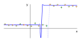

---
jupytext:
  cell_metadata_filter: -all
  formats: md:myst
  text_representation:
    extension: .md
    format_name: myst
    format_version: 0.13
    jupytext_version: 1.16.4
kernelspec:
  display_name: Python 3 (ipykernel)
  language: python
  name: python3
---

# Minimization algorithms

+++

So far, I've been talking about minimization algorithms as black boxes that are supposed to find the minimum of any function—and sometimes don't. Let's think about this more, since it's essential to both basic fitting and training neural networks.

This section focuses on theory, rather than practical advice on how to train a neural network. However, understanding how function minimizers work and why they behave the way they do can help you figure out why an optimization doesn't budge or why it's erratic or unstable.

+++

## Minimizing generic functions

+++

Finding the minimum of a function is hard: in general, functions are arbitrary mappings of input values to output values, so in principle, you'd have to check every possible input to find out which output is minimal.

```{code-cell} ipython3
import numpy as np
import matplotlib.pyplot as plt
```

```{code-cell} ipython3
# domain: integers ∈ [0, 10)
# codomain: integers ∈ [-1000, 1000]

arbitrary2d_array = np.random.randint(-1000, 1001, (10, 10))

def arbitrary2d_function(x, y):
    return arbitrary2d_array[x, y]
```

```{code-cell} ipython3
fig, ax = plt.subplots(figsize=(5, 5))

background_x, background_y = np.meshgrid(np.arange(10), np.arange(10))
background_2d = np.column_stack([background_x.ravel(), background_y.ravel()])

values = arbitrary2d_function(background_x, background_y)
    
ax.contourf(background_x, background_y, values.reshape(background_x.shape))

plt.show()
```

```{code-cell} ipython3
the_minimum = np.inf
for x in range(10):
    for y in range(10):
        value = arbitrary2d_function(x, y)
        if value < the_minimum:
            the_minimum = value

the_minimum
```

Now imagine that the arguments are floating-point values between $-\infty$ and $\infty$. Even though the floating-point values in a computer are finitely enumerable, there are a lot of them!

Fortunately, the functions we need to minimize have some continuity and derivative constraints. For instance, the most common loss function for fitting $N$ data points to a curve $f$ is

$$\chi^2 = \sum_i (f(x_i) - y_i)^2$$

The data points $x_i$ and $y_i$ are constants in the minimization; it's the parameterization of $f$ that varies. If $f$ is continuous and differentiable, then $\chi^2$ is, too.

This should be a strong hint as to why ansatz-fitting is often unstable and/or depends strongly on its initial parameters: every problem has a different $f$ (and maybe a different parameterization of $f$). Even if $f$ is continuous and differentiable, it might have very large derivatives at some points and might be nearly flat in wide regions. As the steep part scans over individual data points, those points have an outsized influence on the global fit, and points in the flat part have no influence.

{. width="75%"}

This should also be a hint as to why a linear fit can be solved exactly: a linear $f$ has a quadratic $f^2$, which can be minimized by finding the roots of its derivative. Basis expansions like Taylor and Fourier series are exactly solvable because, even though each basis function is non-linear, their coefficients form a linear system of equations.

The adaptive basis functions that we use in neural networks, however, are not solvable as a linear system, so we need an iterative, numerical algorithm to search for the minimum. A loss function, $L$, for the most common types of neural networks has the following properties:

* $L$ takes $n$ floating-point numbers as input, which can be thought of as an $n$-dimensional space of real numbers. This number of parameters $n$ may be hundreds or thousands (or more).
* $L$ returns $1$ floating-point number as output. $1$-dimensional real numbers are strictly ordered, which is what makes it possible to say that some value of loss is better than another. (In practice, this means that if we want to optimize two quantities, such as signal strength and background rejection in a HEP analysis, we have to put them both on the same scale: how much signal can we afford to lose to reject enough background? If we're running a bank, how much credit card fraud are we willing to ignore to avoid annoying card-holders with too many alerts? All loss problems have to become $1$-dimensional.)
* $L$ is continuous and differentiable at every point (even if the definition of the derivative seems artificial in some cases).
* $L$ may be very noisy and will have many local minima. Unless the neural network architecture is trivial, $L$ _will_ have non-unique global minima because of symmetries.
* $L$ is bounded below. Its output doesn't, for instance, limit to $-\infty$ as some combination of its input parameters limit to $\infty$ or some divergent point. At least the global minima _exist_.

+++

## Minimization algorithms

+++

All of the minimization algorithms we'll look at have the following basic approach:

1. Start with a random set of parameter values as an initial point $\vec{p}_0$.
2. Compute the loss function $L(\vec{p})$ and its derivative $\nabla L(\vec{p})$ at the current point $\vec{p}$.
3. Use the derivative to take a step in the direction that decreases $L$, but don't jump all the way to the estimated minimum. Take a small step whose size is controlled by the "learning rate."
4. Either repeat step 2 or do something to avoid getting stuck in a local minimum or narrow valley. (There's a great deal of variety in how minimization algorithms choose to approach the apparent minimum.)

Minuit follows this approach, though it also (numerically) calculates a second derivative, $\nabla^2 L(\vec{p})$, which it uses to describe the shape of the minimum. This is because Minuit is intended for ansatz fits—the steepness of the loss function at the minimum tells us the uncertainty in the fitted parameters. Neural network training doesn't need it.

```{code-cell} ipython3
from iminuit import Minuit
```

Let's start by defining a function to optmize:

```{code-cell} ipython3
def function_to_minimize(x, y):
    # https://en.wikipedia.org/wiki/Himmelblau%27s_function
    return (x**2 + y - 11)**2 + (x + y**2 - 7)**2
```

```{code-cell} ipython3
fig, ax = plt.subplots(figsize=(5, 5))

def plot_objective(ax, function, xlow=-6, xhigh=6, ylow=-6, yhigh=6):
    background_x, background_y = np.meshgrid(np.linspace(xlow, xhigh, 100), np.linspace(ylow, yhigh, 100))
    background_2d = np.column_stack([background_x.ravel(), background_y.ravel()])
    values = function(background_x, background_y)
    ax.contourf(background_x, background_y, np.log(values).reshape(background_x.shape), alpha=0.1)
    ax.contour(background_x, background_y, values.reshape(background_x.shape),
               [1, 10, 20, 50, 100, 200, 500, 1000], colors=["gray"], linestyles=["--"])
    ax.set_xlim(xlow, xhigh)
    ax.set_ylim(ylow, yhigh)

plot_objective(ax, function_to_minimize)

plt.show()
```

In order to see what the minimizer is doing, we can modify the function to fill a list with the $x$-$y$ points where the minimizer evaluated it.

```{code-cell} ipython3
def record_sample_points(function):
    samples = []

    def modified_function(x, y):
        samples.append((x, y))
        return function(x, y)

    return samples, modified_function
```

Now let's see what Minuit does when we start it at $x = 0$, $y = 0$.

```{code-cell} ipython3
samples, modified_function = record_sample_points(function_to_minimize)

minuit = Minuit(modified_function, x=0, y=0)
minuit.migrad()
```

It found a minimum at $x = 3$, $y = 2$, and here's the path it took:

```{code-cell} ipython3
fig, ax = plt.subplots(figsize=(5, 5))

def plot_path(ax, samples):
    ax.plot([x for x, y in samples], [y for x, y in samples], color="blue", zorder=1)
    ax.scatter([x for x, y in samples], [y for x, y in samples], marker="o", color="white", zorder=2)
    ax.scatter([x for x, y in samples], [y for x, y in samples], marker=".", color="blue", zorder=2)

plot_objective(ax, function_to_minimize)
plot_path(ax, samples)

plt.show()
```

But if we start at $x = -2$, $y = 0$,

```{code-cell} ipython3
samples, modified_function = record_sample_points(function_to_minimize)

minuit = Minuit(modified_function, x=-2, y=0)
minuit.migrad()
```

It takes a different path and finds a different minimum:

```{code-cell} ipython3
fig, ax = plt.subplots(figsize=(5, 5))

plot_objective(ax, function_to_minimize)
plot_path(ax, samples)

plt.show()
```

Now let's see what an optimizer from PyTorch does.

```{code-cell} ipython3
import torch
from torch import nn, optim
```

Since the "model" to optimize can be an arbitrary class in PyTorch, let's make a model with 2 parameters, $x$ and $y$, that keeps track of where it has been called.

```{code-cell} ipython3
class Position2D(nn.Module):
    def __init__(self, x, y):
        super().__init__()   # let PyTorch do its initialization first
        self.xy = nn.Parameter(torch.tensor([x, y], dtype=torch.float32, requires_grad=True))
        self.samples = [(x, y)]

    def forward(self):
        self.samples.append(tuple(position.xy.detach().numpy()))
        return self.xy[0], self.xy[1]
```

[torch.optim](https://pytorch.org/docs/stable/optim.html) has many optimizers,

```{code-cell} ipython3
[name for name in dir(optim) if isinstance(getattr(optim, name), type) and issubclass(getattr(optim, name), optim.Optimizer)]
```

but generally, Adam or AdamW is [considered a generic best choice](https://www.fast.ai/posts/2018-07-02-adam-weight-decay.html).

The code below sets up `Position2D(0, 0)` as a model, an Adam optimizer, and then steps through 1000 iterations.

```{code-cell} ipython3
position = Position2D(0, 0)

optimizer = optim.Adam(position.parameters(), lr=0.1)

for epoch in range(1000):
    optimizer.zero_grad()

    loss = function_to_minimize(*position())

    loss.backward()
    optimizer.step()
```

```{code-cell} ipython3
fig, ax = plt.subplots(figsize=(5, 5))

plot_objective(ax, function_to_minimize)
plot_path(ax, position.samples)

plt.show()
```

Now with the position starting at $x = -2$, $y = 0$,

```{code-cell} ipython3
position = Position2D(-2, 0)

optimizer = optim.Adam(position.parameters(), lr=0.1)

for epoch in range(1000):
    optimizer.zero_grad()

    loss = function_to_minimize(*position())

    loss.backward()
    optimizer.step()
```

```{code-cell} ipython3
fig, ax = plt.subplots(figsize=(5, 5))

plot_objective(ax, function_to_minimize)
plot_path(ax, position.samples)

plt.show()
```

This optimizer is taking many smaller steps than Minuit, and its path is curved: it has momentum. (Try the above with other minimizers to get a sense of what they do.)

Momentum is the reason why Adam (and variants) are robust minimizers: they dynamically scale the learning rate to find their way through long, narrow valleys. The interactive article below is an excellent explanation of how and why momentum works:

<a href="https://distill.pub/2017/momentum/"></a>

But we can see it by trying to minimize the following function, which has a long, narrow valley that tends to trap the minimization process (like golf).

```{code-cell} ipython3
def function_to_minimize(x, y):
    # Beale from https://en.wikipedia.org/wiki/Test_functions_for_optimization
    return (1.5 - x + x*y)**2 + (2.25 - x + x*y**2)**2 + (2.625 - x + x*y**3)**2
```

```{code-cell} ipython3
position = Position2D(-1, 2)

optimizer = optim.Adam(position.parameters(), lr=0.3)

for epoch in range(1000):
    optimizer.zero_grad()

    loss = function_to_minimize(*position())

    loss.backward()
    optimizer.step()
```

```{code-cell} ipython3
fig, ax = plt.subplots(figsize=(5, 5))

plot_objective(ax, function_to_minimize, xlow=-6, xhigh=6, ylow=-2, yhigh=4)
plot_path(ax, position.samples)

plt.show()
```

To jump over the valley and avoid overshooting the minimum on the other side, we can increase its momentum:

```{code-cell} ipython3
position = Position2D(-1, 2)

optimizer = optim.Adam(position.parameters(), lr=0.3, betas=(0.99, 0.999))

for epoch in range(1000):
    optimizer.zero_grad()

    loss = function_to_minimize(*position())

    loss.backward()
    optimizer.step()
```

```{code-cell} ipython3
fig, ax = plt.subplots(figsize=(5, 5))

plot_objective(ax, function_to_minimize, xlow=-6, xhigh=6, ylow=-2, yhigh=4)
plot_path(ax, position.samples)

plt.show()
```

Keep in mind that what we're doing is unusual: it's very unlikely that you'll ever minimize 2-dimensional functions, and certainly not by hand like this. The reason we're doing this is to understand what these options mean, to have an idea of what to tune when a neural network isn't improving during training.

Most likely, the functions you'll be minimizing will have hundreds or thousands of dimensions, but they'll have complicated structure like the 2-dimensional examples above. This is a 2-dimensional cross-section taken from a real machine learning application ([ref](https://doi.org/10.48550/arXiv.1712.09913)):

{. width="65%"}

Moreover, the minima that we're looking for are not unique. Consider the adaptive basis functions example from the section on [Universal approximators](04-universal-approximators.md):

{. width="100%"}

Once you find a best fit for all sigmoids $\psi(x; \alpha_i, \beta_i)$ in

$$y = \sum_i^n c_i \psi(x; \alpha_i, \beta_i) = \sum_i^n c_i \, \frac{1}{1 + \exp\left((x - \alpha_i)/\beta_i\right)}$$

swap any sigmoid $i$ for sigmoid $j$ (i.e. swap $c_i \leftrightarrow c_j$, $\alpha_i \leftrightarrow \alpha_j$, and $\beta_i \leftrightarrow \beta_j$) and the result will be identical. However, we have just replaced the values of 3 components of parameter $\vec{p}$ with 3 other components: this is a new point $\vec{p}'$. If one is a minimum, then the other must also be a minimum with exactly the same value.

This underscores the distinction between ansatz-fitting and neural network training: when fitting a function to an ansatz, we want to find the unique minimum because the location and shape of the minimum tells us the value and uncertainty in some theoretical parameter—something about the real world, such as the strength of gravity or the charge of an electron. In neural network training, the minimum _cannot_ be unique, at least because of the symmetries in swapping adaptive basis functions, but also because the landscape is very complicated with many local minima. _This_ is why neural networks are evaluated on their ability to predict, not on the values of their internal parameters.

+++

## Initial parameter values

+++

To begin an iterative search for a minimum, we have to start with some initial parameters $\vec{p}_0$ (also called initial "weights"). Since we have hundreds or thousands of parameters and we don't want to bias it by starting at a special point like $0$, we randomly generate a starting point.

Before 2010, not much attention was paid to the distribution of these initial parameters—they were usually chosen from a unit normal (Gaussian) distribution. However, the distribution matters: if the variance is too small or too large, the minimizer would often get stuck in a region of parameter space in which $\nabla \vec{p} \approx 0$ or very large values: the "vanishing gradients problem" or "exploding gradients problem." As it turns out ([ref](http://proceedings.mlr.press/v9/glorot10a)), the optimal variance scales inversely with the number of dimensions in the linear transformation. Identifying this and correcting it was an important step in making deep learning feasible.

PyTorch's default initial parameters are uniformly distributed in

$$-\frac{1}{\sqrt{n_{\mbox{in}}}} < \mbox{initial parameters} < \frac{1}{\sqrt{n_{\mbox{in}}}}$$

where $n_{\mbox{in}}$ is the number of vector components entering a linear transformation ("fan in").

```{code-cell} ipython3
def print_header():
    print(f"# par |  min  | max  | variance")
    print( "------+-------+------+---------")

def print_values(model):
    parameters = np.concatenate(
        [x.detach().numpy().ravel() for x in model.parameters()]
    )
    print(f"{len(parameters):>5d} | {parameters.min():.2f} | {parameters.max():.2f} | {parameters.var():.5f}")

print_header()

for fan_in in [10, 20, 50, 100, 200, 500, 1000]:
    fan_out = 10

    # make a linear transformation, a single layer of a neural network
    model = nn.Linear(fan_in, fan_out)

    print_values(model)
```

But it doesn't depend on the number of vector components that exit the linear transformation ("fan out").

```{code-cell} ipython3
print_header()

for fan_out in [10, 20, 50, 100, 200, 500, 1000]:
    fan_in = 10

    # make a linear transformation, a single layer of a neural network
    model = nn.Linear(fan_in, fan_out)

    print_values(model)
```

This is usually sufficient, but the optimal distributions depend on both $n_{\mbox{in}}$ and $n_{\mbox{out}}$. For smooth activation functions like sigmoids and inverse tangent, Xavier initialization is best and for ReLU and its variants, Hu initialization is best. This can be relevant if you build an architecture in which the size of one layer is very different from the size of the next.

The [nn.init](https://pytorch.org/docs/main/nn.init.html) module provides initialization functions, so you can set initial parameters appropriately:

```{code-cell} ipython3
print_header()

for fan_out in [10, 20, 50, 100, 200, 500, 1000]:
    fan_in = 10

    # make a layer and modify the weights to Xavier's uniform distribution
    model = nn.Linear(fan_in, fan_out)
    nn.init.xavier_uniform_(model.weight)

    print_values(model)
```

## Derivatives and the activation function

+++

You might have noticed the `requires_grad` option in all of the PyTorch `Tensor` objects. By default, PyTorch computes derivatives for every computation it performs and most optimizers use these derivatives. The `loss_function.backward()` step in every model-training `for` loop that you write computes derivatives from the output of the neural network (where it's constrained by the target you're trying to optimize for) through to the inputs.

Here's an example of using a PyTorch `Tensor` to compute a function's derivative.

```{code-cell} ipython3
x = torch.linspace(-np.pi, np.pi, 1000, requires_grad=True)
y = torch.sin(x)  # make this a more exciting function if you want!

Y = torch.sum(y)
Y.backward()
```

```{code-cell} ipython3
fig, ax = plt.subplots()

ax.plot(x.detach().numpy(), y.detach().numpy(), label="y = sin(x)")
ax.plot(x.detach().numpy(), x.grad.detach().numpy(), label="dy/dx = cos(x)")

ax.axvline(0, color="lightgray", ls=":", zorder=-1)
ax.axhline(0, color="lightgray", ls=":", zorder=-1)

ax.set_xlabel("x")
ax.legend(loc="upper left")

plt.show()
```

Unlike Minuit, this derivative is not computed by finite differences ($df/dx \approx (f(x + \Delta x) - f(x))/\Delta x$ for some small $\Delta x$), and it is not a fully symbolic derivative from a computer algebra system (like Mathematica, Maple, or SymPy). [Autograd](https://pytorch.org/tutorials/beginner/blitz/autograd_tutorial.html) is a technique that passes arrays of derivatives through the same calculation that the main arrays have gone through, applying the chain rule at every step. Thus, it's not approximate, it doesn't depend on a choice of scale ($\Delta x$), and the functions don't have to be closed-form formulae.

This is the reason why you have to [Tensor.detach](https://pytorch.org/docs/stable/generated/torch.Tensor.detach.html) before converting a `Tensor` to a NumPy array—the removal of information about the derivative shouldn't be implicit, or it could lead to wrong calculations.

But this is also relevant because you might be wondering how we can use ReLU functions in loss functions that are supposed to be differentiable. Formally,

$$\mbox{ReLU}(x) = \left\{\begin{array}{c l}0 & \mbox{if } x < 0 \\ x & \mbox{if } x \ge 0\end{array}\right.$$

doesn't have a true derivative at $x = 0$. (Limiting from the left, the derivative is $0$; limiting from the right, the derivative is $1$.) However, as an artifact of the autograd technique non-differentiable points get "fake" derivatives (that derive from details of their implementation).

```{code-cell} ipython3
x = torch.arange(1000, dtype=torch.float32, requires_grad=True) * 0.004 - 2
x.retain_grad()

y = nn.ReLU()(x)

Y = torch.sum(y)
Y.backward()
```

```{code-cell} ipython3
fig, ax = plt.subplots()

ax.plot(x.detach().numpy(), y.detach().numpy(), label="y = ReLU(x)")
ax.plot(x.detach().numpy(), x.grad.detach().numpy(), label="dy/dx = Heavyside(x)")

ax.axvline(0, color="lightgray", ls=":", zorder=-1)
ax.axhline(0, color="lightgray", ls=":", zorder=-1)

ax.set_ylim(ax.get_xlim())
ax.set_xlabel("x")
ax.legend(loc="upper left")

plt.show()
```

```{code-cell} ipython3
x[500]
```

```{code-cell} ipython3
x.grad[500]
```

The autograd computation is not sensitive to a neighborhood of points the way that a real derivative is. To see this, let's calculate a ReLU function by hand at $x = 0$, using the seemingly equivalent predicates `x > 0` and `x >= 0`:

```{code-cell} ipython3
x = torch.tensor(0, dtype=torch.float32, requires_grad=True)

y = torch.where(x > 0, x, 0)   # notice the ">"
y.backward()

x.grad
```

but

```{code-cell} ipython3
x = torch.tensor(0, dtype=torch.float32, requires_grad=True)

y = torch.where(x >= 0, x, 0)   # notice the ">="
y.backward()

x.grad
```

At $x = 0$, the first calculation fails `x > 0` so `y` is set to `0` and its derivative is the derivative of the expression `0`, which is `0`.

At $x = 0$, the second calculation passes `x >= 0` so `y` is set to `x` (which is `0`) and its derivative is the derivative of the expression `x`, which is `1`.

This autograd procedure is not sensitive to a local neighborhood around the point that is being differentiated! That's why it doesn't see that the derivative has a left-limit that is different from its right-limit, and doesn't recognize that a true derivative is not defined. The value that this procedure returns depends on what seems like an implementation detail: `x > 0` versus `x >= 0` to decide between `x` and `0`.

But, as a matter of convention adopted by the ML community,

$$\frac{d}{dx} \mbox{ReLU}(0) = 0$$

It could have been defined to be $0$ or $1$, but $0$ is more popular.

+++

## Practical advice

+++

* Use the [optim.Adam](https://pytorch.org/docs/stable/generated/torch.optim.Adam.html) minimizer.
* Pay close attention to the learning rate (`lr`). Try different, exponentially spaced steps (like `0.001`, `0.01`, `0.1`) if the optimization doesn't seem to be doing anything or if the output is erratic.
* Maybe even play with the momentum (`betas`), but the primary learning rate is more important.
* The final, fitted parameters are not meaningful. Unlike ansatz fitting, solutions are even guaranteed to not be unique. The parameters you get from one loss-minimization will likely be different from the parameters you get from another.
* The variance of the initial random parameter values matters! If your network architecture has roughly the same number of vector components in each layer, you can use PyTorch's default. If not, initialize the parameter values using the appropriate function from [nn.init](https://pytorch.org/docs/main/nn.init.html), which depends on your choice of activation function.
* Most of the function minimizers need to be given derivatives. Despite appearances, ReLU is differentiable in the sense that it needs to be.

And finally, the number of epochs and mini-batch size are also important for the rate of convergence of training. They're important enough for me to leave to the next section.
