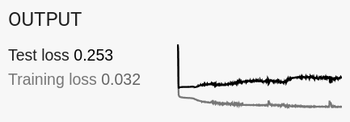

---
jupytext:
  cell_metadata_filter: -all
  formats: md:myst
  text_representation:
    extension: .md
    format_name: myst
    format_version: 0.13
    jupytext_version: 1.16.4
kernelspec:
  display_name: Python 3 (ipykernel)
  language: python
  name: python3
---

# Exercise 5: Regularization in the Playground

+++

Given the <a href="https://playground.tensorflow.org/#activation=relu&batchSize=5&dataset=gauss&regDataset=reg-plane&learningRate=0.03&regularizationRate=0&noise=50&networkShape=8,8,8,8,8,8&seed=0.66131&showTestData=false&discretize=false&percTrainData=50&x=true&y=true&xTimesY=false&xSquared=false&ySquared=false&cosX=false&sinX=false&cosY=false&sinY=false&collectStats=false&problem=classification&initZero=false&hideText=false" target="_blank">ridiculously overfit network</a> below,

1. add an L1 regularization term with a big enough coefficient to simplify the model,
2. do the same with an L2 regularization term.

Do you notice anything different in the resulting matrix weights (the lines between the layers)?

Notice the plot in the upper right:

{. width="50%"}

What is it telling you? How does it change as you add regularization?
