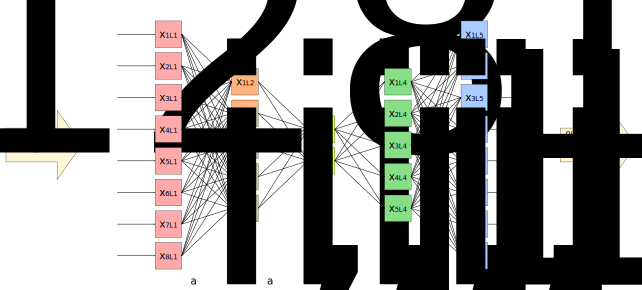
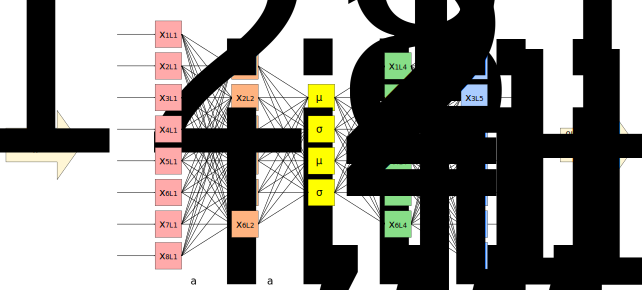

---
jupytext:
  cell_metadata_filter: -all
  formats: md:myst
  text_representation:
    extension: .md
    format_name: myst
    format_version: 0.13
    jupytext_version: 1.16.4
kernelspec:
  display_name: Python 3 (ipykernel)
  language: python
  name: python3
execution:
  timeout: 600
---

# Autoencoders

+++

Since we explicitly used `targets` to define the loss function to train neural networks, you may be wondering how they can be unsupervised. They have to be optimized to something; what are they optimized to?

Consider the following neural network:

{. width="100%"}

and suppose that we train it to output the same data that we put in. That is, for each input vector $\vec{x}_i$, we want the output vector to be as close to $\vec{x}_i$ as possible. The thing that makes this non-trivial is the fact that an intermediate layer has fewer dimensions than the input/output. All the complexity of data in an 8-dimensional space has to be encoded in a 2-dimensional space.

If the training data just coats a 2-dimensional surface within the 8 dimensions, even as a curvy, potato-shaped submanifold, then the model will learn to flatten it out, so that it can be projected onto the 2-component layer without losing any information. But if the distribution of data extends into 3 or more dimensions, then there will be some information loss, which the model will try to minimize.

This can be thought of as a compression algorithm, but instead of compressing discrete bits into a smaller number of discrete bits, it's compressing real-valued data into a smaller number of dimensions. (For categorical data in a one-hot encoding, these are essentially the same thing.)

In the diagram from [Machine Learning for Everyone](https://vas3k.com/blog/machine_learning/), this is "dimension reduction."

{. width="50%"}

Reducing the number of dimensions is useful for visualization, since humans can visualize at most 3 dimensions, and are much better at visualizing 2 dimensions (as a colored plane) or 1 dimension (as a histogram axis, for instance).

It's also useful for clustering because in a high-dimensional space, the distances between pairs of points are more nearly equal to each other than in a low-dimensional space ([ref](https://en.wikipedia.org/wiki/Curse_of_dimensionality#Distance_function)). Reducing the number of dimensions is a necessary first step for clustering to be effective, but unlike visualization, the reduced number of dimensions may be higher than 3.

```{code-cell} ipython3
import numpy as np
import pandas as pd
import matplotlib as mpl
import matplotlib.pyplot as plt

import torch
from torch import nn, optim
```

## Training an autoencoder

+++

Let's use the jet data from the main project.

```{code-cell} ipython3
hls4ml_lhc_jets_hlf = pd.read_parquet("data/hls4ml_lhc_jets_hlf.parquet")
features_unnormalized = torch.tensor(
    hls4ml_lhc_jets_hlf.drop("jet_type", axis=1).values, dtype=torch.float32
)
features = (features_unnormalized - features_unnormalized.mean(axis=0)) / features_unnormalized.std(axis=0)
```

As a reminder, the jets are characterized by 16 features. Can we compress them into 2 dimensions to make a plot?

```{code-cell} ipython3
features.shape
```

Here's an autoencoder model that takes the 16 dimensions down to 2 in stages:

* 16 inputs → 12 hidden
* 12 hidden → 8 hidden
* 8 hidden → 4 hidden
* 4 hidden → 2 hidden
* make a plot!
* 2 hidden → 4 hidden
* 4 hidden → 8 hidden
* 8 hidden → 12 hidden
* 12 hidden → 16 outputs

```{code-cell} ipython3
class Autoencoder(nn.Module):
    def __init__(self):
        super().__init__()   # let PyTorch do its initialization first

        self.shrinking = nn.Sequential(
            nn.Linear(16, 12),
            nn.Sigmoid(),
            nn.Linear(12, 8),
            nn.Sigmoid(),
            nn.Linear(8, 4),
            nn.Sigmoid(),
            nn.Linear(4, 2),
            nn.Sigmoid(),
        )
        self.growing = nn.Sequential(
            nn.Linear(2, 4),
            nn.Sigmoid(),
            nn.Linear(4, 8),
            nn.Sigmoid(),
            nn.Linear(8, 12),
            nn.Sigmoid(),
            nn.Linear(12, 16),
        )

    def forward(self, features):
        return self.growing(self.shrinking(features))
```

```{code-cell} ipython3
NUM_EPOCHS = 20
BATCH_SIZE = 500

torch.manual_seed(12345)

model = Autoencoder()

loss_function = nn.MSELoss()

optimizer = optim.Adam(model.parameters(), lr=0.03)

loss_vs_epoch = []
for epoch in range(NUM_EPOCHS):
    total_loss = 0

    for start_batch in range(0, len(features), BATCH_SIZE):
        stop_batch = start_batch + BATCH_SIZE

        optimizer.zero_grad()
    
        predictions = model(features[start_batch:stop_batch])
        loss = loss_function(predictions, features[start_batch:stop_batch])
        total_loss += loss.item()
    
        loss.backward()
        optimizer.step()

    loss_vs_epoch.append(total_loss)
    print(f"{epoch = } {total_loss = }")
```

```{code-cell} ipython3
fig, ax = plt.subplots()

ax.plot(range(len(loss_vs_epoch)), loss_vs_epoch)

ax.set_ylim(0, ax.get_ylim()[1])
ax.set_xlabel("epoch")
ax.set_ylabel("loss")

plt.show()
```

If this were a real project, we'd split the data into training, validation, and test subsamples and try to minimize the loss further. But this is just a demo.

Now let's look at the distribution of data in the 2-dimensional hidden layer:

```{code-cell} ipython3
embedded = model.shrinking(features).detach().numpy()
```

```{code-cell} ipython3
fig, ax = plt.subplots(figsize=(6, 5))

xmin, xmax = np.min(embedded[:, 0]), np.max(embedded[:, 0])
ymin, ymax = np.min(embedded[:, 1]), np.max(embedded[:, 1])

def plot_embedded(ax, embedded):    
    p = ax.hist2d(embedded[:, 0], embedded[:, 1],
                  bins=(100, 100), range=((xmin, xmax), (ymin, ymax)),
                  norm=mpl.colors.LogNorm())
    ax.axis([xmin, xmax, ymin, ymax])
    return p

p = plot_embedded(ax, embedded)
fig.colorbar(p[-1], ax=ax, label="number of samples")

plt.show()
```

The exact distribution isn't meaningful (and it would change if we used a different [torch.manual_seed](https://pytorch.org/docs/stable/generated/torch.manual_seed.html)). What is relevant is that the optimization process has arranged the data in clumps, presumably for different types of jets, so that it can produce the right distribution in the 16-dimensional feature space.

How well do these clumps correspond to the known jet sources?

```{code-cell} ipython3
hidden_truth = hls4ml_lhc_jets_hlf["jet_type"].values
```

```{code-cell} ipython3
fig, ax = plt.subplots(5, 1, figsize=(5, 25))

plot_embedded(ax[0], embedded[hidden_truth == "g"])
plot_embedded(ax[1], embedded[hidden_truth == "q"])
plot_embedded(ax[2], embedded[hidden_truth == "t"])
plot_embedded(ax[3], embedded[hidden_truth == "w"])
plot_embedded(ax[4], embedded[hidden_truth == "z"])

ax[0].set_title("gluon jets (\"g\")")
ax[1].set_title("light quark jets (\"q\")")
ax[2].set_title("top quark jets (\"t\")")
ax[3].set_title("W boson jets (\"w\")")
ax[4].set_title("Z boson jets (\"z\")")

plt.show()
```

The clumps don't correspond exactly with jet source, but that's because jets from the same source can decay in different ways.

Generally, we see the largest differences between gluons/light quarks, top quarks, and $W$/$Z$ bosons, as expected.

To see these as histograms, let's further compress the 2-dimensional hidden layer to 1 dimension. We can start with the above model as a [foundation](https://en.wikipedia.org/wiki/Foundation_model) and zero-out one of its dimensions, then let it optimize around the new restriction.

```{code-cell} ipython3
class Autoencoder1D(nn.Module):
    def __init__(self, shrinking, growing):
        super().__init__()   # let PyTorch do its initialization first

        self.shrinking = shrinking
        self.growing = growing

    def forward(self, features):
        embedded = self.shrinking(features)
        squashed = torch.column_stack([
            embedded[:, [0]],                 # keep the x values, drop the y
            torch.zeros((len(features), 1)),  # make new zeros for y
        ])
        return self.growing(squashed)
```

```{code-cell} ipython3
NUM_EPOCHS_2 = 20

model1D = Autoencoder1D(model.shrinking, model.growing)

for epoch in range(NUM_EPOCHS_2):
    total_loss = 0

    for start_batch in range(0, len(features), BATCH_SIZE):
        stop_batch = start_batch + BATCH_SIZE

        optimizer.zero_grad()
    
        predictions = model1D(features[start_batch:stop_batch])
        loss = loss_function(predictions, features[start_batch:stop_batch])
        total_loss += loss.item()
    
        loss.backward()
        optimizer.step()

    loss_vs_epoch.append(total_loss)
    print(f"{epoch = } {total_loss = }")
```

```{code-cell} ipython3
fig, ax = plt.subplots()

ax.plot(range(len(loss_vs_epoch)), loss_vs_epoch)
ax.axvline(NUM_EPOCHS, color="gray", ls="--")

ax.set_ylim(0, ax.get_ylim()[1])
ax.set_xlabel("epoch")
ax.set_ylabel("loss")

plt.show()
```

Zeroing-out one of the 2 dimensions made the loss much worse—the model no longer reproduced its input—but a few epochs of iteration allowed this to "heal."

```{code-cell} ipython3
embedded1D = model1D.shrinking(features).detach().numpy()[:, 0]
```

```{code-cell} ipython3
fig, ax = plt.subplots()

xmin, xmax = np.min(embedded1D), np.max(embedded1D)

def plot_one(ax, embedded, label):
    ax.hist(embedded, bins=1000, range=(xmin, xmax), histtype="step", label=label)

plot_one(ax, embedded1D[hidden_truth == "g"], "gluon jets (\"g\")")
plot_one(ax, embedded1D[hidden_truth == "q"], "light quark jets (\"q\")")
plot_one(ax, embedded1D[hidden_truth == "t"], "top quark jets (\"t\")")
plot_one(ax, embedded1D[hidden_truth == "w"], "W boson jets (\"w\")")
plot_one(ax, embedded1D[hidden_truth == "z"], "Z boson jets (\"z\")")

ax.set_xlim(xmin, xmax)
ax.set_xlabel("hidden layer value")
ax.set_ylabel("counts")

ax.legend(loc="upper right")

plt.show()
```

Jets from each of the sources still have a few different ways to decay, but they only partly overlap. Those overlaps are indistinguishable decays (indistinguishable to the current state of the model, at least). But each type also has distinguishable decays.

If our only interest is to identify jet sources and we have the MC truth labels, we'd want to do supervised classification (what you did in your main project). Autoencoders are useful if you don't have MC truth: for instance, you want to detect any anomalous signal and you don't know what it would look like before you simulate it.

+++

## Self-organizing maps

+++

We used the autoencoder above as a visualization aid, but it's not the best tool for this job. A [self-organizing map](https://en.wikipedia.org/wiki/Self-organizing_map) is a different neural network topology: instead of a 2-dimensional layer, it outputs $n$ nodes that are the points of a 2-dimensional grid, and the optimization preserves the topological structure of the data. It produces visualizations that are more stable than the one above.

After reducing the dimensionality of a dataset, we can use the clustering methods from the [previous section](22-beyond-supervised.md) to categorize the data.

+++

## Variational autoencoder

+++

If we plan to cluster the lower-dimensional data with [k-means](https://en.wikipedia.org/wiki/K-means_clustering) cluster centers $\vec{c}_j$ or a [Gaussian mixture model](https://en.wikipedia.org/wiki/Mixture_model)'s centers $\vec{\mu}_j$ and covariance matrices $\hat{\sigma}_j$, why not generate these parameters directly as components of a hidden layer, instead of introducing clustering as a separate step?

This topology is called a [variational autoencoder](https://en.wikipedia.org/wiki/Variational_autoencoder):

{. width="100%"}

In the above, $\mu_j$, $\sigma_j$ represent components of cluster centers and covariances. When executing the model, the third layer generates random points with a distribution given by these cluster parameters. Like the basic autoencoder, the variational autoencoder is trained to act as an identity function, returning the vectors $\vec{x}_i$ close to what it is given as input, but after training, the $\mu_j$, $\sigma_j$ parameters can be directly interpreted as peaks and widths of the distribution. This is a neural network with a Gaussian Mixture model built in.
