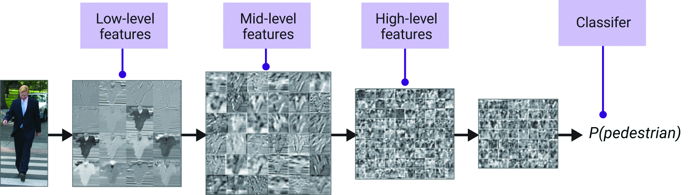
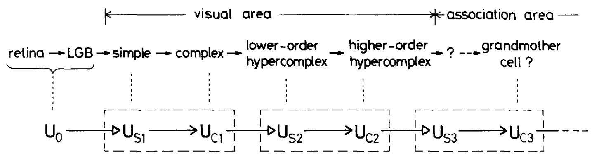
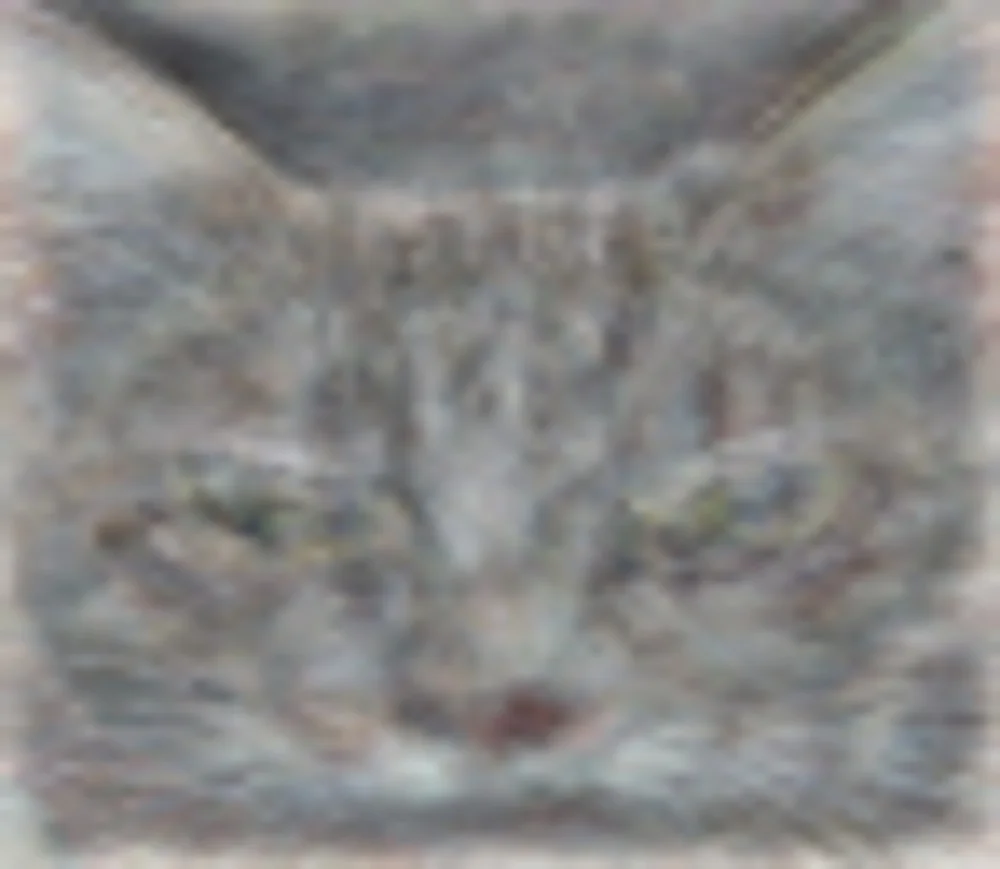

---
jupytext:
  cell_metadata_filter: -all
  formats: md:myst
  text_representation:
    extension: .md
    format_name: myst
    format_version: 0.13
    jupytext_version: 1.16.4
kernelspec:
  display_name: Python 3 (ipykernel)
  language: python
  name: python3
execution:
  timeout: 120
---

# Convolutional Neural Networks (CNNs)

+++

Returning to supervised learning, it's often the case that we want models to take low-level, raw data as input, so that it can discover relevant features for us. Low-level data is often image-like: a rectangular grid of pixels, a hexagonal grid of detector measurements, or some other discretization of a plane or a volume.

Beyond HEP, images are a very common input or output of ML models because photographs and drawings are important to humans. In this section, we'll look at a typical HEP image processing task, and how a neural network topology designed for images can help us.

```{code-cell} ipython3
import numpy as np
import pandas as pd
import matplotlib as mpl
import matplotlib.pyplot as plt

import h5py
import sklearn.datasets
import torch
from torch import nn, optim
```

## Images in HEP

+++

The jet dataset that you used for your [main project](20-main-project.md) is based on 16 hand-crafted features:

```{code-cell} ipython3
list(sklearn.datasets.fetch_openml("hls4ml_lhc_jets_hlf")["data"].columns)
```

Suppose we didn't know that these are a useful way to characterize jet substructure, or suppose that there are better ways not listed here (very plausible!). A model trained on these 16 features wouldn't have as much discriminating power as it could.

At an earlier stage of processing, a jet is a distribution of energy in pseudorapidity ($\eta$) and azimuthal angle ($\phi$), determined from binned tracks or calorimeter measurements that provide their own binning, or from a high-level particle flow procedure. In the `data` directory of [this repository](https://github.com/hsf-training/deep-learning-intro-for-hep), a file named [deep-learning-intro-for-hep/data/jet-images.h5](https://github.com/hsf-training/deep-learning-intro-for-hep/blob/main/deep-learning-intro-for-hep/data/jet-images.h5) contains these images of jets.

```{code-cell} ipython3
with h5py.File("data/jet-images.h5") as file:
    jet_images = file["images"][:]
    jet_labels = file["labels"][:]

jet_label_order = ["g", "q", "t", "w", "z"]
```

There are $80\,000$ images with 20×20 pixels each.

```{code-cell} ipython3
jet_images.shape
```

```{code-cell} ipython3
fig, axs = plt.subplots(4, 4, figsize=(12, 12))

for i, ax in enumerate(axs.flatten()):
    ax.imshow(jet_images[i])
    ax.text(10, 1.5, f"'{jet_label_order[jet_labels[i]]}' jet image", color="white")

plt.show()
```

Each image is different, but the three basic jet types (gluon/light quark, top, and $W$/$Z$ boson) are clearly different in sums over all images:

```{code-cell} ipython3
fig, axs = plt.subplots(5, 1, figsize=(6, 30))

for i, ax in enumerate(axs):
    ax.imshow(np.sum(jet_images[jet_labels == i], axis=0))
    ax.set_title(f"sum of '{jet_label_order[i]}' jet images")

plt.show()
```

Several pre-processing steps have already been taken care of, such as centering all of the jets in the middle of each image and scaling the energies to a common order of magnitude.

```{code-cell} ipython3
fig, ax = plt.subplots()

ax.hist(
    np.mean(jet_images.reshape(-1, 20*20), axis=1),
    bins=100, range=(0, 5), histtype="step",
)
ax.set_xlabel("average energy in each bin (unknown units)")
ax.set_ylabel("counts")

plt.show()
```

## Replace linear transformations with convolutions

+++

Since you know how to make a model with 16-dimensional inputs, you could make a model with each 20×20 pixel image as an input, which is to say, 400-dimensional inputs. The problem is that a fully connected layer from $400$ inputs to $n$ components of a hidden layer would be $400 \times n$ parameters. It gets computationally expensive very quickly.

Just as neural networks were originally inspired by biology, we can take note of another biological feature: neurons in an eye are connected in layers, but only spatially nearby neurons are connected from one layer to the next ([ref](https://webvision.med.utah.edu/)).

{. width="50%"}

We can do the same in an artificial neural network by only connecting spatially nearby vector components from one layer to the next ([ref](https://doi.org/10.1007/BF00344251)):

{. width="50%"}

Remember that the "connections" are components of a linear transformation from one layer to the next. Excluding connections is equivalent to forcing components of the linear transformation to zero, which reduces the set of parameters that need to be varied.

But apart from eliminating probably-unnecessary calculations, this kind of restriction has meaning for images: it is a [convolution](https://en.wikipedia.org/wiki/Convolution) of the image with a small [kernel](https://en.wikipedia.org/wiki/Kernel_(image_processing)), which is a well-known way to extract higher-level information from images. That's why a neural network built this way is called a Convolutional Neural Network (CNN).

To demonstrate the action of kernel convolution, consider this image (taken by me before the CMS experiment was lowered underground):

```{code-cell} ipython3
image = mpl.image.imread("data/sun-shines-in-CMS.png")
```

```{code-cell} ipython3
fig, ax = plt.subplots()

ax.imshow(image)

plt.show()
```

```{code-cell} ipython3
from scipy.signal import convolve2d
```

The convolution of a grayscale version of the image, which is a 480×640 matrix, with a 7×7 [Sobel matrix](https://en.wikipedia.org/wiki/Sobel_operator) produces an image of horizontal edges:

```{code-cell} ipython3
fig, ax = plt.subplots()

convolved_image = convolve2d(
    # grayscale version of the image (sum over the RGB axis)
    np.sum(image, axis=-1),

    # https://stackoverflow.com/a/41065243/1623645
    np.array([
        [-3/18, -2/13, -1/10, 0, 1/10, 2/13, 3/18],
        [-3/13, -2/8 , -1/5 , 0, 1/5 , 2/8 , 3/13],
        [-3/10, -2/5 , -1/2 , 0, 1/2 , 2/5 , 3/10],
        [-3/9 , -2/4 , -1/1 , 0, 1/1 , 2/4 , 3/9 ],
        [-3/10, -2/5 , -1/2 , 0, 1/2 , 2/5 , 3/10],
        [-3/13, -2/8 , -1/5 , 0, 1/5 , 2/8 , 3/13],
        [-3/18, -2/13, -1/10, 0, 1/10, 2/13, 3/18],
    ]),
)

ax.imshow(convolved_image, cmap="gray")

plt.show()
```

Each pixel in the above image is a sum over a product of a 7×7 section of the original image with the 7×7 kernel. Different kernels bring out different higher-level features of the image, such as this one for vertical edges:

```{code-cell} ipython3
fig, ax = plt.subplots()

convolved_image = convolve2d(
    # grayscale version of the image (sum over the RGB axis)
    np.sum(image, axis=-1),

    # https://stackoverflow.com/a/41065243/1623645
    np.array([
        [-3/18, -3/13, -3/10, -3/9, -3/10, -3/13, -3/18],
        [-2/13, -2/8 , -2/5 , -2/4, -2/5 , -2/8 , -2/13],
        [-1/10, -1/5 , -1/2 , -1/1, -1/2 , -1/5 , -1/10],
        [  0  ,   0  ,   0  ,   0 ,   0  ,   0  ,   0  ],
        [ 1/10,  1/5 ,  1/2 ,  1/1,  1/2 ,  1/5 ,  1/10],
        [ 2/13,  2/8 ,  2/5 ,  2/4,  2/5 ,  2/8 ,  2/13],
        [ 3/18,  3/13,  3/10,  3/9,  3/10,  3/13,  3/18],
    ]),
)

ax.imshow(convolved_image, cmap="gray")

plt.show()
```

We could keep custom-building these kernels to find a variety of features in the image, or we could let them be discovered by the neural network. If we wire the first two layers of the network with 7×7 overlaps (terms in the linear transformation that are _not_ forced to be 0), then the network will fill in the 49 components of this matrix with a kernel that is useful for identifying the image. And not just one kernel, but several, like the two above, which the network will combine in various ways.

Incidentally, a very prominent kernel in the retina of mouse eyes is custom-fitted to identify the shape of hawks ([ref](https://doi.org/10.1073/pnas.1211547109)).

+++

## CNN in PyTorch

+++

To build a CNN in PyTorch, we need to organize the tensor into the axis order that it expects.

```{code-cell} ipython3
jet_images_tensor = torch.tensor(jet_images[:, np.newaxis, :, :], dtype=torch.float32)
jet_labels_tensor = torch.tensor(jet_labels, dtype=torch.int64)
```

PyTorch wants this shape: (number of images, number of channels, height in pixels, width in pixels), so we make the 1 channel explicit with `np.newaxis`.

```{code-cell} ipython3
jet_images_tensor.shape
```

(An RGB image would have 3 channels, and if we use $n$ kernels to make $n$ convolutions of the image, the next layer would have $n$ channels.)

A PyTorch [nn.Conv2d](https://pytorch.org/docs/stable/generated/torch.nn.Conv2d.html) has enough tunable parameters to describe a fixed-size convolution matrix (3×3 below) from a number of input channels (1 below) to a number of output channels (1 below).

The number of parameters _does not_ scale with the size of the image.

```{code-cell} ipython3
list(nn.Conv2d(1, 1, 3).parameters())
```

A PyTorch [nn.MaxPool2d](https://pytorch.org/docs/stable/generated/torch.nn.MaxPool2d.html) scales down an image by a fixed factor, by taking the maximum value in every $n \times n$ block. It has _no_ tunable parameters. Although not strictly necessary, it's a generally useful practice to pool convolutions, to reduce the total number of parameters and sensitivity to noise.

```{code-cell} ipython3
list(nn.MaxPool2d(2).parameters())
```

The general strategy is to reduce the size of the image with each convolution (and max-pooling) while increasing the number of channels, so that the spatial grid gradually becomes an abstract vector.

Then do a normal fully-connected network to classify the vectors. The hardest part is getting all of the indexes right.

```{code-cell} ipython3
class ConvolutionalClassifier(nn.Module):
    def __init__(self):
        super().__init__()   # let PyTorch do its initialization first

        self.convolutional1 = nn.Sequential(
            nn.Conv2d(1, 5, 5),     # 1 input channel → 5 output channels, 5×5 convolution...
            nn.ReLU(),              #     input image: 20×20, convoluted image: 16×16 (because of edges)
            nn.MaxPool2d(2),        # scales down by taking the max in 2×2 squares, output is 8×8
        )
        self.convolutional2 = nn.Sequential(
            nn.Conv2d(5, 10, 5),    # 5 input channels → 10 output channels, 5×5 convolution...
            nn.ReLU(),              #     input image: 8×8, convoluted image: 4×4 (because of edges)
            nn.MaxPool2d(2),        # scales down by taking the max in 2×2 squares, output is 2×2
        )
        self.fully_connected = nn.Sequential(
            nn.Linear(10 * 2*2, 30),
            nn.ReLU(),
            nn.Linear(30, 20),
            nn.ReLU(),
            nn.Linear(20, 10),
            nn.ReLU(),
            nn.Linear(10, 5),
        )

    def forward(self, step0):
        step1 = self.convolutional1(step0)
        step2 = self.convolutional2(step1)
        step3 = self.fully_connected(torch.flatten(step2, 1))
        return step3
```

Although this has a lot of parameters ($3\,505$), it's less than the number of images ($80\,000$). Thus, this model is not likely to overfit. (If it _does_ [overfit](15-under-overfitting.md), use [regularization](16-regularization.md) to correct it.)

```{code-cell} ipython3
num_model_parameters = 0
for tensor_parameter in ConvolutionalClassifier().parameters():
    num_model_parameters += tensor_parameter.detach().numpy().size

num_model_parameters, len(jet_images_tensor)
```

Now we train the model in the usual way.

```{code-cell} ipython3
NUM_EPOCHS = 15
BATCH_SIZE = 1000

model_without_softmax = ConvolutionalClassifier()

loss_function = nn.CrossEntropyLoss()

optimizer = optim.Adam(model_without_softmax.parameters(), lr=0.03)

loss_vs_epoch = []
for epoch in range(NUM_EPOCHS):
    total_loss = 0

    for start_batch in range(0, len(jet_images_tensor), BATCH_SIZE):
        stop_batch = start_batch + BATCH_SIZE

        optimizer.zero_grad()
    
        predictions = model_without_softmax(jet_images_tensor[start_batch:stop_batch])
        loss = loss_function(predictions, jet_labels_tensor[start_batch:stop_batch])
        total_loss += loss.item()
    
        loss.backward()
        optimizer.step()

    loss_vs_epoch.append(total_loss)
    print(f"{epoch = } {total_loss = }")
```

```{code-cell} ipython3
fig, ax = plt.subplots()

ax.plot(range(len(loss_vs_epoch)), loss_vs_epoch)

ax.set_xlim(-1, len(loss_vs_epoch))
ax.set_ylim(0, np.max(loss_vs_epoch) * 1.1)
ax.set_xlabel("epoch")
ax.set_ylabel("loss")

plt.show()
```

Let's see the accuracy as a confusion matrix.

```{code-cell} ipython3
model_with_softmax = nn.Sequential(
    model_without_softmax,
    nn.Softmax(dim=1),
)
```

```{code-cell} ipython3
predictions_tensor = model_with_softmax(jet_images_tensor)

confusion_matrix = np.array(
    [
        [
            (predictions_tensor[jet_labels_tensor == true_class].argmax(axis=1) == prediction_class).sum().item()
            for prediction_class in range(5)
        ]
        for true_class in range(5)
    ]
)
confusion_matrix
```

```{code-cell} ipython3
assert confusion_matrix[0:2, 2:].sum() / confusion_matrix[0:2].sum() < 0.5
```

```{code-cell} ipython3
assert confusion_matrix[3:, :3].sum() / confusion_matrix[3:].sum() < 0.5
```

Most images are in the diagonal of the confusion matrix—the predicted category is the actual category—so this CNN is correctly identifying jets!

The biggest confusion (off-diagonal terms) is between gluons and light quarks and between $W$ and $Z$ bosons, as expected.

```{code-cell} ipython3
fig, ax = plt.subplots(figsize=(6, 6))

image = ax.imshow(confusion_matrix, vmin=0)
fig.colorbar(image, ax=ax, label="number of test samples", shrink=0.8)

ax.set_xticks(range(5), jet_label_order)
ax.set_yticks(range(5), jet_label_order)

ax.set_xlabel("predicted jet category")
ax.set_ylabel("true jet category")

plt.show()
```

## Discussion

+++

The first layer mostly uses kernels to find edges and other small-scale patterns, and the next layer combines these small patterns into larger patterns. You can add more convolution layers to build up larger and larger scale spatial patterns before handing them off to the fully connected network to do generic (non-spatial) classification. The idea is that the network builds from low-level features to high-level features with each layer—which is why _deep_ neural networks are so successful.

{. width="100%"}

This idea was already proposed in the paper that introduced CNNs in 1980 ([ref](https://doi.org/10.1007/BF00344251)):

{. width="100%"}

The "[grandmother cell](https://en.wikipedia.org/wiki/Grandmother_cell)" refers to an old hypothesis that, somewhere in the human brain, _one cell_ encodes a very high-level concept like "grandmother." (Or it could have been meant as hyperbole!) However, when a large unsupervised image clustering network was built at Google, trained on YouTube videos ([ref](https://dl.acm.org/doi/10.5555/3042573.3042641)), one of the neurons projected back onto image space like this:

{. width="50%"}

Apparently, there _is_ a cat cell.
