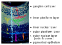
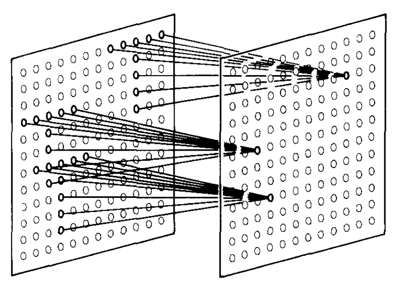

---
jupytext:
  cell_metadata_filter: -all
  formats: md:myst
  text_representation:
    extension: .md
    format_name: myst
    format_version: 0.13
    jupytext_version: 1.16.4
kernelspec:
  display_name: Python 3 (ipykernel)
  language: python
  name: python3
---

# Convolutional Neural Networks (CNNs)

+++

Returning to supervised learning, it's often the case that we want models to take low-level, raw data as input, so that it can discover relevant features for us. Low-level data is often image-like: a rectangular grid of pixels, a hexagonal grid of detector measurements, or some other discretization of a plane or a volume.

Beyond HEP, images are a very common input or output of ML models because photographs and drawings are important to humans. In this section, we'll look at a typical HEP image processing task, and how a neural network topology designed for images can help us.

```{code-cell} ipython3
import numpy as np
import pandas as pd
import matplotlib as mpl
import matplotlib.pyplot as plt

import h5py
import sklearn.datasets
import torch
from torch import nn, optim
```

## Images in HEP

+++

The jet dataset that you used for your [main project](20-main-project.md) is based on 16 hand-crafted features:

```{code-cell} ipython3
list(sklearn.datasets.fetch_openml("hls4ml_lhc_jets_hlf")["data"].columns)
```

Suppose we didn't know that these are a useful way to characterize jet substructure, or suppose that there are better ways not listed here (very plausible!). A model trained on these 16 features wouldn't have as much discriminating power as it could.

At an earlier stage of processing, a jet is a distribution of energy in pseudorapidity ($\eta$) and azimuthal angle ($\phi$), determined from binned tracks or calorimeter measurements that provide their own binning, or from a high-level particle flow procedure. In the `data` directory of [this repository](https://github.com/hsf-training/deep-learning-intro-for-hep), a file named [deep-learning-intro-for-hep/data/jet-images.h5](https://github.com/hsf-training/deep-learning-intro-for-hep/blob/main/deep-learning-intro-for-hep/data/jet-images.h5) contains these images of jets.

```{code-cell} ipython3
with h5py.File("data/jet-images.h5") as file:
    jet_images = file["images"][:]
    jet_labels = file["labels"][:]

jet_label_order = ["g", "q", "t", "w", "z"]
```

There are $80\,000$ images with 20×20 pixels each.

```{code-cell} ipython3
jet_images.shape
```

```{code-cell} ipython3
fig, axs = plt.subplots(4, 4, figsize=(12, 12))

for i, ax in enumerate(axs.flatten()):
    ax.imshow(jet_images[i])
    ax.text(10, 1.5, f"'{jet_label_order[jet_labels[i]]}' jet image", color="white")

plt.show()
```

Each image is different, but the three basic jet types (gluon/light quark, top, and $W$/$Z$ boson) are clearly different in sums over all images:

```{code-cell} ipython3
fig, axs = plt.subplots(5, 1, figsize=(6, 30))

for i, ax in enumerate(axs):
    ax.imshow(np.sum(jet_images[jet_labels == i], axis=0))
    ax.set_title(f"sum of '{jet_label_order[i]}' jet images")

plt.show()
```

Several pre-processing steps have already been taken care of, such as centering all of the jets in the middle of each image and scaling the energies to a common order of magnitude.

```{code-cell} ipython3
fig, ax = plt.subplots()

ax.hist(
    np.mean(jet_images.reshape(-1, 20*20), axis=1),
    bins=100, range=(0, 5), histtype="step",
)
ax.set_xlabel("average energy in each bin (unknown units)")
ax.set_ylabel("counts")

plt.show()
```

## Replace linear transformations with convolutions

+++

Since you know how to make a model with 16-dimensional inputs, you could make a model with each 20×20 pixel image as an input, which is to say, 400-dimensional inputs. The problem is that a fully connected layer from $400$ inputs to $n$ components of a hidden layer would be $400 \times n$ parameters. It gets computationally expensive very quickly.

Just as neural networks were originally inspired by biology, we can take note of another biological feature: neurons in an eye are connected in layers, but only spatially nearby neurons are connected from one layer to the next ([ref](https://webvision.med.utah.edu/)).

{. width="50%"}

We can do the same in an artificial neural network by only connecting spatially nearby vector components from one layer to the next ([ref](https://doi.org/10.1007/BF00344251)):

{. width="50%"}

Remember that the "connections" are components of a linear transformation from one layer to the next. Excluding connections is equivalent to forcing components of the linear transformation to zero, which reduces the set of parameters that need to be varied.

But apart from eliminating probably-unnecessary calculations, this kind of restriction has meaning for images: it is a [convolution](https://en.wikipedia.org/wiki/Convolution) of the image with a small [kernel](https://en.wikipedia.org/wiki/Kernel_(image_processing)), which is a well-known way to extract higher-level information from images.

To demonstrate the action of a kernel, consider this image (taken by me before the CMS experiment was lowered underground):

```{code-cell} ipython3
image = mpl.image.imread("data/sun-shines-in-CMS.png")
```

```{code-cell} ipython3
fig, ax = plt.subplots()

ax.imshow(image)

plt.show()
```

```{code-cell} ipython3
from scipy.signal import convolve2d
```

The convolution of a grayscale version of the image, which is a 480×640 matrix, with a 7×7 [Sobel matrix](https://en.wikipedia.org/wiki/Sobel_operator) produces an image of horizontal edges:

```{code-cell} ipython3
fig, ax = plt.subplots()

convolved_image = convolve2d(
    # grayscale version of the image (sum over the RGB axis)
    np.sum(image, axis=-1),

    # https://stackoverflow.com/a/41065243/1623645
    np.array([
        [-3/18, -2/13, -1/10, 0, 1/10, 2/13, 3/18],
        [-3/13, -2/8 , -1/5 , 0, 1/5 , 2/8 , 3/13],
        [-3/10, -2/5 , -1/2 , 0, 1/2 , 2/5 , 3/10],
        [-3/9 , -2/4 , -1/1 , 0, 1/1 , 2/4 , 3/9 ],
        [-3/10, -2/5 , -1/2 , 0, 1/2 , 2/5 , 3/10],
        [-3/13, -2/8 , -1/5 , 0, 1/5 , 2/8 , 3/13],
        [-3/18, -2/13, -1/10, 0, 1/10, 2/13, 3/18],
    ]),
)

ax.imshow(convolved_image, cmap="gray")

plt.show()
```

```{code-cell} ipython3

```
