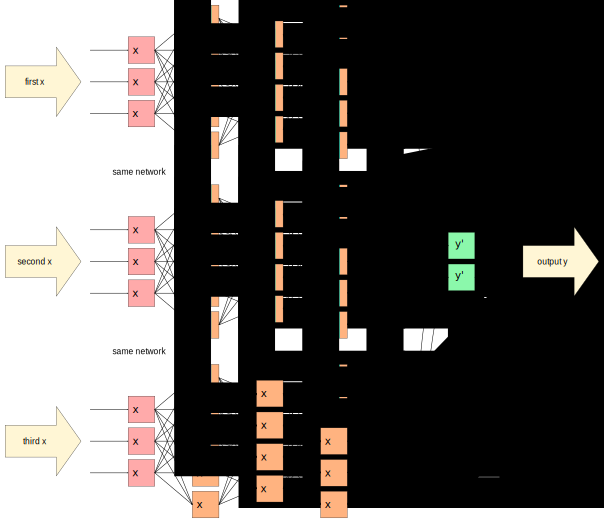
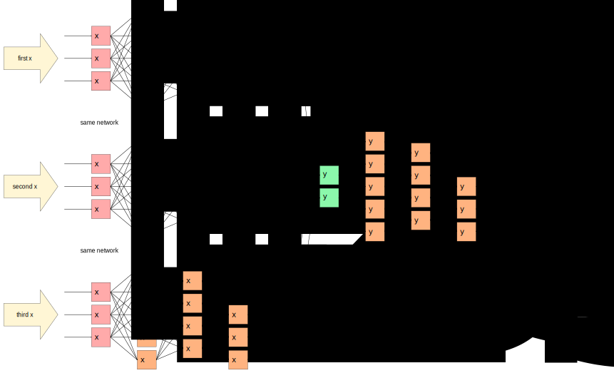
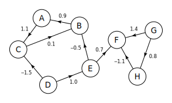

---
jupytext:
  cell_metadata_filter: -all
  formats: md:myst
  text_representation:
    extension: .md
    format_name: myst
    format_version: 0.13
    jupytext_version: 1.16.4
kernelspec:
  display_name: Python 3 (ipykernel)
  language: python
  name: python3
---

# Ragged data and Graph Neural Networks (GNNs)

+++

So far, all of the neural networks we've considered take and return fixed-size vectors as inputs and outputs. However, HEP data _usually_ comes in variable-length lists:

```{code-cell} ipython3
import numpy as np
import awkward as ak
import uproot
```

```{code-cell} ipython3
event_data = uproot.open("data/SMHiggsToZZTo4L.root")["Events"].arrays()
```

```{code-cell} ipython3
event_data.Muon_pt
```

This dataset has 299973 events with a different number of muons in each event, and therefore a different number of muon $p_T$ values in each event. As an array, the second axis has a different number of components in each element of the first axis. This is called a [ragged array or jagged array](https://en.wikipedia.org/wiki/Jagged_array).

How can a neural network accept ragged data? If we're talking about features as vectors $\vec{x}_i$ for $i \in [0, N)$ where $N$ is the number of data points, each $\vec{x}_i$ would have a different number of dimensions. How can we perform a linear transformation from a variable number of dimensions to some other space? Raggedness breaks the whole idea of how a neural network works.

+++

## Pad and truncate

+++

One option is to _force_ the variable-length dimension to be regular. We can assert that the incoming data are $n$-dimensional for some fixed $n$, remove dimensions if there are too many, and insert zeros if there are too few.

Following [this section](https://awkward-array.org/doc/main/user-guide/how-to-restructure-pad.html) of the Awkward Array User Guide, it can be done with [ak.pad_none](https://awkward-array.org/doc/main/reference/generated/ak.pad_none.html) and [ak.fill_none](https://awkward-array.org/doc/main/reference/generated/ak.fill_none.html).

```{code-cell} ipython3
ak.fill_none(ak.pad_none(event_data.Muon_pt, 2, clip=True), 0)
```

The `clip=True` argument of [ak.pad_none](https://awkward-array.org/doc/main/reference/generated/ak.pad_none.html) truncates (removing the third and higher element from each list) while the function pads missing dimensions with `None`. The [ak.fill_none](https://awkward-array.org/doc/main/reference/generated/ak.fill_none.html) function can then replace the `None` values with a chosen value, like `0`. This makes all $\vec{x}_i$ 2-dimensional, which you can see in the data type: `2 * float64` instead of `var * float64`.

Maybe now you want to convert it [ak.to_numpy](https://awkward-array.org/doc/main/reference/generated/ak.to_numpy.html) before passing it to PyTorch to make a tensor. (As of this writing, PyTorch doesn't recognize Awkward Arrays and it slowly iterates over them, rather than converting them in compiled code.)

```{code-cell} ipython3
import torch
```

```{code-cell} ipython3
torch.tensor(ak.to_numpy(
    ak.fill_none(ak.pad_none(event_data.Muon_pt, 2, clip=True), 0)
), dtype=torch.float32)
```

These two input features are the $p_T$ of the first muon and the $p_T$ of the second muon, imputing zeros if either does not exist. Usually, you'll want to use all or many of the particle's attributes as features, so you'll need to [np.stack](https://numpy.org/doc/stable/reference/generated/numpy.stack.html) them together (or, equivalently, create a length-1 axis with [np.newaxis](https://numpy.org/doc/2.1/reference/constants.html#numpy.newaxis) and [np.concatenate](https://numpy.org/doc/stable/reference/generated/numpy.concatenate.html) along the new axis). You would have to do this whether the data are ragged or not.

```{code-cell} ipython3
muon_fields = [name for name in event_data.fields if name.startswith("Muon_")]
muon_fields
```

```{code-cell} ipython3
np.concatenate([event_data[name, :, :, np.newaxis] for name in muon_fields], axis=-1)
```

The array above is 299973 events with a variable number of 11-dimensional feature vectors. You can pad and truncate the above as we did with a single attribute or you can pad and truncate first, then [np.stack](https://numpy.org/doc/stable/reference/generated/numpy.stack.html) the rectangular arrays.

```{code-cell} ipython3
rectangular_arrays = [ak.fill_none(ak.pad_none(event_data[name], 2, clip=True), 0) for name in muon_fields]
rectangular_arrays
```

```{code-cell} ipython3
np.stack(rectangular_arrays, axis=-1)
```

While working this out in your own data, check the first few values of the output to be sure that it's stacking along the axis that you expect. The [np.column_stack](https://numpy.org/doc/stable/reference/generated/numpy.column_stack.html) that we usually use applies to `axis=1`, and this dataset is one level deeper because the first level is "events," the second is "particles," and the third is "particle attributes." (The same warning applies to image data in [Convolutional Neural Networks (CNNs)](24-convolutional.md), which has row pixels, column pixels, and channels as extra levels.) Since we want to concatenate attributes together as the deepest level of nesting, we can use `axis=-1` as a shorthand for "deepest level."

Now that I've shown how to pad and truncate, is it a good idea?

* Padding with zeros or some value that can't appear in the data is not bad, because we're feeding it into a neural network. After training, the neural network will learn to treat the pad value as a special value, possibly by dedicating some ReLU neurons to it to put it in a category by itself.
* Truncating, however, throws away possibly useful information. Moreover, it always throws away values from one end of the list and not the other: if we truncate to 2 muons, the model will never see the 3<sup>rd</sup> or 4<sup>th</sup>, but will always see the 1<sup>st</sup> and 2<sup>nd</sup>. If the muons are sorted in descending $p_T$ and you know that the $n$<sup>th</sup> muon is never relevant when you truncate at $n$, then this can be okay.

+++

## Recurrent Neural Networks (RNNs)

+++

As an alternative, we can consider using a [Recurrent Neural Network (RNN)](https://en.wikipedia.org/wiki/Recurrent_neural_network). In the first section of this course on [Neural networks](05-neural-networks.md), I discussed the general case of a neural network with cycles—neurons that pass data to neurons that comes back to the original neuron—and then dismissed it. Since then, we've only considered graph topologies without cycles.

An RNN feeds data back to itself at a later time. For instance, a network may take $\vec{x}_i$ as input and return $\vec{y}_i$ as output, but then the next input would be some combination of $\vec{x}_{i + 1}$ (the next data point) and $\vec{y}_i$ (the previous output). This has been especially fruitful in text processing, such as an autocomplete engine that takes an 8-dimensional fixed-size vector like

`TO BE OR`

predicts ` NOT` and then is fed

`E OR NOT`

as the next input (which then generates random Shakespeare). Incidentally, this kind of autocomplete application was producing [astonishingly life-like text in 2015](https://karpathy.github.io/2015/05/21/rnn-effectiveness/), 7 years before ChatGPT.

The relevance for HEP is that sets of particles in an event can be thought of as characters in a sentence: a sequence of arbitrary length is ended by an end-of-event token (such as `0` for all attributes), just as a sentence ends with punctuation or a prescribed end-of-message token.

For example, instead of a ragged array like

```{code-cell} ipython3
event_data.Muon_pt
```

we could end each list with `0`,

```{code-cell} ipython3
ak.concatenate([event_data.Muon_pt, np.zeros((len(event_data), 1))], axis=-1)
```

and then [ak.flatten](https://awkward-array.org/doc/main/reference/generated/ak.flatten.html) them into a single stream:

```{code-cell} ipython3
ak.flatten(
    ak.concatenate([event_data.Muon_pt, np.zeros((len(event_data), 1))], axis=-1)
)
```

There are many different types of RNNs—as there are many ways of adding cycles to a graph—but they would all train on data with ragged structure replaced by sequential structure.

+++

## Permutation invariance and data augmentation

+++

The problem with the above approach is that HEP events contain _sets_ of particles and RNNs train on _sequences_. When we give the model artificial information, such as the order of particles in an event, it will attempt to use that information to predict the target. In the best case, the model will learn that this extra information is irrelevant, but that might not happen. The common technique of sorting particles by descending $p_T$ is helpful—the most relevant particles will be at the beginning of each list and the low-energy radiation or spurious, misreconstructed data will be at the end of each list—but small differences in $p_T$ can swap the order of two particles, and the relevance of two particles _to each other_ rarely depends on their having similar $p_T$. For instance, two muons from the same $Z$ boson decay probably have very different $p_T$ values, and muons from a completely different decay will likely be in between.

If our data consists of sets and we represent them as sequences (arrays), then the meaning of those sequences is unchanged by permuting (reordering) their elements. This is a symmetry of the data, and we want it to be a symmetry of the model as well.

One way of imposing a symmetry is to randomly augment the training data. For instance, if we want a jet image model, such as the one from the section on [Convolutional Neural Networks (CNNs)](24-convolutional.md), to not depend on the rotation angle of the jet image, we can randomly rotate images in the training data. In fact, we can increase the size of our training dataset by including copies of the same event with different rotations. Similarly, if we want an image model to be independent of translations (shifting left-right or up-down), we can randomly augment the training data with this symmetry operator as well. The symmetry operator for order is permutation.

Here's how to randomly shuffle ragged arrays, using [ak.num](https://awkward-array.org/doc/main/reference/generated/ak.num.html) to get the number of elements in each list, [np.random.uniform](https://numpy.org/doc/2.1/reference/random/generated/numpy.random.uniform.html) to generate random numbers, [ak.unflatten](https://awkward-array.org/doc/main/reference/generated/ak.unflatten.html) to give the random numbers the same structure as the original data, and [ak.argsort](https://awkward-array.org/doc/main/reference/generated/ak.argsort.html) to sort the random numbers and apply that order to the original data.

```{code-cell} ipython3
counts = ak.num(event_data.Muon_pt)
counts
```

```{code-cell} ipython3
random_per_muon = ak.unflatten(np.random.uniform(0, 1, np.sum(counts)), counts)
random_per_muon
```

```{code-cell} ipython3
indexes = ak.argsort(random_per_muon, axis=-1)
indexes
```

```{code-cell} ipython3
event_data.Muon_pt[indexes]
```

The muon $p_T$ values above are shuffled within each event (but not across events). To shuffle all of the other attributes (`event_data.Muon_eta`, `event_data.Muon_phi`, etc.) with the same order, slice them with the same `indexes` as above.

+++

## Building permutation invariance into the model

+++

Another way to ensure that the model has permutation symmetry is to compute it using only operations that preserve that symmetry. For instance, consider the following:

{. width="100%"}

When we have $n$ muons in an event, we can consider passing the attributes of each one of those $n$ muons into the same neural network, then compute the sum (or minimum, maximum, mean, or other aggregation) of the network's outputs to produce a single fixed-size vector for the next stage of processing. The next stage could be more neural network layers.

The next event might have a different number of muons, but they would each be passed through the network and aggregated the same way. Since the aggregation can take an arbitrary number of inputs and it doesn't priviledge the inputs (the aggregation can't be `first` or `last` or something), a model built from it is automatically permutation invariant.

You might be wondering about the loss of information inherent in aggregating $n$ vectors into $1$ vector. You can compensate for that by making the network increase the number of dimensions from $\vec{x}^{L1}$ to the $\vec{y}$ that gets aggregated. This gives the optimizer wiggle room to preserve information about multiple inputs. The number of dimensions that you should give $\vec{y}$ depends on the average number of inputs $n$, so you'll need to be sure to tune this hyperparameter for a particular training dataset.

To implement this, we'll need aggregation operators that propagate derivatives and can be used in a PyTorch model. [PyTorch Geometric](https://pytorch-geometric.readthedocs.io/en/stable/) is an extension of PyTorch for Graph Neural Networks (GNNs).

```{code-cell} ipython3
from torch_geometric.nn import aggr
```

PyTorch Geometric wants ragged arrays to be expressed as two equal-length [torch.Tensors](https://pytorch.org/docs/stable/tensors.html): one contains the flattened data (`dtype=torch.float32`) and the other contains the index of the list that it originally belonged to (`dtype=torch.int64`).

That is, a ragged array like

```{code-cell} ipython3
event_data.Muon_pt
```

would have to be expanded by broadcasting ([ak.broadcast_arrays](https://awkward-array.org/doc/main/reference/generated/ak.broadcast_arrays.html)) increasing integers made by [np.arange](https://numpy.org/doc/2.1/reference/generated/numpy.arange.html).

```{code-cell} ipython3
ragged_data, ragged_index = ak.broadcast_arrays(
    event_data.Muon_pt,
    np.arange(len(event_data))[:, np.newaxis],
)

flattened_data = torch.tensor(ak.to_numpy(ak.flatten(ragged_data)), dtype=torch.float32)
flattened_index = torch.tensor(ak.to_numpy(ak.flatten(ragged_index)), dtype=torch.int64)
```

After broadcasting, the `ragged_index` has the same list lengths as `ragged_data`, containing duplicated event numbers:

```{code-cell} ipython3
ragged_index
```

While `flattened_index` tells [aggr.SumAggregation](https://pytorch-geometric.readthedocs.io/en/stable/generated/torch_geometric.nn.aggr.SumAggregation.html) how to add the values in `flattened_data` without crossing event boundaries:

```{code-cell} ipython3
aggr.SumAggregation()(flattened_data[:, np.newaxis], flattened_index)
```

The `[:, np.newaxis]` is because PyTorch expects this tensor to be a feature tensor, with a fixed number of attributes in each value. Let's make it one, pulling together both the process of interlacing attribute vectors into a feature vector and creating a ragged index.

```{code-cell} ipython3
ragged_features = [event_data[name, :, :, np.newaxis] for name in muon_fields]

_, ragged_index = ak.broadcast_arrays(event_data["Muon_pt"], np.arange(len(event_data))[:, np.newaxis])

ragged_data = ak.concatenate(ragged_features, axis=-1)

flattened_data = torch.tensor(ak.to_numpy(ak.flatten(ragged_data)), dtype=torch.float32)
flattened_index = torch.tensor(ak.to_numpy(ak.flatten(ragged_index)), dtype=torch.int64)
```

In the above,

* `ragged_features` is a list of ragged arrays (all with the same shape) for each of the muon attributes,
* `ragged_index` is event numbers broadcasted to one of the muon attributes (`"Muon_pt"`),
* `ragged_data` is a ragged array of feature vectors,
* `flattened_data` is a floating-point [torch.Tensor](https://pytorch.org/docs/stable/tensors.html) of feature vectors without event boundaries,
* `flattened_index` is an integer [torch.Tensor](https://pytorch.org/docs/stable/tensors.html) of event numbers for each feature vector.

They can be used in a [aggr.SumAggregation](https://pytorch-geometric.readthedocs.io/en/stable/generated/torch_geometric.nn.aggr.SumAggregation.html) (or any other aggregation) without modification.

```{code-cell} ipython3
result = aggr.SumAggregation()(flattened_data, flattened_index)
result
```

The result of the aggregation has dimensions of: number of events × number of muon attributes.

```{code-cell} ipython3
result.shape
```

Here's an example that passes feature vectors through a neural network, and then passes that into a 20-dimensional aggregation (larger than the 11 dimensions of the muon attributes):

```{code-cell} ipython3
from torch import nn
```

```{code-cell} ipython3
class NeuralNetworkThenSum(nn.Module):
    def __init__(self):
        super().__init__()   # let PyTorch do its initialization first
        self.neural_network = nn.Sequential(
            nn.Linear(11, 15),
            nn.Sigmoid(),
            nn.Linear(15, 20),
            nn.Sigmoid(),
        )
        self.sum = aggr.SumAggregation()

    def forward(self, flattened_data, flattened_index):
        return self.sum(self.neural_network(flattened_data), flattened_index)
```

```{code-cell} ipython3
model = NeuralNetworkThenSum()

model(flattened_data, flattened_index)
```

This fragment can be part of a larger network, such as DeepSets ([ref](https://dl.acm.org/doi/10.5555/3294996.3295098)), Attention ([ref](https://arxiv.org/abs/1409.0473)), or Transformers ([ref](https://dl.acm.org/doi/10.5555/3295222.3295349)).

DeepSets is the simplest: it just applies a few more layers of a standard neural network after the sum:

{. width="100%"}

Applied to sets of particles, the first neural network transforms particle attributes to a [latent space](https://en.wikipedia.org/wiki/Latent_space) representing all particles in the event and the second one transforms this event data to a regression or classification.

+++

## Graph Neural Networks (GNNs)

+++

Just as linear fitting is the first step toward neural networks, DeepSets is the first step toward Graph Neural Networks (GNNs). Whereas a basic neural network takes fixed-size vectors as inputs and DeepSets takes sets of fixed-sized vectors as inputs, GNNs take _graphs_ of fixed-sized vectors as inputs.

In this context, a "[graph](https://en.wikipedia.org/wiki/Graph_(discrete_mathematics))" is an abstract structure made of vertices and edges (not, for instance, a plot of data). Neural networks are computations described as graphs (see all the pictures above, on this page), but what's special about GNNs is that they perform computations on _data_ that are graphs.

DeepSets operates on data that are sets, and a set is just a graph without edges:

| Set | Graph |
|:--:|:--:|
| {. width="100%"} | {. width="100%"} |

DeepSets combines all objects in a single summation, treating all objects equally. GNNs, however, use the edges to assign weights in the summation or otherwise modify the aggregation in an edge-dependent way.

GNNs are a large field of study, and they are particularly useful in HEP because HEP objects are unordered with important interrelationships.
