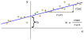
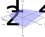

---
jupytext:
  cell_metadata_filter: -all
  formats: md:myst
  text_representation:
    extension: .md
    format_name: myst
    format_version: 0.13
    jupytext_version: 1.16.4
kernelspec:
  display_name: Python 3 (ipykernel)
  language: python
  name: python3
---

# Basic fitting

+++

In this section, we'll start doing some computations, so get a Python interface (terminal, file, or notebook) handy! I'll start with basic fitting, which I assume you're familiar with, and show how neural networks are a generalization of linear fits.

+++

## Linear fitting

+++

Suppose you're given a dataset in which pairs of values, $x_i$ and $y_i$ (indexes $i \in [0, N)$ for $N$ pairs), have an approximate linear relationship.

```{code-cell} ipython3
import numpy as np
import matplotlib.pyplot as plt
```

```{code-cell} ipython3
# uniformly random x values
x = np.random.uniform(-5, 5, 100)

# linear (2 * x + 3) plus normal-distributed noise
y = (2 * x + 3) + np.random.normal(0, 3, 100)
```

```{code-cell} ipython3
fig, ax = plt.subplots()

ax.scatter(x, y, marker="+", color="tab:orange")

None
```

You can write an equation for an exact linear relationship:

$$a \, x + b = y$$

and express the quality of this model as a fit to the data by how close it gets to the actual points:

$$\chi^2 = \sum_i \left[(a \, x_i + b) - y_i\right]^2$$

If $a$ and $b$ are chosen well, the line will go through the middle of the points, like this:

{. width="75%"}

$\chi^2$ will be small because most $(a \, x_i + b)$ are close to the corresponding $y_i$ and their squared difference will be small. You're not given $a$ and $b$: you have to find $a$ and $b$ values that make $\chi^2$ as small as possible. As it turns out, this problem can be solved with an exact formula:

```{code-cell} ipython3
sum1  = len(x)
sumx  = np.sum(x)
sumy  = np.sum(y)
sumxx = np.sum(x**2)
sumxy = np.sum(x * y)
delta = (sum1*sumxx) - (sumx*sumx)

a = ((sum1*sumxy) - (sumx*sumy))  / delta
b = ((sumxx*sumy) - (sumx*sumxy)) / delta
a, b
```

which should be close to $a = 2$ and $b = 3$. Differences from the true values depend on the details of the noise. Regenerate the data points several times and you should see $a$ jump around $2$ and $b$ jump around $3$.

We can also confirm that the line goes through the points:

```{code-cell} ipython3
fig, ax = plt.subplots()

ax.scatter(x, y, marker="+", color="tab:orange")
ax.plot([-5, 5], [a*-5 + b, a*5 + b], color="tab:blue")

None
```

One thing that you should keep in mind is that we're treating the $x$ dimension and the $y$ dimension differently: $\chi^2$ is minimizing differences in predicted $y$ ($a x_i + b$) and measured $y$ ($y_i$): only the _vertical_ differences between points and the line matter. In an experiment, you'd use $x$ to denote the variables you can control, such as the voltage you apply to a circuit, and $y$ is the measured response of the system, like a current in that circuit. In ML terminology, $x$ is a "feature" and $y$ is a "prediction," and this whole fitting process is called "regression."

Now suppose you control two features. The $x$ values are now 2-dimensional vectors and you need a 2-dimensional $a$ parameter to write a linear relationship:

$$\left(\begin{array}{c c}
a^1 & a^2 \\
\end{array}\right) \cdot \left(\begin{array}{c}
x^1 \\
x^2 \\
\end{array}\right) + b = y$$

where $\cdot$ is matrix multiplication. This fits a plane in $x^1$, $x^2$ to 1-dimensional outputs $y$.

{. width="75%"}

Or suppose you have many feature dimensions:

$$\left(\begin{array}{c c c c}
a^1 & a^2 & \cdots & a^n \\
\end{array}\right) \cdot \left(\begin{array}{c}
x^1 \\
x^2 \\
\vdots \\
x^n
\end{array}\right) + b = y$$

and many predicted dimensions:

$$\left(\begin{array}{c c c c}
a^{1,1} & a^{1,2} & \cdots & a^{1,n} \\
a^{2,1} & a^{2,2} & \cdots & a^{2,n} \\
\vdots & \vdots & & \vdots \\
a^{m,1} & a^{m,2} & \cdots & a^{m,n} \\
\end{array}\right) \cdot \left(\begin{array}{c}
x^1 \\
x^2 \\
\vdots \\
x^n
\end{array}\right) + \left(\begin{array}{c}
b^1 \\
b^2 \\
\vdots \\
b^m
\end{array}\right) = \left(\begin{array}{c}
y^1 \\
y^2 \\
\vdots \\
y^m
\end{array}\right)$$

In this general case, you're looking for a best-fit $\hat{a}$ matrix and $\vec{b}$ vector to describe a linear relationship between a set of n-dimensional vectors $\vec{x}_i$ and a set of m-dimensional vectors $\vec{y}_i$.

(By the way, it's sometimes convenient to collect all of our free parameters, $\hat{a}$ and $\vec{b}$, into a single matrix $\hat{A}$ by adding a "fake" dimension to the input features:

$$\left(\begin{array}{c c c c c}
a^{1,1} & a^{1,2} & \cdots & a^{1,n} & b^1 \\
a^{2,1} & a^{2,2} & \cdots & a^{2,n} & b^2 \\
\vdots & \vdots & & \vdots & \vdots \\
a^{m,1} & a^{m,2} & \cdots & a^{m,n} & b^m \\
\end{array}\right) \cdot \left(\begin{array}{c}
x^1 \\
x^2 \\
\vdots \\
x^n \\
1
\end{array}\right) = \left(\begin{array}{c}
y^1 \\
y^2 \\
\vdots \\
y^m
\end{array}\right)$$

This is just a mathematical convenience that we'll use below.)

Since this is still a linear fit and $\chi^2$ is still ordinary least squares:

$$\chi^2 = \sum_i || (\hat{a} \cdot \vec{x}_i + \vec{b}) - \vec{y}_i ||^2$$

the solution is still an exact formula ([see derivation](https://web.stanford.edu/~mrosenfe/soc_meth_proj3/matrix_OLS_NYU_notes.pdf)):

$$\hat{A} = (\hat{X}^T \, \hat{X})^{-1} \, \hat{X}^T \, \hat{Y}$$

where $\hat{X}$ is a matrix of $\vec{x}_i$ features with the "fake" dimension and $\hat{Y}$ is a matrix of $\vec{y}_i$ predictions. In general, you don't need to use this equation directly, since there are libraries that compute linear fits. Scikit-Learn is one:

```{code-cell} ipython3
from sklearn.linear_model import LinearRegression
```

```{code-cell} ipython3
# Scikit-Learn wants an array of vectors, even if they're 1-dimensional
X = x.reshape(len(x), 1)   # or X = x[:, np.newaxis]
y = y

best_fit = LinearRegression().fit(X, y)

(a,) = best_fit.coef_
b = best_fit.intercept_

a, b
```

Or with more dimensions,

```{code-cell} ipython3
# uniformly random 2-D vectors
X = np.random.uniform(-5, 5, (100000, 2))

# true linear relationship (2-D → 3-D)
a_true = np.array([[1.1, 2.2],
                   [3.3, 4.4],
                   [5.5, 6.6]])
b_true = np.array([7.7, 8.8, 9.9])

# linear (a_true · x + b_true) for each x ∈ X plus noise
Y = (X @ a_true.T + b_true) + np.random.normal(0, 1, (100000, 3))
```

```{code-cell} ipython3
best_fit = LinearRegression().fit(X, Y)
```

```{code-cell} ipython3
best_fit.coef_
```

```{code-cell} ipython3
best_fit.intercept_
```

Before we leave linear fitting, I want to point out that getting the indexes right is hard, and that both the mathematical notation and the array syntax hide this difficulty.

* The first of the two fits with Scikit-Learn takes features (`X`) with shape `(100, 1)` and targets (`y`) with shape `(100,)`.
* The second takes features (`X`) with shape `(100000, 2)` and targets (`Y`) with shape `(100000, 3)`.

Scikit-Learn's `fit` function is operating in two modes: the first takes a rank-1 array (the `shape` tuple has length 1) as a set of scalar targets and the second takes a rank-2 array as a set of vector targets. In both cases, Scikit-Learn requires the features to be rank-2, even if its second dimension just has length 1. (Why isn't it just as strict about the targets? I don't know.)

The mathematical notation is just as tricky: in the fully general case, we want to fit n-dimensional feature vectors $\vec{x}_i$ to m-dimensional target vectors $\vec{y}_i$, and we're looking for a best-fit matrix $\hat{A}$ (or a best-fit matrix $\hat{a}$ _and_ vector $\vec{b}$, depending on whether we use the "fake dimension" trick or not). I'm using the word "vector" (with an arrow over the variable) to mean rank-1 and "matrix" (with a hat over the variable) to mean rank-2. Each pair of $\vec{x}_i$ and $\vec{y}_i$ vectors should be close to the

$$\hat{A} \cdot \vec{x}_i = \vec{y}_i$$

relationship and we minimize $\chi^2$ for the whole dataset, summing over all $i$.

This $i$ can be thought of as _another_ dimension, which is why we have a matrix $\hat{X}$ and a matrix $\hat{Y}$ (but still only a matrix $\hat{A}$: the model parameters are not as numerous as the number of data points in the dataset).

In machine learning applications like computer vision, the individual data points are images, which we'd like to think of as having two dimensions. Thus, we can get into higher and higher ranks, and that's why we usually talk about "tensors." It will be worth paying special attention to which dimensions mean what. The notation gets complicated because it's hard to decide where to put all those indexes. In the above, I've tried to consistently put the data-points-in-dataset index $i$ as a subscript and the features/targets-are-vectors index as a superscript, but if we have more of them, then we just have to list them somehow.

A concept that you should _not_ carry over from physics is the idea that tensors are defined by how they transform under spatial rotations—like the inertia tensor, the stress tensor, or tensors in general relativity. These "tensors" are just rectilinear arrays of numbers.

+++

## Non-linear fitting

+++

In physics, we usually try to find a first-principles theory that relates quantities $x$ to measurements $y$. Usually, that theory doesn't predict a _linear_ relationship. For example, the position of a tossed object as a function of time, $y(t)$, is

$$y(t) = y_0 - \frac{1}{\mu} \log \left( \cosh \frac{t - t_0}{t_f} \right)$$

where $y_0$ and $t_0$ are the starting position and time, and $\mu$ and $t_f$ are related to the air resistance.

```{code-cell} ipython3
def y_of_t(t):
    y0, t0, mu, tf = 60, 3, 0.05, 2
    return y0 - (1/mu)*np.log(np.cosh((t - t0)/tf))

def measurement_error(n):
    return np.random.normal(0, 1, n)
```

```{code-cell} ipython3
fig, ax = plt.subplots()

t = np.linspace(0, 10, 50)
y = y_of_t(t) + measurement_error(50)

ax.scatter(t, y, marker=".", color="tab:orange")
ax.errorbar(t, y, 1, fmt="none", color="tab:orange")

ax.set_xlabel("time after release")
ax.set_ylabel("height above ground")

None
```

A linear fit would be a disaster:

```{code-cell} ipython3
best_fit = LinearRegression().fit(t[:, np.newaxis], y)

(linear_slope,) = best_fit.coef_
linear_intercept = best_fit.intercept_
```

```{code-cell} ipython3
fig, ax = plt.subplots()

ax.plot([0, 10], [linear_slope * 0 + linear_intercept, linear_slope * 10 + linear_intercept])

ax.scatter(t, y, marker=".", color="tab:orange")
ax.errorbar(t, y, 1, fmt="none", color="tab:orange")

ax.set_xlabel("time after release")
ax.set_ylabel("height above ground")

None
```

Instead, we use our theoretical knowledge of the shape of the functional form, often called an "ansatz," and consider any unknown magnitudes as free parameters. Unlike a linear fit, there might not be an exact formula to find those parameters—there usually isn't—so we use an algorithm to search the space of free parameters until it minimizes

$$\chi^2 = \sum_i \left[f(x) - y\right]^2$$

In HEP, our favorite search algorithm is implemented by the Minuit library.

```{code-cell} ipython3
from iminuit import Minuit
from iminuit.cost import LeastSquares
```

```{code-cell} ipython3
def ansatz(t, y0, t0, mu, tf):
    return y0 - (1/mu)*np.log(np.cosh((t - t0)/tf))

least_squares = LeastSquares(t, y, 1, ansatz)
minimizer = Minuit(least_squares, y0=100, t0=0, mu=1, tf=5)   # <-- initial guess
minimizer.migrad()

y_from_ansatz = ansatz(t, **{p.name: p.value for p in minimizer.params})
```

```{code-cell} ipython3
fig, ax = plt.subplots()

ax.plot(t, y_from_ansatz)

ax.scatter(t, y, marker=".", color="tab:orange")
ax.errorbar(t, y, 1, fmt="none", color="tab:orange")

ax.set_xlabel("time after release")
ax.set_ylabel("height above ground")

None
```

It's a great fit, but you had to put part of the answer in to get this answer out. First, you had to know the functional form. Suppose you used the formula for the position of a tossed object _without_ air resistance?

$$y(t) = y_0 - \frac{1}{2}g(t - t_0)^2$$

```{code-cell} ipython3
def wrong_ansatz(t, y0, t0, g):
    return y0 - (1/2)*g*(t - t0)**2

least_squares = LeastSquares(t, y, 1, wrong_ansatz)
minimizer = Minuit(least_squares, y0=100, t0=0, g=5)   # <-- initial guess
minimizer.migrad()

y_from_wrong_ansatz = wrong_ansatz(t, **{p.name: p.value for p in minimizer.params})
```

```{code-cell} ipython3
fig, ax = plt.subplots()

ax.plot(t, y_from_wrong_ansatz)

ax.scatter(t, y, marker=".", color="tab:orange")
ax.errorbar(t, y, 1, fmt="none", color="tab:orange")

ax.set_xlabel("time after release")
ax.set_ylabel("height above ground")

None
```

Or suppose you have the right functional form but provided the fitter with a bad initial guess? These are the numbers passed to the `Minuit` object constructor:

```{code-cell} ipython3
def ansatz(t, y0, t0, mu, tf):
    return y0 - (1/mu)*np.log(np.cosh((t - t0)/tf))

least_squares = LeastSquares(t, y, 1, ansatz)
minimizer = Minuit(least_squares, y0=100, t0=100, mu=100, tf=100)   # <-- initial guess
minimizer.migrad()

y_from_ansatz = ansatz(t, **{p.name: p.value for p in minimizer.params})
```

```{code-cell} ipython3
fig, ax = plt.subplots()

ax.plot(t, y_from_ansatz)

ax.scatter(t, y, marker=".", color="tab:orange")
ax.errorbar(t, y, 1, fmt="none", color="tab:orange")

ax.set_xlabel("time after release")
ax.set_ylabel("height above ground")

None
```

```{code-cell} ipython3
assert np.sum((y_from_ansatz - y)**2) > 100
```

The fit might converge to the wrong value or it might fail to converge entirely. (Long-time HEP experimentalists are familiar with these struggles!)

+++

## When to use basic fitting?

+++

If you _do_ know enough to write a (correct) functional form and seed the fit with good starting values, then ansatz fitting is the best way to completely understand a system. Not only is the fitted function an accurate predictor of new values, but the parameters derived from the fit tell you about the underlying reality by filling in numerical values that were missing from the theory. In the above example, we could have used $\mu$ and $t_f$ to derive the force of air resistance on the tossed object—we'd learn something new. In general, all of physics is one big ansatz fit: we hypothesize general relativity and the Standard Model, then perform fits to measurements and learn the values of the constant of universal gravitation, the masses of quarks, leptons, and bosons, the strengths of interactions between them, etc. I didn't show it in the examples above, but fitting procedures can also provide uncertainties on each parameter, their correlations, and likelihoods that the ansatz is correct.

_However_, most scientific problems beyond physics don't have this much prior information. This is especially true in sciences that study the behavior of human beings. What is the underlying theory for a kid preferring chocolate ice cream over vanilla? What are the variables, and what's the functional form? Even if you think that human behavior is determined by underlying chemistry and physics, it would be horrendously complex.

Here's an example: the [Boston Housing Prices](https://www.kaggle.com/datasets/vikrishnan/boston-house-prices) is a classic dataset for regression. The goal is to predict median housing prices in areas around Boston using features like

* proportion of residental land zoned for lots over 25,000 square feet
* proportion of non-retail business acres per town
* whether the area is adjacent to the Charles river (a boolean variable)
* nitric oxides concentration
* average number of rooms per dwelling
* proportion of owner-occupied lots built before 1940
* weighted distances to 5 Boston employment centers
* accessibility to radial highways
* full-value property tax rate
* pupil-teacher ratio in schools

All of these seem like they would have an effect on housing prices, but it's almost impossible to guess which would be more important. Problems like these are usually solved by a generic linear fit of many variables. Unimportant features would have a best-fit slope near zero, and if our goal is to find out which features are most important, we can force unimportant features toward zero with "regularization" (to be discussed in a later section). The idea of ML as "throw everything into a big fit" is close to what you have to do if you have no ansatz, and neural networks are a natural generalization of high-dimensional linear fitting.

In the next section, we'll try to fit arbitrary non-linear _curves_ without knowing an ansatz.
