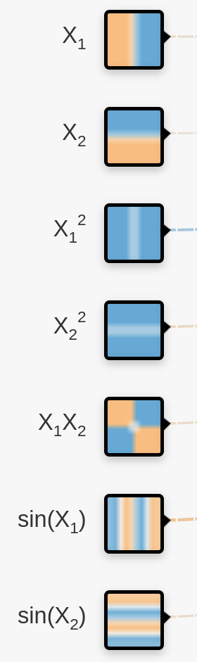

---
jupytext:
  cell_metadata_filter: -all
  formats: md:myst
  text_representation:
    extension: .md
    format_name: myst
    format_version: 0.13
    jupytext_version: 1.16.4
kernelspec:
  display_name: Python 3 (ipykernel)
  language: python
  name: python3
---

# Exercise 1: TensorFlow Playground

+++

For this exercise, go to <a href="https://playground.tensorflow.org/#activation=sigmoid&batchSize=10&dataset=gauss&regDataset=reg-plane&learningRate=0.03&regularizationRate=0&noise=0&networkShape=&seed=0.55534&showTestData=false&discretize=false&percTrainData=50&x=true&y=true&xTimesY=false&xSquared=false&ySquared=false&cosX=false&sinX=false&cosY=false&sinY=false&collectStats=false&problem=classification&initZero=false&hideText=false" target="_blank">playground.tensorflow.org</a> by clicking on the image below.

+++

+++

Press the "play" button to start training the network. The colored background (the model) should progressively become a better fit to the points (the training data).

Next, try each of these exercises:

1. Increase the noise in the data and fit it again.

2. Select the "circle" dataset and attempt to fit it again. Can you fit it if you add hidden layers? What's the smallest number of hidden layers (and nodes) you need to fit the data?

3. Do the same for the "xor" dataset.

4. Do the same for the "spiral" dataset.

5. What if you use different features instead? Repeat 2‒4 using features instead of hidden layers.

6. What about different activation functions?

7. We'll discuss regularization later, but play with it and see if you can figure out what it does. Try making a neural network with too many layers and nodes for a simple problem (such as the linearly separable blobs) and turn on L1 regularization with a mid-range regularization rate. What happens if you let it run for a while?

Other things to explore: the 2 regression problems,

the learning rate,

and the batch size,

Have fun!
