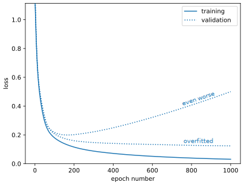

---
jupytext:
  cell_metadata_filter: -all
  formats: md:myst
  text_representation:
    extension: .md
    format_name: myst
    format_version: 0.13
    jupytext_version: 1.16.4
kernelspec:
  display_name: Python 3 (ipykernel)
  language: python
  name: python3
---

# Goodness of fit metrics

+++

So far, we've mostly been fitting datasets with small numbers of dimensions and identifying good or bad fits by eye.

+++

## Ansatz fitting (traditional HEP)

+++

When fitting data with a parameterized functional form, traditional HEP analyses would check that the reduced $\chi^2$,

$$\chi^2 / N_{\mbox{dof}} = \sum_i^N \left[ f(x) - y \right]^2 / N_{\mbox{dof}}$$

is close to 1. The $N_{\mbox{dof}}$, number of degrees of freedom, is the number of data points $N$ minus the number of parameters in the ansatz. This $\chi^2$ is the regression loss function evaluated on training data, and using $N_{\mbox{dof}}$ as the denominator adjusts for the bias that is introduced by judging the fit by how well it performs on training data. Anyway, the number of parameters in the ansatz is always much less than $N$, so overfitting is unlikely.

The "close to 1" criterion can be a little more formal by instead computing the $\chi^2$ probability as $P(\chi^2, N_{\mbox{dof}})$ from

$$P(x, n) = \frac{1}{2^{n/2} \Gamma(n/2)} x^{n/2 - 1} \exp(-x/2)$$

which is available in SciPy as [scipy.stats.chi2](https://docs.scipy.org/doc/scipy/reference/generated/scipy.stats.chi2.html). This probability, when computed for many similar fits, should be nearly uniform between $0$ and $1$, so values that are very close to $0$ are likely underfitted and values that are very close to $1$ are likely overfitted.

+++

## The loss function

+++

For many-parameter ML fits, we need to be more careful about overfitting. In fact, overfitting is the usual case, since the easy way to produce an optimal model is to give it too many parameters and restrict them with regularization.

As we've seen, evaluating the loss function for the training data and the validation data, both as a function of epoch, reveals overfitting by a divergence between these two curves. Usually, the validation loss levels out (overfitting to the training data doesn't help the model generalize), but in principle, overfitting could make the validation loss get _worse_ with epoch.

{. width="75%"}

But let's not stop there.

+++

## Confusion matrix

+++

## Quantities derived from the confusion matrix

+++

## ROC curve

+++

## Area under the ROC curve
