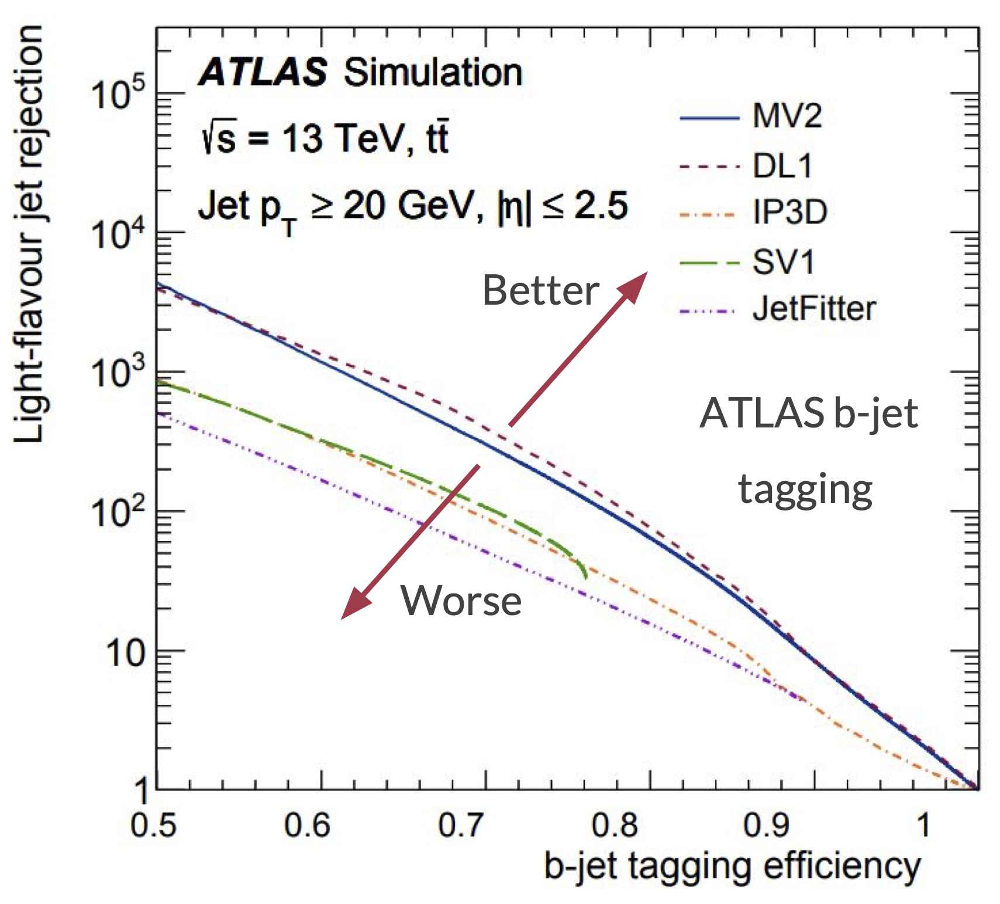

---
jupytext:
  cell_metadata_filter: -all
  formats: md:myst
  text_representation:
    extension: .md
    format_name: myst
    format_version: 0.13
    jupytext_version: 1.16.4
kernelspec:
  display_name: Python 3 (ipykernel)
  language: python
  name: python3
---

# Goodness of fit metrics

+++

So far, we've mostly been fitting datasets with small numbers of dimensions and identifying good or bad fits by eye.

```{code-cell} ipython3
import numpy as np
import pandas as pd
import matplotlib.pyplot as plt
```

## Ansatz fitting (traditional HEP)

+++

When fitting data with a parameterized functional form, traditional HEP analyses would check that the reduced $\chi^2$,

$$\chi^2 / N_{\mbox{dof}} = \sum_i^N \left[ f(x) - y \right]^2 / N_{\mbox{dof}}$$

is close to 1. The $N_{\mbox{dof}}$, number of degrees of freedom, is the number of data points $N$ minus the number of parameters in the ansatz. This $\chi^2$ is the regression loss function evaluated on training data, and using $N_{\mbox{dof}}$ as the denominator adjusts for the bias that is introduced by judging the fit by how well it performs on training data. Anyway, the number of parameters in the ansatz is always much less than $N$, so overfitting is unlikely.

The "close to 1" criterion can be a little more formal by instead computing the $\chi^2$ probability as $P(\chi^2, N_{\mbox{dof}})$ from

$$P(x, n) = \frac{1}{2^{n/2} \Gamma(n/2)} x^{n/2 - 1} \exp(-x/2)$$

which is available in SciPy as [scipy.stats.chi2](https://docs.scipy.org/doc/scipy/reference/generated/scipy.stats.chi2.html). This probability, when computed for many similar fits, should be nearly uniform between $0$ and $1$, so values that are very close to $0$ are likely underfitted and values that are very close to $1$ are likely overfitted.

+++

## The loss function

+++

For many-parameter ML fits, we need to be more careful about overfitting. In fact, overfitting is the usual case, since the easy way to produce an optimal model is to give it too many parameters and restrict them with regularization.

As we've seen, evaluating the loss function for the training data and the validation data, both as a function of epoch, reveals overfitting by a divergence between these two curves. Usually, the validation loss levels out (overfitting to the training data doesn't help the model generalize), but in principle, overfitting could make the validation loss get _worse_ with epoch.

{. width="75%"}

For regression problems, you can also look at the raw residuals,

$$\mbox{residual}_i = f(x_i) - y_i$$

or pulls, which are weighted by uncertainties $\sigma_{y_i}$,

$$\mbox{pull}_i = \left[f(x_i) - y_i\right] / \sigma_{y_i}$$

their mean (the "bias" of the model) and standard deviation (the "resolution" of the model). All of these, however, are components of the $\chi^2$ (for a weighted regression in the case of pulls). It can be useful to break this down, rather than only looking at the $\chi^2 / N_{\mbox{dof}}$ as a summary, but they're all parts of the same thing.

For classification problems, there's another suite of goodness-of-fit measures we can consider.

+++

## Confusion matrix

+++

Story time:

> Once upon a time, a shepherd boy got bored while tending the village's sheep. For fun, he cried, "Wolf!" even though there was no wolf. The villagers ran to protect the sheep, then got mad when they saw that there was no wolf.
>
> The next day, the same thing happened.
>
> The day after that, there really was a wolf and the shepherd cried, "Wolf!" but the villagers refused to be fooled again and didn't help. The wolf ate all the sheep.

Each day, there are two possible truth states:

* there really is a wolf
* there is not wolf

and two possible claims by a model that puports to represent reality (the shepherd boy's utterances):

* he cries, "Wolf!"
* he does not cry, "Wolf!"

Together, they make four combinations, collectively called the **confusion matrix**:

<table width="100%">
    <tr style="background: white;">
        <td align="right"></td>
        <td>&nbsp;</td>
        <td align="center"><b>there is a wolf</b></td>
        <td>&nbsp;</td>
        <td align="center"><b>there is no wolf</b></td>
    </tr>
    <tr style="background: white;">
        <td align="right"><b>he cries, "Wolf!"</b></td>
        <td>&nbsp;</td>
        <td align="center"><br><b>true positive</b></td>
        <td>&nbsp;</td>
        <td align="center"><br><b>false positive</b></td>
    </tr>
    <tr><td><br></td><td><br></td></tr>
    <tr style="background: white;">
        <td align="right"><b>he does not cry, "Wolf!"</b></td>
        <td>&nbsp;</td>
        <td align="center"><br><b>false negative</b></td>
        <td>&nbsp;</td>
        <td align="center"><br><b>true negative</b></td>
    </tr>
</table>

It's easy to get the terminology confused: "positive" and "negative" represent what the model _says_, like the result of a medical test. "True" and "false" specifies whether that test accords with reality or not.

For a concrete example, let's make a linear model that separates orange and blue points in an $x$-$y$ plane:

```{code-cell} ipython3
from sklearn.linear_model import LogisticRegression
```

```{code-cell} ipython3
all_target = np.random.randint(0, 2, 200)

all_xy = np.random.normal(-0.5, 0.75, (len(all_target), 2))
all_xy[all_target == 1] = np.random.normal(0.5, 0.75, (np.count_nonzero(all_target), 2))
```

```{code-cell} ipython3
model = LogisticRegression().fit(all_xy, all_target)
```

```{code-cell} ipython3
fig, ax = plt.subplots(figsize=(5, 5))

def plot_cutoff_decision_at(threshold):
    # compute the three probabilities for every 2D point in the background
    background_x, background_y = np.meshgrid(np.linspace(-3, 3, 100), np.linspace(-3, 3, 100))
    background_2d = np.column_stack([background_x.ravel(), background_y.ravel()])
    probabilities = model.predict_proba(background_2d)
    
    # draw contour lines where the probabilities cross the 50% threshold
    ax.contour(background_x, background_y, probabilities[:, 1].reshape(background_x.shape), [threshold])
    ax.contourf(background_x, background_y, probabilities[:, 1].reshape(background_x.shape), alpha=0.1)
    
    # draw data points on top
    ax.scatter(all_xy[all_target == 0, 0], all_xy[all_target == 0, 1])
    ax.scatter(all_xy[all_target == 1, 0], all_xy[all_target == 1, 1])
    
    ax.axis([-3, 3, -3, 3])

plot_cutoff_decision_at(0.5)

plt.show()
```

In the training data, we know which points are actually orange and actually blue:

```{code-cell} ipython3
actually_blue   = all_xy[all_target == 0]
actually_orange = all_xy[all_target == 1]
```

And we can ask the model which points it says are blue, which we'll label as the "positive" condition, and which are orange, which we'll label as "negative."

```{code-cell} ipython3
def model_says_blue(data_subset):
    return np.sum(model.predict(data_subset) == 0)

def model_says_orange(data_subset):
    return np.sum(model.predict(data_subset) == 1)
```

```{code-cell} ipython3
true_positive  = model_says_blue(actually_blue)
false_positive = model_says_blue(actually_orange)

false_negative = model_says_orange(actually_blue)
true_negative  = model_says_orange(actually_orange)
```

Here's the confusion matrix as an array of counts:

```{code-cell} ipython3
confusion_matrix = np.array([
    [true_positive, false_positive],
    [false_negative, true_negative],
])
confusion_matrix
```

And here it is as an array of fractions:

```{code-cell} ipython3
confusion_matrix / len(all_xy)
```

This is a pretty good model because the diagonal (true positive and true negative) has large numbers, about 0.4, while the off-diagonal (false positive and false negative) has small numbers, about 0.1.

Also note that if you are using fractions, the sum of the matrix is $1$ by construction:

```{code-cell} ipython3
np.sum(confusion_matrix / len(all_xy))
```

## Quantities derived from the confusion matrix

+++

Many goodness-of-fit terms are derived from the binary (2×2) confusion matrix, and some of them have different names in different fields. Here's a summary.

* **Accuracy:** probability of getting the correct result from the model, whether positive or negative.

```{code-cell} ipython3
accuracy = (true_positive + true_negative) / len(all_xy)
accuracy
```

* **Sensitivity:** probability of getting a positive result in cases that are actually positive.

In HEP, this is also called **signal efficiency**.

Yet another term: it's also called **recall** and **true positive rate**.

```{code-cell} ipython3
sensitivity = true_positive / (true_positive + false_negative)
sensitivity
```

* **Specificity:** probability of getting a negative result in cases that are actually negative.

```{code-cell} ipython3
specificity = true_negative / (true_negative + false_positive)
specificity
```

In HEP, there's also **background efficiency**, which is the **false positive rate**.

```{code-cell} ipython3
background_efficiency = false_positive / (true_negative + false_positive)
background_efficiency
```

and its reciprocal, **background rejection**.

```{code-cell} ipython3
background_rejection = 1/background_efficiency
background_rejection
```

Here are some less-used terms:

* **Precision:** probability that a case is actually positive when the model says so.

```{code-cell} ipython3
precision = true_positive / (true_positive + false_positive)
precision
```

* **F₁ score:** harmonic mean of precision and recall.

```{code-cell} ipython3
f1_score = 2 / (1/precision + 1/sensitivity)
f1_score
```

The F₁ score ranges from 0 (worst) to 1 (best), and there is a [family of Fᵦ scores](https://en.wikipedia.org/wiki/F-score), defined with different weights.

+++

## ROC curve

+++

Returning to the Boy Who Cried Wolf, the 4 outcomes are not equally good or bad. Public scorn is not as bad as all the sheep being eaten, so if the shepherd boy has any doubt about whether a wolf-like animal is really a wolf, he should err on the side of calling it a wolf.

Suppose that we really want to catch as many blue (positive) points as possible, and we're willing to accept some contamination of orange (negative). Instead of cutting the model at its 50% threshold, perhaps we should cut it at its 90% threshold:

```{code-cell} ipython3
fig, ax = plt.subplots(figsize=(5, 5))

plot_cutoff_decision_at(0.9)

plt.show()
```

Similarly, we can get a confusion matrix for this looser threshold:

```{code-cell} ipython3
def matrix_for_cutoff_decision_at(threshold):
    actually_blue   = all_xy[all_target == 0]
    actually_orange = all_xy[all_target == 1]

    def model_says_blue(data_subset):
        return np.sum(model.predict_proba(data_subset)[:, 0] > threshold)

    def model_says_orange(data_subset):
        return np.sum(model.predict_proba(data_subset)[:, 0] <= threshold)

    true_positive  = model_says_blue(actually_blue)
    false_positive = model_says_blue(actually_orange)

    false_negative = model_says_orange(actually_blue)
    true_negative  = model_says_orange(actually_orange)

    return np.array([
        [true_positive, false_positive],
        [false_negative, true_negative],
    ])
```

A loose 90% threshold allows more false negatives (bottom left) in order to reduce the false positives (top right):

```{code-cell} ipython3
matrix_for_cutoff_decision_at(0.9) / len(all_xy)
```

A tight 10% threshold allows more false positives (top right) in order to reduce the false negatives (bottom left):

```{code-cell} ipython3
matrix_for_cutoff_decision_at(0.1) / len(all_xy)
```

With just two categories, the sum of this matrix is still 1, for any threshold.

```{code-cell} ipython3
np.sum(matrix_for_cutoff_decision_at(0.1) / len(all_xy))
```

To summarize all of this in one plot, we can vary the threshold from 0% to 100% and plot the true positive rates versus the false positive rates. This is called a Receiver Operating Characteristic (ROC) curve for historical reasons.

```{code-cell} ipython3
true_positive_rates = []
false_positive_rates = []

for threshold in np.linspace(0, 1, 1000):
    ((true_positive, false_positive),
     (false_negative, true_negative)) = matrix_for_cutoff_decision_at(threshold)

    true_positive_rates.append(true_positive / (true_positive + false_negative))
    false_positive_rates.append(false_positive / (true_negative + false_positive))
```

```{code-cell} ipython3
fig, ax = plt.subplots(figsize=(5, 5))

ax.plot(false_positive_rates, true_positive_rates)

ax.grid(True, linestyle=":")

ax.set_xlabel("false positive rate")
ax.set_ylabel("true positive rate")

plt.show()
```

Some properties of the ROC curve:

* It has endpoints at $(0, 0)$, the tightest threshold that doesn't recognize any inputs as "positive," and at $(1, 1)$, the loosest threshold that recognizes all inputs as "positive."
* The better a model is, the closer it gets to $(0, 1)$ (zero false positive rate and perfect true positive rate).
* If the model is completely uninformative—randomly guessing—then the ROC curve is a horizontal line from $(0, 0)$ to $(1, 1)$. (For finite datasets, it's a noisy horizontal line: it only approaches a perfect diagonal when evaluated on very large datasets.)
* If you plot the ROC curve with higher resolution than the size of the dataset it is evaluated on, as above, it consists of horizontal and vertical segments as the threshold curve scans across individual points (of the two categories).
* Be sure to plot the ROC curve using the validation dataset while tuning hyperparameters and only use the test dataset after the model is fixed.

For completeness, let's see the ROC curves for a perfect model (always correct) and a model that randomly guesses.

```{code-cell} ipython3
def matrix_for_perfect_model(threshold):
    actually_blue   = all_xy[all_target == 0]
    actually_orange = all_xy[all_target == 1]

    true_positive  = len(actually_blue)
    false_negative = 0

    true_negative  = len(actually_orange)
    false_positive = 0

    return np.array([
        [true_positive, false_positive],
        [false_negative, true_negative],
    ])

def matrix_for_random_model(threshold):
    actually_blue   = all_xy[all_target == 0]
    actually_orange = all_xy[all_target == 1]

    true_positive  = np.sum(np.random.uniform(0, 1, len(actually_blue)) > threshold)
    false_negative = len(actually_blue) - true_positive

    true_negative  = np.sum(np.random.uniform(0, 1, len(actually_orange)) <= threshold)
    false_positive = len(actually_orange) - true_negative

    return np.array([
        [true_positive, false_positive],
        [false_negative, true_negative],
    ])

perfect_true_positive_rates = []
perfect_false_positive_rates = []

for threshold in np.linspace(0, 1, 1000):
    ((true_positive, false_positive),
     (false_negative, true_negative)) = matrix_for_perfect_model(threshold)

    perfect_true_positive_rates.append(true_positive / (true_positive + false_negative))
    perfect_false_positive_rates.append(false_positive / (true_negative + false_positive))

random_true_positive_rates = []
random_false_positive_rates = []

for threshold in np.linspace(0, 1, 1000):
    ((true_positive, false_positive),
     (false_negative, true_negative)) = matrix_for_random_model(threshold)

    random_true_positive_rates.append(true_positive / (true_positive + false_negative))
    random_false_positive_rates.append(false_positive / (true_negative + false_positive))
```

```{code-cell} ipython3
fig, ax = plt.subplots(figsize=(5, 5))

ax.plot(false_positive_rates, true_positive_rates)
ax.scatter(random_false_positive_rates, random_true_positive_rates, marker=".", color="orange")
ax.scatter(perfect_false_positive_rates, perfect_true_positive_rates, s=200, marker="*", color="magenta")

ax.grid(True, linestyle=":")

ax.set_xlabel("false positive rate")
ax.set_ylabel("true positive rate")

ax.legend(["optimized model", "random guessing", "perfect model"])

plt.show()
```

In HEP analyses, it's usually more important to exclude background events than to accept signal, since we're usually interested in extremely rare processes. Therefore, ROC curves are plotted differently, often employing logarithmic axes and background rejection, the reciprocal of false positive rate. Here is an example that compares the quality of several models for identifying $b$-jets ("$b$-jet tagging efficiency" is true positive rate, so the axes are also swapped):

{. width="75%"}

+++

## Area under the ROC curve

+++

The ROC curve summarizes the tradeoff between accepting more signal and rejecting more background on a single plot. But can we get it in a single number?

On a plane in which ROC curves that reach higher are better, the Area Under the Curve (AUC) is higher for good models and lower for bad models:

$$ \mbox{AUC} = \int_0^1 \mbox{ROC}(x) \, dx $$

A perfect model has an AUC of exactly $1$. Here's how our optimized model fares:

```{code-cell} ipython3
sorted_indexes = np.argsort(false_positive_rates)
sorted_x = np.array(false_positive_rates)[sorted_indexes]
sorted_y = np.array(true_positive_rates)[sorted_indexes]

np.trapz(sorted_y, sorted_x, 0.001)
```

A randomly guessing model should be close to $0.5$ (exactly $0.5$ in the limit of infinitely large datasets):

```{code-cell} ipython3
sorted_indexes = np.argsort(random_false_positive_rates)
sorted_x = np.array(random_false_positive_rates)[sorted_indexes]
sorted_y = np.array(random_true_positive_rates)[sorted_indexes]

np.trapz(sorted_y, sorted_x, 0.001)
```

## More than two categories

+++

With $n$ categories, our confusion matrix becomes $n \times n$, since the model can report any category $c_i$ for any actual category $c_j$. As before, a good model has large numbers on the diagonal (reported category is the actual category).

Let's see this with our penguins.

```{code-cell} ipython3
penguins_df = pd.read_csv("data/penguins.csv")

categorical_int_df = penguins_df.dropna()[["bill_length_mm", "bill_depth_mm", "species"]]
categorical_int_df["species"], code_to_name = pd.factorize(categorical_int_df["species"].values)

# Pre-normalize the data so we can ignore that part of modeling
feats = ["bill_length_mm", "bill_depth_mm"]
categorical_int_df[feats] = (
    categorical_int_df[feats] - categorical_int_df[feats].mean()
) / categorical_int_df[feats].std()

features = categorical_int_df[feats].values
targets = categorical_int_df["species"].values
```

```{code-cell} ipython3
from sklearn.linear_model import LogisticRegression
```

```{code-cell} ipython3
best_fit = LogisticRegression(penalty=None).fit(features, targets)
```

```{code-cell} ipython3
fig, ax = plt.subplots(figsize=(5, 5))

# compute the three probabilities for every 2D point in the background
background_x, background_y = np.meshgrid(np.linspace(-3, 3, 100), np.linspace(-3, 3, 100))
background_2d = np.column_stack([background_x.ravel(), background_y.ravel()])
probabilities = best_fit.predict_proba(background_2d)

# draw contour lines where the probabilities cross the 50% threshold
ax.contour(background_x, background_y, probabilities[:, 0].reshape(background_x.shape), [0.5])
ax.contour(background_x, background_y, probabilities[:, 1].reshape(background_x.shape), [0.5])
ax.contour(background_x, background_y, probabilities[:, 2].reshape(background_x.shape), [0.5])

ax.scatter(features[targets == 0, 0], features[targets == 0, 1])
ax.scatter(features[targets == 1, 0], features[targets == 1, 1])
ax.scatter(features[targets == 2, 0], features[targets == 2, 1])

ax.set_xlim(-3, 3)
ax.set_ylim(-3, 3)
ax.set_xlabel("scaled bill length (unitless)")
ax.set_ylabel("scaled bill depth (unitless)")

plt.show()
```

Now the model is 3×3.

```{code-cell} ipython3
def matrix_for_penguins(threshold):
    actually_Adelie = features[targets == 0]
    actually_Gentoo = features[targets == 1]
    actually_Chinstrap = features[targets == 2]
    
    def model_says_Adelie(data_subset):
        return np.sum(best_fit.predict_proba(data_subset)[:, 0] > threshold)
    
    def model_says_Gentoo(data_subset):
        return np.sum(best_fit.predict_proba(data_subset)[:, 1] > threshold)
    
    def model_says_Chinstrap(data_subset):
        return np.sum(best_fit.predict_proba(data_subset)[:, 2] > threshold)

    return np.array([
        [model_says_Adelie(actually_Adelie), model_says_Adelie(actually_Gentoo), model_says_Adelie(actually_Chinstrap)],
        [model_says_Gentoo(actually_Adelie), model_says_Gentoo(actually_Gentoo), model_says_Gentoo(actually_Chinstrap)],
        [model_says_Chinstrap(actually_Adelie), model_says_Chinstrap(actually_Gentoo), model_says_Chinstrap(actually_Chinstrap)],
    ])
```

```{code-cell} ipython3
matrix_for_penguins(0.5)
```

Since this is a good model, the diagonals are much larger than the off-diagonals.

The matrix also has a fractional form,

```{code-cell} ipython3
matrix_for_penguins(0.5) / len(features)
```

but the sum is not always $1$:

```{code-cell} ipython3
np.sum(matrix_for_penguins(0.99) / len(features))
```

Not all of the quantities in the suite of definitions are still meaningful with multiple categories, but a few are.

```{code-cell} ipython3
[[AA, AG, AC],
 [GA, GG, GC],
 [CA, CG, CC]] = matrix_for_penguins(0.5)
```

Accuracy is a sum along the diagonal:

```{code-cell} ipython3
accuracy = (AA + GG + CC) / len(features)
accuracy
```

Each category has its own sensitivity and specificity:

```{code-cell} ipython3
sensitivity_A = AA / (AA + GA + CA)
sensitivity_G = GG / (AG + GG + CG)
sensitivity_C = CC / (AC + GC + CC)

sensitivity_A, sensitivity_G, sensitivity_C
```

```{code-cell} ipython3
specificity_A = (GG + GC + CG + CC) / (AG + AC + GG + GC + CG + CC)
specificity_G = (AA + AC + CA + CC) / (GA + GC + AA + AC + CA + CC)
specificity_C = (AA + AG + GA + GG) / (CA + CG + AA + AG + GA + GG)

specificity_A, specificity_G, specificity_C
```

But that's because, for each category, we're labeling that category as "positive" and all the other categories as "negative" to compute the binary sensitivity and specificity. In general, we can always label a subset of the categories as positive and the rest as negative to talk about it in binary classification terms.

Now you have everything that you need to do the main project.
