# History of HEP and ML

The purpose of this section is to show that particle physics, specifically High Energy Physics (HEP), has always needed ML. It is not a fad: ML (in a usable form) would have brought major benefits to HEP at any stage in its history. It's being applied to many problems in HEP now because it's just becoming _possible_ now.

{. width="40%"}

## HEP, computation, and big data

Big data processing has always been an essential part of HEP, since the beginning of the field. The late 1940's/1950's can be called the "beginning" of HEP because that's when it acquired the characteristics that define it today:

1. Physicists in this era used accelerators to collide subatomic particles with more energy and higher flux than is observed in nature. Then, as now, cosmic rays produce _higher_-energy collisions than can be produced by accelerators, but accelerators are needed to produce enough collisions in one place to study them in detail. Ernest Lawrence's large team at Berkeley (dozens of scientists) invented a series of ever-larger accelerators in the 1930's, but it was in the late 1940's that accelerators started to be built around the world as the preferred tool of discovery.
2. These collisions produced new particles to discover, for any type of particle whose mass is less than the center-of-mass energy of the collision (with additional constraints from quantum numbers). In the first few decades, the accelerated particles were driven into stationary targets, rather than two colliding beams. However, the goal of the experiments was to produce particles that can't ordinarily be found in nature and study their properties, just as it is now.
3. Computers quantified particle trajectories, reconstructed invisible (neutral) particles, and rejected backgrounds, for as many collision events as possible.

The last point is the one I want to highlight: high energy physicists started using computers as soon as they became available. For example, Luis Alvarez's group at Berkeley's \$9 million Bevatron built a \$1.25 million detector experiment and bought a \$0.2 million IBM 650 to analyze the data in 1955 ([ref](https://www2.lbl.gov/Science-Articles/Research-Review/Magazine/1981/81fchp6.html)). Computers were a significant fraction of the already large costs, and yet analysis productivity was still limited by processing speed.

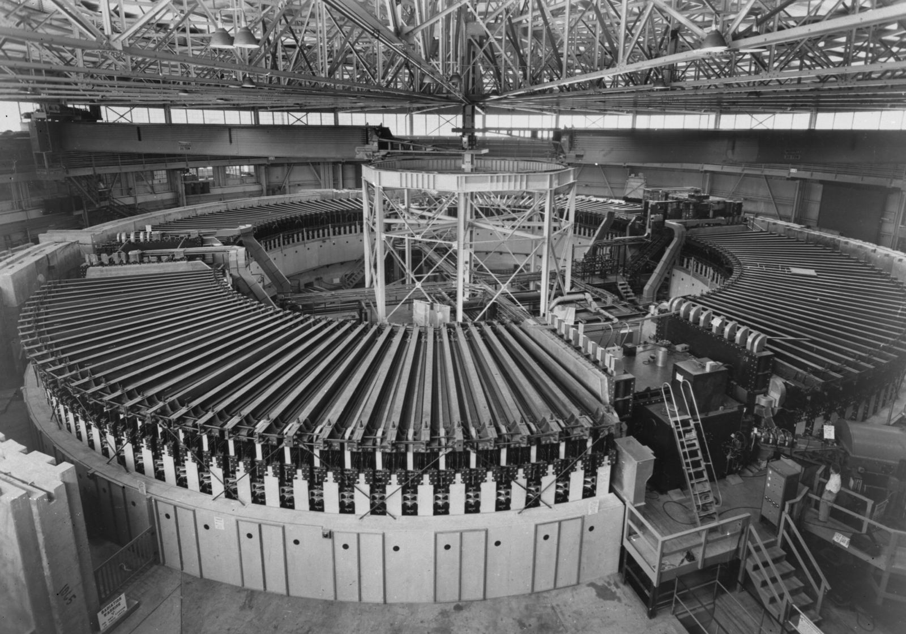{. width="31%"} 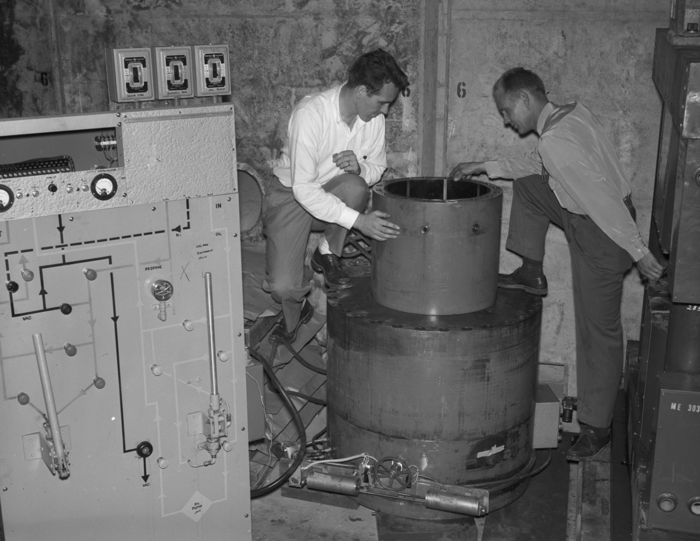{. width="28%"} 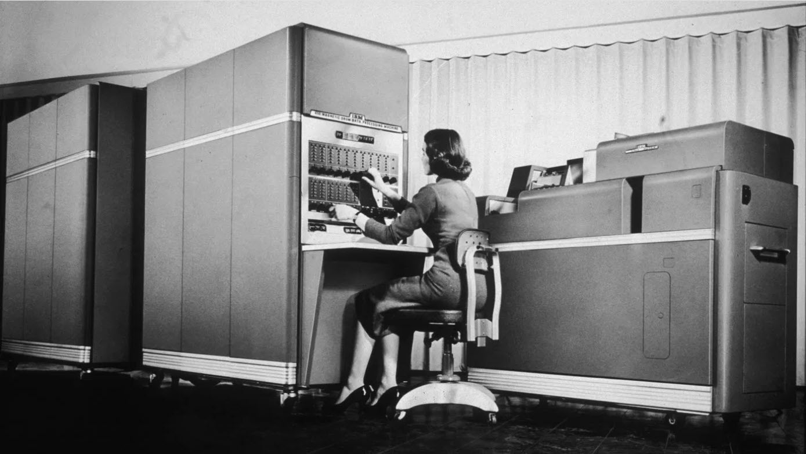{. width="39%"}

The limitation was algorithmic: physicists wanted to compute kinematics of the observed particles, which is an easy program to write (just a formula), but the particles were observed as images, which are hard to convert into trajectories. Something had to find the locations of the line segments and endpoints in the photograph. For the first 10‒20 years, that "something" was people: humans, mostly women, identified the vertices and trajectories of tracks in bubble chamber photos on specially designed human-computer interfaces (see [ref](https://www.physics.ucla.edu/marty/HighEnergyPhysics.pdf) for a first-hand account).

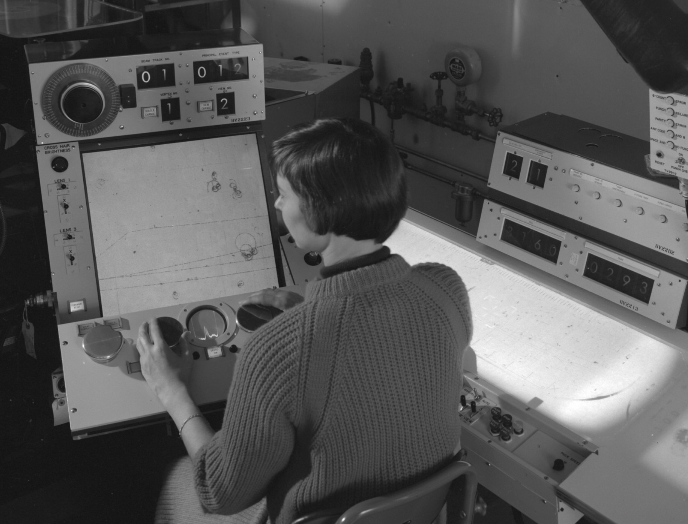{. width="49%"}{. width="47.4%" align="right"}

This is a pattern-recognition task—if ML had been available (in a usable form) in the 1950's, then it would have been better than using humans for this task. Moreover, humans couldn't keep up with the rate. Then as now, the quality of the results—discovery potential and statistical precision—scales with the number of analyzed events: the more, the better. The following plot (from <a href="https://books.google.de/books?id=imidr-iFYCwC&lpg=PA129&dq=jack%20franck%20franckenstein&pg=PA130#v=onepage&q&f=false">ref</a>) was made to quantify the event interpretation rate using different human-computer interfaces.

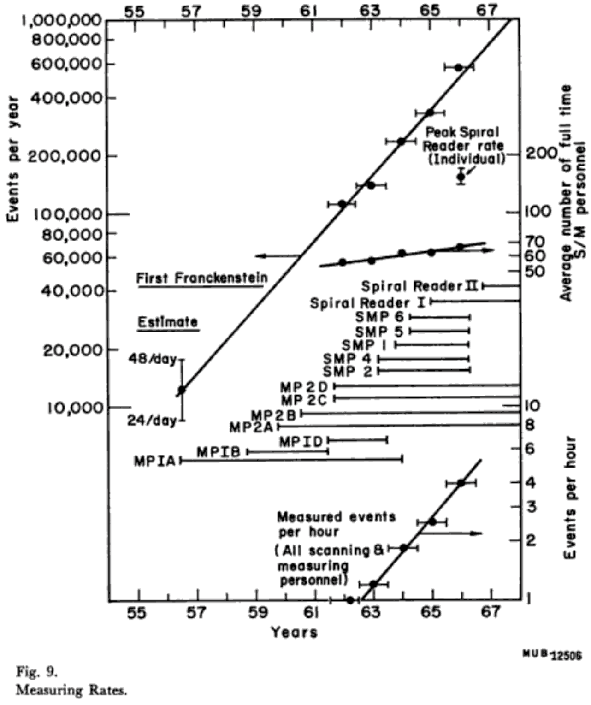{. width="60%"}

Below, I extended the plot to the present day: the number of events per second has continued to increase exponentially.

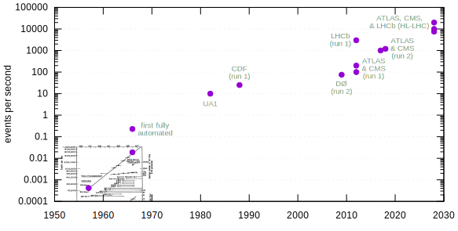{. width="100%"}

These event rates have been too fast for humans since the 1970's, when human scanners were replaced by heuristic track-finding routines, usually by hand-written algorithms that iterate through all combinations within plausible windows (which are now a bottleneck in high track densities).

Although many computing tasks in particle physics are suitable for hand-written algorithms, the field also has and has always had tasks that are a natural fit for ML and artificial intelligence, to such an extent that human intelligence was enlisted to solve them. While ML would have been beneficial to HEP from the very beginning of the field, algorithms and computational resources have only recently made it possible.

## Symbolic AI and connectionist AI

AI has had a rocky history, driven by competition between two philosophies that have been called "symbolic" (or "[GOFAI](https://en.wikipedia.org/wiki/GOFAI): Good Old Fashioned AI") and "connectionist."

Symbolic AI consists of hand-written algorithms, which today wouldn't be called AI. In fact, it was a joke that once a human-like problem had been solved by computer, at that point [it ceases to be AI](https://quoteinvestigator.com/2024/06/20/not-ai/). The problems that went through this cycle include:

* parsing the source code of a high-level programming language,
* checking the proof of a theorem, and later, searching for proofs,
* playing chess and other games by truncated searches through all possible games,
* expert systems and fuzzy database searches.

Symbolic AI is called "symbolic" because the starting point is a system of abstract symbols and rules—like programming in general. An associated philosophical idea is that this is the starting point for intelligence itself: human and artificial intelligence consists in manipulating propositions like an algebra. Mathematician-philosophers like George Boole, Gottlob Frege, and Bertrand Russell formulated these as "the laws of thought".

Connectionist AI makes a weaker claim about what happens in an intelligent system (human or artificial): only that the system's inputs and outputs are correlated appropriately, and an intricate network of connections can implement that correlation. As we'll see, neural networks are an effective way to implement it, and they were (loosely) inspired by the biology of human brains. The idea that we can only talk about the inputs and outputs of human systems, without proposing symbols as entities in the mind, was a popular trend in psychology called Behaviorism in the first half of the 20th century. Today, Cognitive Psychologists can measure the scaling time and other properties of algorithms in human minds, so Behaviorism is out of favor. But it's ironic that large language models like ChatGPT are an implementation of what Behaviorists proposed as a model of human intelligence a century ago.

Although connectionist systems like neural networks don't start with propositions and symbols, something like these structures may form among the connections as the most effective way to produce the desired outputs, similar to emergent behavior in dynamical systems. Practitioners of explainable AI (xAI) try to find patterns like these in trained neural networks—far from treating a trained model as a black box, they treat it as a natural system to study!

## AI's summers and winters

Connectionism started early: Warren McCulloch and Walter Pitts described a formalism for neural networks in 1943 ([ref](https://doi.org/10.1007/BF02478259)), while the first digital computers were still being invented. Frank Rosenblatt built a working model and demonstrated it to the U.S. Navy in 1958 ([ref](https://doi.org/10.1037/h0042519), [retrospective](https://news.cornell.edu/stories/2019/09/professors-perceptron-paved-way-ai-60-years-too-soon)). In modern terms, the architecture was already multi-layer: a 20×20 input grid fed into a 512-node hidden layer, which fed into an 8-node output layer ([ref](https://en.wikipedia.org/wiki/Perceptron#Mark_I_Perceptron_machine)).

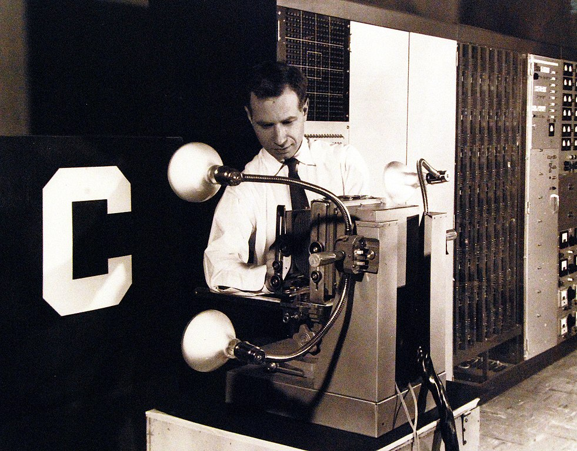{. width="47%"} 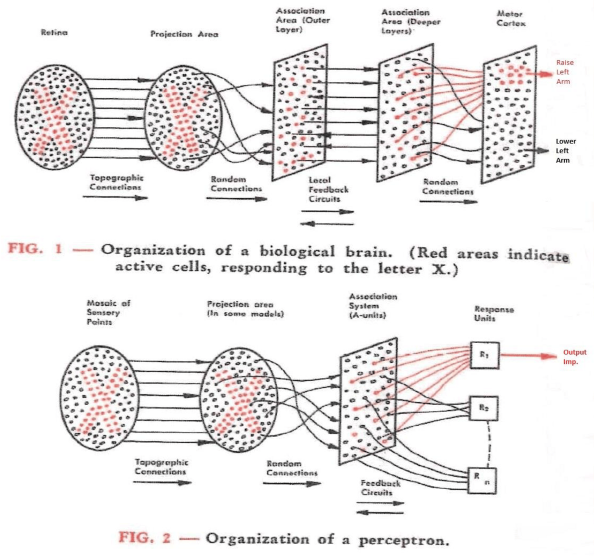{. width="45%"}

These early attempts were only moderately successful, but those who were excited about the technology made extravagant claims about what they were doing and what they would be able to do in the near future ([ref](https://www.nytimes.com/1958/07/13/archives/electronic-brain-teaches-itself.html?smid=url-share)). When those claims fell short, so did the funding. The backlash against the first perceptron machines, as well as automated language translation, led to a period of reduced funding called the first "winter" of AI in the 1970's.

The second wave ("summer") of AI was commercial, rather than academic-with-military-applications. In the early 1980's, programs called "expert systems" were promoted as a way for humans to query domain-specific knowledge using natural language or fuzzy searches. Unfortunately, it was hard to encode common-sense variations using hand-written algorithms, so these projects were short-lived. Neural networks were revived as researchers recognized the importance of developing specialized network topologies, such as the Convolutional Neural Network (CNN) for recognizing images. Still more needed to be done before these systems became practical, and AI entered a second winter in the 1990s.

From that point until about 2015, AI research has continued, shifting more toward connectionist systems. Since the term "artificial intelligence" was out of favor, synonyms like "data mining" and "machine learning" were used instead. Dramatic advances in deep learning (neural networks with many layers) revived the field around 2015, and we're still seeing the effects of this rise.

We can see this whole story at a glace through the frequency of terms used to describe it in books:

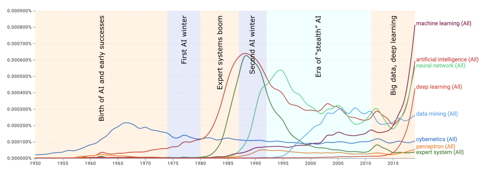{. width="100%"}

<a href="https://books.google.com/ngrams/graph?content=cybernetics%2Cartificial+intelligence%2Cexpert+system%2Cperceptron%2Cneural+network%2Cmachine+learning%2Cdata+mining%2Cdeep+learning&year_start=1950&year_end=2019&case_insensitive=true&corpus=en-2019&smoothing=0">The above search</a> in Google Books's Ngram Viewer shows the rise and fall of the following terms:

* "Cybernetics", an interdisciplinary movement in the 1940's focusing on feedback mechanisms for controlling electronics and biological systems. Warren McCulloch and Walter Pitts's mathematical model of neurons, the foundation of neural networks, was a part of this movement.
* "Artificial intelligence", coined by John McCarthy at the 1956 Dartmouth Workshop to distance the field from cybernetics ([ref](https://en.wikipedia.org/wiki/Dartmouth_workshop)). He believed that cybernetics focused too much on analog feedback, rather than the new digital computers and their ability to manipulate explicit symbols.
* "Expert systems", which brought AI into the commercial sector in the 1980's, though it was short-lived.
* "Perceptron" and "neural network" describe a single artificial neuron and a whole artificial brain, respectively. Frank Rosenblatt and his critics used the word "perceptron"; the later use of "neural networks" emphasizes the multi-layered approach that is essential for solving non-linear problems (as we'll see in the next chapter).
* "Machine learning" and "data mining" at first focused on limiting the use of AI for data analysis, rather than emulating human-like intelligence, but now "machine learning" has become synonymous with "artificial intelligence".
* "Deep learning" refers to neural networks with many hidden layers, a major innovation that contributed to the resurgence of the field around 2015.

The most recent decline and resurgence of AI is also visible in attendance of AI conferences from 1985 to the present ([source](https://aiindex.stanford.edu/report/)):

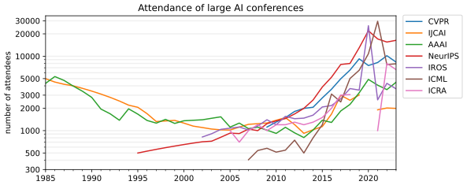{. width="100%"}

More importantly for us, AI was adopted in experimental particle physics, starting in the late 1980's ([ref](https://doi.org/10.1016/0010-4655(88)90004-5), [ref](https://doi.org/10.1016/0168-9002(89)91300-4), [ref](https://inspirehep.net/literature/277470), [ref](https://doi.org/10.1016/0010-4655(89)90267-1), [ref](https://doi.org/10.1016/0168-9002(90)91491-S), and [retrospective](https://indico.ijclab.in2p3.fr/event/5999/timetable/#77-origins-of-ai-in-high-energ)). It's visible in talks at CHEP (Computing in High Energy Physics), in which about 5% of the titles and abstracts from 1989 to 1997 matched "neural" or "NN" as a word. The synonyms "ML", "machine-learning", and "deep-learning" (with or without the hyphen) didn't appear until the resurgence of interest after 2015.

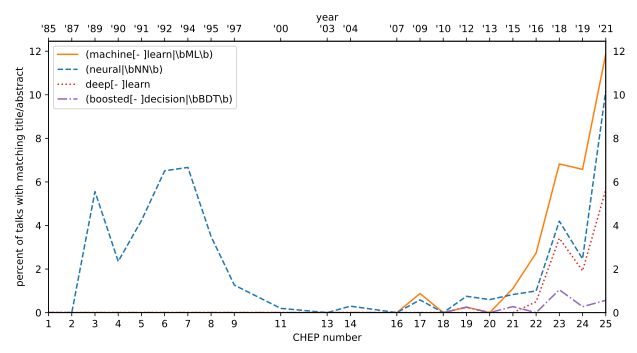{. width="100%"}

Clearly, the physicists' interests are following the developments in computer science, including the latest "winter." From personal experience, I know that Boosted Decision Trees (BDTs) were popular in the gap between the 2000 and 2015, but they rarely appear in CHEP conference talks. (Perhaps they were less exciting...)

The 2024 Nobel Prize in Physics has drawn attention to connections between the theoretical basis of neural networks and statistical mechanics—particularly John Hopfield's memory networks (which have the same mathematical structure as Ising spin-glass systems in physics) and Geoffrey Hinton's application of simulated annealing to training Hopfield and restricted Boltzmann networks (gradually reducing random noise in training to find a more global optimum). However, this connection is distinct from the application of neural networks to solve experimental physics problems—which seemed promising in the 1990's and is yielding significant results today.

## Conclusion

HEP has always needed ML. Since the beginning of the HEP as we know it, high energy physicists have invested heavily in computing, but their problems could not be solved without human intelligence in the workflow, which doesn't scale to large numbers of collision events. Today, we're finding that many of the hand-written algorithms from the decades in which AI was not ready are less efficient and less capable than connectionist AI solutions, especially deep learning.

Meanwhile, the prospect of connectionist AI has been unclear until very recently. Interest and funding vacillated throughout its history (including a [brief dip in 2020‒2022](https://en.wikipedia.org/wiki/AI_winter#AI_spring_(2015%E2%80%932020)_followed_by_a_short_winter_(2020%E2%80%932022)), before ChatGPT) as hype alternated with pessimism. Given this history, one could find examples to justify either extreme: it has been heavily oversold and undersold.

Experimental particle physicists followed these trends, at least in the last cycle, since the neural networks of the 1990's seemed promising, but ultimately not as effective as BDTs. Things changed when the state of the art in AI reached a new level around 2015. We still haven't exhausted the consequences of these recent advancements and AI capabilities don't seem to be leveling off into a plateau again, at least not yet.

Although we should avoid using AI beyond its reasonable applications—that is, problems in which an exact solution or functional form is known, problems that suggest a specific algorithm that could be hand-written, or systems that need to be controlled without surprising special cases—the range of _good_ problems for AI in HEP is broad and not fully explored.
