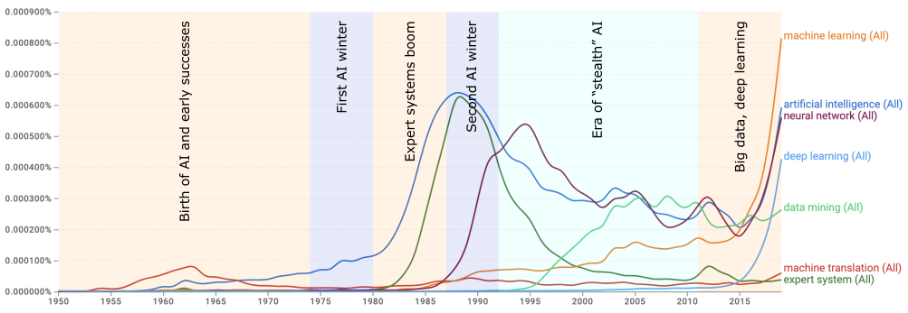

---
jupytext:
  cell_metadata_filter: -all
  formats: md:myst
  text_representation:
    extension: .md
    format_name: myst
    format_version: 0.13
    jupytext_version: 1.16.3
kernelspec:
  display_name: Python 3
  language: python
  name: python3
---

# History of HEP and ML

The purpose of this section is to show that particle/High Energy Physics (HEP) has always needed ML. It is not a fad—ML would have brought major benefits to HEP at any stage in its history. It's being used now because it's just becoming _possible_ now.

{. width="40%"}

## HEP, computation, and big data

Big data processing has always been an essential part of HEP, since the beginning of the field. The late 1940's/1950's can be called the "beginning" of HEP because that's when it acquired the characteristics that define it today:

1. Physicists in this era used accelerators to collide subatomic particles with more energy and higher flux than is observed in nature. Then, as now, cosmic rays produce higher-energy collisions than can be produced by accelerators, but not with high enough rates to study those events in detail. Ernest Lawrence's large team at Berkeley (dozens of scientists) invented a series of ever-larger accelerators in the 1930's, but it was in the late 1940's that accelerators started to be built around the world as the preferred tool of discovery.
2. These collisions produced new particles to discover, for any type of particle whose mass is less than the center-of-mass energy of the collision (with additional constraints from quantum numbers). In the first few decades, the accelerated particles were driven into stationary targets, rather than two colliding beams with a higher center-of-mass. However, the goal of the experiments was to produce particles that can't ordinarily be found in nature and study their properties, just as it is now.
3. Computers quantified particle trajectories, reconstructed invisible (neutral) particles, and rejected backgrounds, for as many collision events as possible.

The last point is key: high energy physicists started using computers as soon as they became available. For example, Luis Alvarez's group at Berkeley's \$9,000,000 Bevatron built a \$1,250,000 detector experiment and bought a \$200,000 IBM 650 to analyze the data in 1955 ([ref](https://www2.lbl.gov/Science-Articles/Research-Review/Magazine/1981/81fchp6.html)). Computers were a significant fraction of the already large costs, and yet analysis productivity was still limited by processing speed.

{. width="31%"} {. width="28%"} {. width="39%"}

The limitation was algorithmic: physicists wanted to compute kinematics of the observed particles, which is an easy program to write (just a formula), but the particles were observed as images, which are hard to convert into trajectories. Something has to find the locations of the line segments and endpoints in the photograph. For the first 10‒20 years, that "something" was people: humans, mostly women, identified the vertices and trajectories of tracks in bubble chamber photos on specially designed human-computer interfaces (see [ref](https://www.physics.ucla.edu/marty/HighEnergyPhysics.pdf) for a first-hand account).

{. width="49%"}{. width="47.4%" align="right"}

This is a pattern-recognition task—if ML had been available (in a usable form) in the 1950's, then it would have better than using humans for this task. Moreover, humans couldn't keep up with the rate. Then as now, the quality of the results—discovery potential and statistical precision—scales with the number of analyzed events: the more, the better. The following plot (from <a href="https://books.google.de/books?id=imidr-iFYCwC&lpg=PA129&dq=jack%20franck%20franckenstein&pg=PA130#v=onepage&q&f=false">ref</a>) was made to quantify the event interpretation rate using different human-computer interfaces.

{. width="60%"}

Below, I extended the plot to the present day: the number of events per second has continued to increase exponentially.

{. width="100%"}

These event rates have been too fast for humans since the 1970's, when human scanners were replaced by heuristic track-finding routines, usually by hand-written algorithms that iterate through all combinations within plausible windows (which are now a bottleneck in high track densities).

Although many computing tasks in particle physics are suitable for hand-written algorithms, the field also has and has always had tasks that are a natural fit for ML and artificial intelligence, to such an extent that human intelligence was enlisted to solve them. While ML would have been beneficial to HEP from the very beginning of the field, algorithms and computational resources have only recently made it possible.

## Symbolic AI and connectionist AI

AI has had a rocky history, driven by competition between two philosophies that have been called "symbolic" (or "GOFAI: Good Old Fashioned AI") and "connectionist."

Symbolic AI consists of hand-written algorithms, which today wouldn't be called AI. In fact, it was a joke that once a human-like problem had been solved by computer, at that point [it ceases to be AI](https://quoteinvestigator.com/2024/06/20/not-ai/). The problems that went through this cycle include:

* parsing the source code of a high-level programming language,
* checking the proof of a theorem, and later, searching for proofs,
* playing chess and other games by truncated searches through all possible games,
* expert systems and fuzzy database searches.

Symbolic AI is called "symbolic" because the starting point is a system of abstract symbols and rules—like programming in general. An associated philosophical idea is that this is the starting point for intelligence itself: human and artificial intelligence consists in manipulating propositions like an algebra, in formalisms like those of George Boole, Gottlob Frege, Bertrand Russell, and Noam Chomsky.

Connectionist AI makes a weaker claim about what happens in the intelligent system (human or artificial): only that the system's inputs and outputs are correlated appropriately, and an intricate network of connections can implement that correlation. As we'll see, neural networks are an effective way to implement it, and they were (loosely) inspired by the biology of human brains. The idea that we can only talk about the inputs and outputs of human systems, without proposing symbols as entities in the mind, was a popular trend in psychology called Behaviorism in the first half of the 20th century (in a similar spirit as Quantum Mechanics and S-Matrix theory in physics, in which we only speak of particles going in and particles coming out of an interaction, not what happens in between). Today, Cognitive Psychologists can measure the scaling time and other properties of algorithms in human minds, so Behaviorism is out of favor. But it's ironic that large language models like ChatGPT are an implementation of what Behaviorists proposed as a model of human intelligence a century ago.

Although connectionist systems like neural networks don't start with propositions and symbols, something like these structures may form among the connections as the most effective way to produce the desired outputs, similar to emergent behavior in dynamical systems. Practitioners of explainable AI (xAI) try to find patterns like these in trained neural networks—far from treating them as a black box!

## AI's summers and winters

Connectionism started early: Warren McCulloch and Walter Pitts described a formalism for neural networks in 1943 ([ref](https://doi.org/10.1007/BF02478259)), while the first digital computers were still being invented. Frank Rosenblatt built a working model and demonstrated it to the U.S. Navy in 1958 ([ref](https://news.cornell.edu/stories/2019/09/professors-perceptron-paved-way-ai-60-years-too-soon), 20×20 input grid → 512-node hidden layer → 8-node output layer, [ref](https://en.wikipedia.org/wiki/Perceptron#Mark_I_Perceptron_machine)).

{. width="47%"} {. width="45%"}

These early attempts were only moderately successful, but those who were excited about the technology made extravagant claims about what they were doing and what they would be able to do in the near future ([ref](https://www.nytimes.com/1958/07/13/archives/electronic-brain-teaches-itself.html?smid=url-share)). When those claims fell short, so did the funding. The backlash against the first perceptron machines, as well as automated language translation, led to a period of reduced funding called the first "winter" of AI in the 1970's.

The second wave ("summer") of AI was commercial, rather than academic with military applications. In the early 1980's, programs called "expert systems" were promoted as a way for humans to query domain-specific knowledge using natural language or fuzzy searches. Unfortunately, it was hard to encode common-sense variations using hand-written algorithms, so these projects were short-lived. Neural networks were revived as researchers recognized the importance of developing specialized network topologies, such as the Convolutional Neural Network (CNN) for recognizing images. Still more needed to be done before these systems became practical, and AI entered a second winter in the 1990s.

From that point until about 2015, AI research has continued, shifting more toward connectionist systems. Since the term "AI" was out of favor, synonyms like "data mining" and "machine learning" were used instead. Dramatic advances in deep learning (neural networks with many layers) revived the field around 2015, and we're still seeing the effects of this rise.

We can see this whole story at a glance through the frequency of the terms "artificial intelligence", "machine translation", "expert system", "machine learning", "data mining", "neural network", and "deep learning" in <a href="https://books.google.com/ngrams/graph?content=artificial+intelligence%2Cmachine+translation%2Cexpert+system%2Cmachine+learning%2Cdata+mining%2Cneural+network%2Cdeep+learning&year_start=1950&year_end=2019&case_insensitive=true&corpus=en-2019&smoothing=0">Google Books Ngram Viewer</a>. Below, the relative frequency of each term is overlaid with the funding "winters."

{. width="100%"}

Although the term "artificial intelligence" was coined in 1956, the primary application, "machine translation", was more prominent at first. "Artificial intelligence" appeared widely in print in the 1980's, due to its application in "expert systems". Technical improvements in "neural networks" were widely written about in the 1990's, though this term also fell out of favor when new technical issues were encountered. From the late 1990's until the past decade, alternate terms were introduced, such as "data mining" and "machine learning", to continue research without associating with past failures. "Deep learning" was used to describe neural networks with many hidden layers, and this was one of the innovations that led to the resurgence of the field in 2015.

This era of "stealth" AI is also visible in attendance of AI conferences ([source](https://aiindex.stanford.edu/report/)),

{. width="100%"}

and in 

{. width="100%"}
