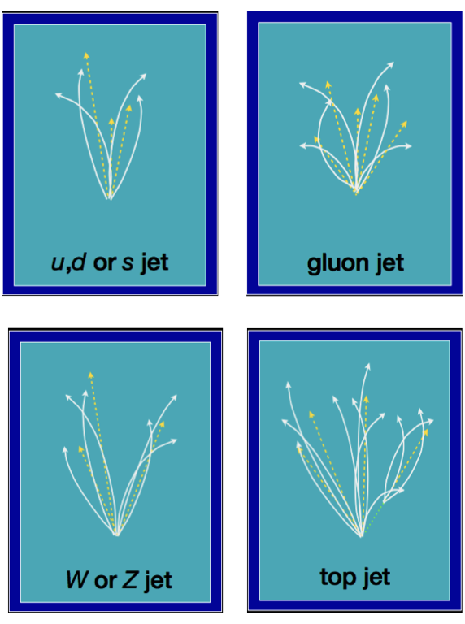

---
jupytext:
  cell_metadata_filter: -all
  formats: md:myst
  text_representation:
    extension: .md
    format_name: myst
    format_version: 0.13
    jupytext_version: 1.16.4
kernelspec:
  display_name: Python 3 (ipykernel)
  language: python
  name: python3
---

# Main Project (2 hours)

+++

In this project, you will download a dataset of jets from a HEP experiment and classify them in 5 categories:

* `'g'`: a gluon jet (a gluon from the original proton-proton collision hadronized into a jet)
* `'q'`: a light quark hadronized into a jet: up (u), down (d), or strange (s)
* `'t'`: a top (t) quark decayed into a bottom (b) quark and a W boson, which subsequently decayed and hadronized
* `'W'`: a W boson directly from the original proton-proton collision decayed and its constituents hadronized
* `'Z'`: the same thing for a Z boson

{. width="50%"}

```{code-cell} ipython3
import numpy as np
import pandas as pd
import matplotlib.pyplot as plt

import sklearn.datasets
import torch
from torch import nn, optim
from torch.utils.data import TensorDataset, DataLoader, random_split
```

## Step 1: download and understand the data

+++

The data comes from an online catalog: [hls4ml_lhc_jets_hlf](https://openml.org/search?type=data&id=42468&sort=runs&status=active).

The full description is online, with references to the paper in which it was published.

Scikit-Learn has a tool for downloading it, which takes a minute or two.

```{code-cell} ipython3
hls4ml_lhc_jets_hlf = sklearn.datasets.fetch_openml("hls4ml_lhc_jets_hlf")

features, targets = hls4ml_lhc_jets_hlf["data"], hls4ml_lhc_jets_hlf["target"]
```

View the features (16 numerical properties of jets) as a Pandas DataFrame:

```{code-cell} ipython3
features
```

And some summary statistics for each feature:

```{code-cell} ipython3
features.describe()
```

You can convert the (830000 row × 16 column) DataFrame into a NumPy array (of shape `(830000, 16)`) with

```{code-cell} ipython3
features.values
```

Similarly, you can view the target (5 jet categories) as a Pandas Series:

```{code-cell} ipython3
targets
```

The categories are represented as 5 Python strings (`dtype='object'` means Python objects in a NumPy array/Pandas Series).

```{code-cell} ipython3
targets.cat.categories
```

But the large dataset consists of (8-bit) integers corresponding to the position in this list of categories.

```{code-cell} ipython3
targets.cat.codes
```

```{code-cell} ipython3
targets.cat.codes.values
```

As with any new dataset, _take some time to explore it_, plotting features for each of the categories to see if and how much they overlap, what their general distributions are, etc. You _always_ want to have some sense of the data's distribution before applying a machine learning algorithm (or any other mechanical procedure).

+++

## Step 2: split the data into training, validation, and test samples

+++

For this exercise, put

* 80% of the data into the training sample, which the optimizer will use in its fits
* 10% of the data into the validation sample, which you will look at while developing the model
* 10% of the data into the test sample, which you should not look at until you're done and making the final ROC curve

These data are supposed to be Independent and Identically Distributed (IID), but just in case there are any beginning-of-dataset, end-of-dataset biases, sample them randomly.

Remember that PyTorch has a [random_split](https://pytorch.org/docs/stable/data.html#torch.utils.data.random_split) function that you can use with [TensorDataset](https://pytorch.org/docs/stable/data.html#torch.utils.data.TensorDataset) and [DataLoader](https://pytorch.org/docs/stable/data.html#torch.utils.data.DataLoader).

_Do not look at any goodness-of-fit criteria on the test sample until you are completely done!_

+++

## Step 3: build a classifier neural network

+++

Make it have the following architecture:

* input 16 numerical features,
* pass through 3 (fully connected) hidden layers with 32 vector components each,
* ReLU activation functions in each hidden layer,
* return probabilities for the 5 output categories. For each input, all of the output probabilities are non-negative and add up to $1$.

Use any tools you have to improve the quality of the model, but the model should be implemented in PyTorch.

Think about all of the issues covered in the previous sections of this course.

If you use [nn.CrossEntropyLoss](https://pytorch.org/docs/stable/generated/torch.nn.CrossEntropyLoss.html) (that's not the only way!), remember that it applies a softmax to predicted values you give it, so your model can't also apply a softmax, and it can take the target values as a 1-dimensional array of integers (the true category) or as a 2-dimensional array of one-hot vectors (the category probabilities, which are all 0's and 1's).

Since all of the examples we have seen so far involved small datasets, we used an excessive number of epochs. For this large dataset, you shouldn't need more than 10 epochs, and it can be useful to debug your model one epoch at a time. Print out useful information in the loop over epochs, so that you don't have to wait for the whole thing to finish.

Helpful hint: are the input data close to the $(-1, 1)$ interval? If not, what should you do?

+++

## Step 4: monitor the loss function

+++

Plot the loss function versus epoch for the training sample and the validation sample (and _not_ the test sample!).

Do they diverge? If so, what can you do about that?

Suggestion: compute the validation loss before the training loss, since a training loop over mini-batches changes the model state.

Helpful hint: since you'll be comparing losses computed from different dataset sizes, you need to scale them by the number of data points.

```python
for epoch in range(NUM_EPOCHS):
    features_tensor, targets_tensor = the_validation_sample
    ...
    validation_loss = loss.item() * len(the_validation_sample) * (0.8 / 0.1)

    training_loss = 0
    for features_tensor, targets_tensor in training_sample_batches:
        ...
        training_loss += loss.item() * len(targets_tensor)   # one training mini-batch
```

+++

## Step 5: compute a 5×5 confusion matrix

+++

Since you have 5 categories, rather than 2, the confusion matrix is 5×5:

| | actually `'g'` | actually `'q'` | actually `'t'` | actually `'w'` | actually `'z'` |
|--:|:--:|:--:|:--:|:--:|:--:|
| **predicted `'g'`** | # | # | # | # | # |
| **predicted `'q'`** | # | # | # | # | # |
| **predicted `'t'`** | # | # | # | # | # |
| **predicted `'w'`** | # | # | # | # | # |
| **predicted `'z'`** | # | # | # | # | # |

Each prediction from your model is a vector of 5 numbers. The softmax of these 5 numbers are the 5 probabilities for each category (guaranteed by the [definition of softmax](https://en.wikipedia.org/wiki/Softmax_function) to add up to 1). If you use [nn.CrossEntropyLoss](https://pytorch.org/docs/stable/generated/torch.nn.CrossEntropyLoss.html), your model does not apply the softmax, so you'd need to apply it as an additional step.

For a large set of predictions (a 2-dimensional array with shape `(num_predictions, 5)`), the [torch.argmax](https://pytorch.org/docs/stable/generated/torch.argmax.html#torch.argmax) with `axis=1` finds the index of the maximum probability in each prediction.

Use this to count how many true `'g'` your model predicts as `'g'`, how many true `'g'` your model predicts as `'q'`, etc. for all 25 elements of the confusion matrix.

Then plot this matrix as a colormap using Matplotlib's [ax.imshow](https://matplotlib.org/stable/api/_as_gen/matplotlib.pyplot.imshow.html).

_Use the validation sample only!_

+++

## Step 6: project it down to a 2×2 confusion matrix

+++

Suppose that we're primarily interested in how the model separates lightweight QCD jets (`'g'` and `'q'`) from heavy electroweak jets (`'t'`, `'w'`, `'z'`). Since the categories are

```{code-cell} ipython3
targets.cat.categories
```

the index range `0:2` selects lightweight QCD probabilities and the index range `2:5` selects heavy electroweak probabilities. By summing over one of these ranges (slice the second dimension of your set of predicted probabilities, followed by [torch.sum](https://pytorch.org/docs/stable/generated/torch.sum.html#torch.sum) with `axis=1`), you get its total probability $p$, and the other range gives $1 - p$.

Compute the 2×2 confusion matrix for the problem of distinguishing lightweight QCD jets (background) from heavy electroweak jets (signal). You might find this easiest to write as a function of a `threshold`, with the default `threshold` being `0.5`. Anyway, you'll need that for the next step.

Finally, plot a ROC curve, the true positive rate versus false positive rate curve. How close does your model get to perfection (true positive rate = 1 and false positive rate = 0)? How does its shape differ at one end of the ROC curve from the other? Would it be symmetric if you swapped true positive rate withs false positive rate?

+++

## Step 7: plot a ROC curve

+++

First plot a ROC curve using the validation dataset, and when you're completely satisfied, finally switch to the test dataset.

Your ROC curve should be close to this one (not exact!):

```{code-cell} ipython3
expected_ROC = np.array([
    [0,               0.01886829927], [0.0001020304051, 0.1289489538],
    [0.0004081216202, 0.209922966  ], [0.0009182736455, 0.3068408332],
    [0.001632486481,  0.376408661  ], [0.002550760127,  0.4303733732],
    [0.003673094582,  0.4678969334 ], [0.004999489848,  0.5027722976],
    [0.006529945924,  0.526339701  ], [0.00826446281,   0.5538282184],
    [0.01020304051,   0.5764214002 ], [0.01234567901,   0.6020473392],
    [0.01469237833,   0.6217746216 ], [0.01724313846,   0.6441249222],
    [0.01999795939,   0.6616243646 ], [0.02295684114,   0.6776505449],
    [0.0261197837,    0.6922878624 ], [0.02948678706,   0.7049561472],
    [0.03305785124,   0.7174712901 ], [0.03683297623,   0.7281837347],
    [0.04081216202,   0.7378146857 ], [0.04499540863,   0.7487390868],
    [0.04938271605,   0.7581570351 ], [0.05397408428,   0.7678773984],
    [0.05876951331,   0.7770101384 ], [0.06376900316,   0.7856509131],
    [0.06897255382,   0.7942924103 ], [0.07438016529,   0.8015956393],
    [0.07999183757,   0.8080126115 ], [0.08580757066,   0.8131647638],
    [0.09182736455,   0.8193828345 ], [0.09805121926,   0.8250768418],
    [0.1044791348,    0.8305736234 ], [0.1111111111,    0.8350616401],
    [0.1179471483,    0.8392843805 ], [0.1249872462,    0.843458635 ],
    [0.132231405,     0.8485805236 ], [0.1396796245,    0.8527170936],
    [0.1473319049,    0.8568358996 ], [0.1551882461,    0.8609808587],
    [0.1632486481,    0.8650308152 ], [0.1715131109,    0.8690270267],
    [0.1799816345,    0.8728376092 ], [0.188654219,     0.8768071621],
    [0.1975308642,    0.8809618493 ], [0.2066115702,    0.8844406165],
    [0.2158963371,    0.8878818684 ], [0.2253851648,    0.8913015608],
    [0.2350780533,    0.895321326  ], [0.2449750026,    0.8988141059],
    [0.2550760127,    0.9023606647 ], [0.2653810836,    0.9060166576],
    [0.2758902153,    0.9095274507 ], [0.2866034078,    0.9131203545],
    [0.2975206612,    0.9160367475 ], [0.3086419753,    0.9194866744],
    [0.3199673503,    0.9227445269 ], [0.331496786,     0.9258525464],
    [0.3432302826,    0.9288425431 ], [0.35516784,      0.9320369642],
    [0.3673094582,    0.934770168  ], [0.3796551372,    0.937793916 ],
    [0.3922048771,    0.9407399938 ], [0.4049586777,    0.9435231388],
    [0.4179165391,    0.946281785  ], [0.4310784614,    0.9488092479],
    [0.4444444444,    0.9518475898 ], [0.4580144883,    0.9547152601],
    [0.471788593,     0.9572437037 ], [0.4857667585,    0.959630249 ],
    [0.4999489848,    0.9625112252 ], [0.5143352719,    0.9647093883],
    [0.5289256198,    0.9668044304 ], [0.5437200286,    0.9689679766],
    [0.5587184981,    0.9712781888 ], [0.5739210285,    0.9728035781],
    [0.5893276196,    0.9748502201 ], [0.6049382716,    0.9769168758],
    [0.6207529844,    0.9783125007 ], [0.636771758,     0.9804721129],
    [0.6529945924,    0.982129956  ], [0.6694214876,    0.9841034064],
    [0.6860524436,    0.9858651034 ], [0.7028874605,    0.9875667363],
    [0.7199265381,    0.9892142364 ], [0.7371696766,    0.9907125562],
    [0.7546168758,    0.9919437219 ], [0.7722681359,    0.9932740291],
    [0.7901234568,    0.9942632436 ], [0.8081828385,    0.9954980595],
    [0.826446281,     0.9962563498 ], [0.8449137843,    0.9970929737],
    [0.8635853484,    0.9977009724 ], [0.8824609734,    0.9984200208],
    [0.9015406591,    0.9988781108 ], [0.9208244057,    0.9991514607],
    [0.940312213,     0.9994587815 ], [0.9600040812,    0.999709012 ],
    [0.9799000102,    0.9998581822 ], [1,               1           ],
])
```

Overlay your ROC curve on the expected one to see how well you did!

```{code-cell} ipython3
fig, ax = plt.subplots(figsize=(7, 7))

ax.plot(expected_ROC[:, 0], expected_ROC[:, 1], ls=":", color="tab:blue", label="expected")

ax.grid(True, linestyle=":")

ax.set_xlabel("false positive rate")
ax.set_ylabel("true positive rate")

ax.legend(loc="lower right")

plt.show()
```
