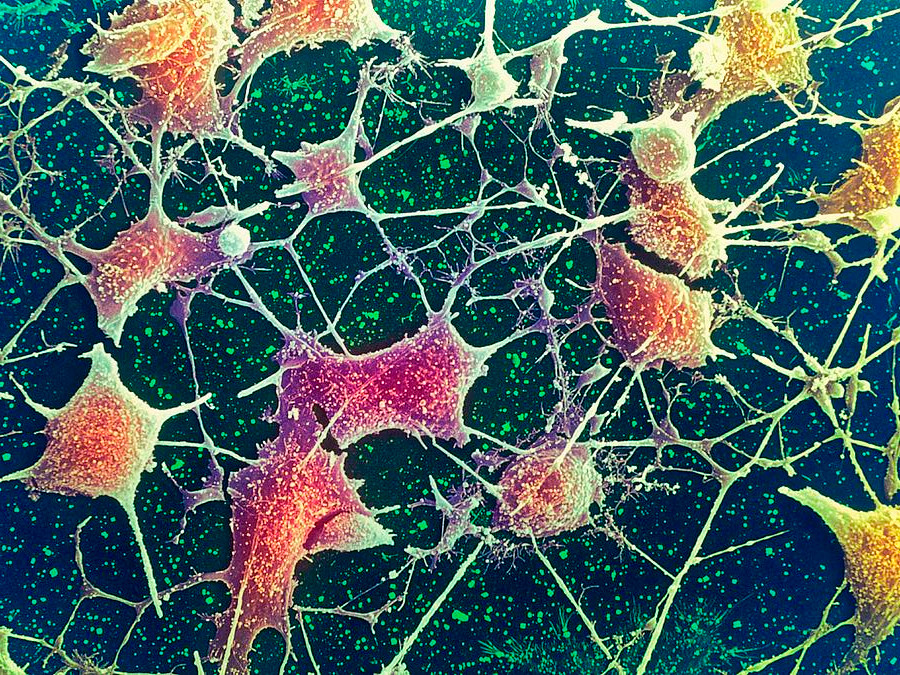
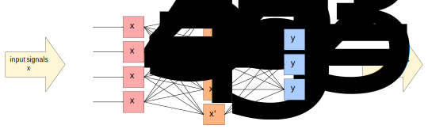
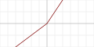
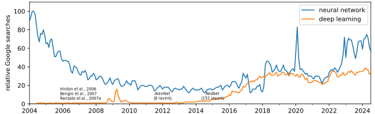

---
jupytext:
  cell_metadata_filter: -all
  formats: md:myst
  text_representation:
    extension: .md
    format_name: myst
    format_version: 0.13
    jupytext_version: 1.16.4
kernelspec:
  display_name: Python 3 (ipykernel)
  language: python
  name: python3
---

# Neural networks

+++

In the previous section, we used adaptive basis functions to fit a generic shape and then noticed that this is a neural network with one hidden layer. This is not the usual way that neural networks are introduced.

Originally, neural networks were inspired by analogy with neurons in the brain (hence the name). A neuron (nerve cell) receives $n$ electro-chemical signals at one end and transmits $m$ electro-chemical signals at the other end, according to some function.

{. width="100%"}

Thus, we could write it like this:

$$f\left[\left(\begin{array}{c c c c}
a_{1,1} & a_{1,2} & \cdots & a_{1,10} \\
a_{2,1} & a_{2,2} & \cdots & a_{2,10} \\
a_{3,1} & a_{3,2} & \cdots & a_{3,10} \\
a_{4,1} & a_{4,2} & \cdots & a_{4,10} \\
a_{5,1} & a_{5,2} & \cdots & a_{5,10} \\
\end{array}\right) \cdot \left(\begin{array}{c}
x_1 \\
x_2 \\
\vdots \\
x_{10}
\end{array}\right) + \left(\begin{array}{c}
b_1 \\
b_2 \\
b_3 \\
b_4 \\
b_5 \\
\end{array}\right)\right] = \left(\begin{array}{c}
y_1 \\
y_2 \\
y_3 \\
y_4 \\
y_5 \\
\end{array}\right)$$

which is

$$\begin{array}{c}
f\left[a_{1,1}x_1 + a_{1,2}x_2 + \ldots + a_{1,10}x_{10} + b_1\right] = y_1 \\
f\left[a_{2,1}x_1 + a_{2,2}x_2 + \ldots + a_{2,10}x_{10} + b_2\right] = y_2 \\
f\left[a_{3,1}x_1 + a_{3,2}x_2 + \ldots + a_{3,10}x_{10} + b_3\right] = y_3 \\
f\left[a_{4,1}x_1 + a_{4,2}x_2 + \ldots + a_{4,10}x_{10} + b_4\right] = y_4 \\
f\left[a_{5,1}x_1 + a_{5,2}x_2 + \ldots + a_{5,10}x_{10} + b_5\right] = y_5 \\
\end{array}$$

I personally don't know whether real neurons are deterministic—can be modeled as a strict function of their inputs—or that it's the same function $f$ for all dendrites ($y_i$), but early formulations like [McCulloch & Pitts (1943)](https://doi.org/10.1007/BF02478259) used a sharp, binary step function:

$$f(x) = \left\{\begin{array}{c l}
0 & \mbox{if } x < 0 \\ 1 & \mbox{if } x \ge 0 \\
\end{array}\right.$$

hiding all the biological details in the sharpness of the step.

+++

## Perceptrons

```{code-cell} ipython3
import numpy as np
import matplotlib.pyplot as plt
```

The first applications of neural networks as a computational tool were called "perceptrons." Although [Rosenblatt (1958)](https://psycnet.apa.org/doi/10.1037/h0042519) described a 3-layer neural network, a perceptron has come to be described as a 1-layer unit with a 1-dimensional output and a binary step function $f$:

$$f\left[\left(\begin{array}{c c c c}
a_{1,1} & a_{1,2} & \cdots & a_{1,10} \\
\end{array}\right) \cdot \left(\begin{array}{c}
x_1 \\
x_2 \\
\vdots \\
x_{10}
\end{array}\right) + b\right] = y$$

The 1-dimensional binary output is good for classification. A binary classification model is trained with a set of $N$ data points, $\vec{x}_i$ with $i \in [0, N)$, and corresponding binary targets, $y_i \in \{A, B\}$, to produce a predictor-machine that associates every point in the space $\vec{x}$ with a probability that it is $A$ or $B$, $P_A(\vec{x})$ and $P_B(\vec{x})$. Naturally, $P_A(\vec{x}) + P_B(\vec{x}) = 1$, so knowing $P_A(\vec{x})$ is equivalent to knowing $P_B(\vec{x})$.

Here's a sample problem to learn: which regions of the plane are orange and which are blue?

```{code-cell} ipython3
blob1 = np.random.normal(0, 1, (1000, 2)) + np.array([[0, 3]])
blob2 = np.random.normal(0, 1, (1000, 2)) + np.array([[3, 0]])

shuffle = np.arange(len(blob1) + len(blob2))
np.random.shuffle(shuffle)

all_data = np.concatenate((blob1, blob2))[shuffle]
targets = np.concatenate((np.zeros(len(blob1)), np.ones(len(blob2))))[shuffle]
```

```{code-cell} ipython3
all_data
```

```{code-cell} ipython3
targets
```

```{code-cell} ipython3
fig, ax = plt.subplots(figsize=(5, 5))

def plot_blob_points(ax, blob1, blob2):
    ax.scatter(blob1[:, 0], blob1[:, 1], marker=".", color="tab:blue")
    ax.scatter(blob2[:, 0], blob2[:, 1], marker=".", color="tab:orange")

plot_blob_points(ax, blob1, blob2)

ax.set_xlim(-4, 7)
ax.set_ylim(-4, 7)

None
```

Since a perceptron doesn't have a hidden layer, it's not even considered a neural network by Scikit-Learn. A model consisting of a linear transformation passed into a sigmoid function is called logistic regression (sigmoid is sometimes called "logistic").

```{code-cell} ipython3
from sklearn.linear_model import LogisticRegression
```

```{code-cell} ipython3
best_fit = LogisticRegression(penalty=None).fit(all_data, targets)
```

```{code-cell} ipython3
fig, ax = plt.subplots(figsize=(5, 5))

def plot_probability_and_50_threshold(ax, best_fit):
    # Compute the model's orange-vs-blue probability for 100×100 points in the background
    background_x, background_y = np.meshgrid(np.linspace(-4, 7, 100), np.linspace(-4, 7, 100))
    background_2d = np.column_stack((background_x.ravel(), background_y.ravel()))
    probabilities = best_fit.predict_proba(background_2d)

    # And draw a line where the probability crosses 0.5
    probability_of_0 = probabilities[:, 0].reshape(background_x.shape)
    ax.contour(background_x, background_y, probability_of_0, [0.5], linestyles=["--"])
    ax.contourf(background_x, background_y, probability_of_0, alpha=0.1)

plot_probability_and_50_threshold(ax, best_fit)
plot_blob_points(ax, blob1, blob2)

ax.set_xlim(-4, 7)
ax.set_ylim(-4, 7)

None
```

By drawing a line where $P_A(\vec{x}) = 0.5$, we effectively turn the soft sigmoid boundary into a sharp binary classifier. `LogisticRegression` has a method to return this hard classification,

```{code-cell} ipython3
best_fit.predict([[0, 3]]).tolist()
```

```{code-cell} ipython3
best_fit.predict([[3, 0]]).tolist()
```

and a method to return the direct output of the logistic, which is the probability of each class:

```{code-cell} ipython3
best_fit.predict_proba([[0, 3]]).tolist()
```

```{code-cell} ipython3
best_fit.predict_proba([[3, 0]]).tolist()
```

```{code-cell} ipython3
best_fit.predict_proba([[2, 2]]).tolist()
```

We've colored the plane by classification probability because the model makes a prediction for every infinitesimal point, though it was trained with finitely many points. (Thus, generalizing well is important!)

Some of the training points are on the wrong side of the 50% probability line, but the fitting process minimized these errors.

Now let's consider a problem that perceptrons are bad at—distributions that are not linearly separable. Incidentally, this example started a controversy that was responsible for the first "winter" of AI ([ref](https://en.wikipedia.org/wiki/Perceptrons_(book))).

```{code-cell} ipython3
blobs1 = np.concatenate((
    np.random.normal(0, 1, (1000, 2)) + np.array([[0, 0]]),
    np.random.normal(0, 1, (1000, 2)) + np.array([[3, 3]]),
))
blobs2 = np.concatenate((
    np.random.normal(0, 1, (1000, 2)) + np.array([[0, 3]]),
    np.random.normal(0, 1, (1000, 2)) + np.array([[3, 0]]),
))

shuffle = np.arange(len(blobs1) + len(blobs2))
np.random.shuffle(shuffle)

all_data = np.concatenate((blobs1, blobs2))[shuffle]
targets = np.concatenate((np.zeros(len(blobs1)), np.ones(len(blobs2))))[shuffle]
```

```{code-cell} ipython3
best_fit = LogisticRegression(penalty=None).fit(all_data, targets)
```

```{code-cell} ipython3
fig, ax = plt.subplots(figsize=(5, 5))

plot_probability_and_50_threshold(ax, best_fit)
plot_blob_points(ax, blobs1, blobs2)

ax.set_xlim(-4, 7)
ax.set_ylim(-4, 7)

None
```

The 50% line is more-or-less random, and the probability threshold (gradient of background colors) isn't as sharp. The trained model can't make correct predictions for all 4 of the blob centers:

```{code-cell} ipython3
best_fit.predict([[0, 0], [3, 3]]).tolist()  # should be the same as each other
```

```{code-cell} ipython3
best_fit.predict([[0, 3], [3, 0]]).tolist()  # should be the same as each other
```

The reason should be clear by looking at the plot: there is no straight line that puts orange points on one side and blue points on the other. The model doesn't have enough complexity to represent the data.

+++

## Adding a layer

+++

The solution starts with the observation that, in a brain, the output of one neuron feeds into the input of other neurons.

{. width="100%"}

The full case of a general graph is hard to think about: what happens if the output of one neuron connects, perhaps through a series of other neurons, back to one of its own inputs? Since each $x_i$ component is single-valued, a cycle has to be handled in a time-dependent way. A value of $x_i = 0$ might, though some connections, force $x_i \to 1$, but only _at a later time_.

There have been a few different approaches.

1. Require the graph to not have cycles. This is what McCulloch & Pitts did in their original formulation, since they were trying to build neuron diagrams that make logical propositions, like AND, OR, and NOT in digital circuits. These have clear inputs and outputs and should be time-independent.
2. Update the graph in discrete time-steps. If $x_i = 0$ implies, through some connections, that $x_i$ will be $1$, it is updated in a later time-step.

The layers that we now use in most neural networks are a special case of #1. Even #2, which are now known as Recurrent Neural Networks (RNNs), evolved toward a layered approach. Hopfield and Hinton's 2024 Nobel prize work started with general, fully-connected graphs like the one below on the left, but eventually led to "Restricted Boltzmann machines," in which nodes are separated into two types: visible (associated with observables to model) and hidden, with connections only between the visible and hidden, not within each type:

{. width="100%"}

This is equivalent to the system of adaptive basis functions that we developed in the previous section:

{. width="100%"}

Now let's use it to classify orange and blue points, the problem described in the previous subsection.

```{code-cell} ipython3
from sklearn.neural_network import MLPRegressor
```

```{code-cell} ipython3
best_fit = MLPRegressor(
    activation="logistic", hidden_layer_sizes=(5,), max_iter=10000, alpha=0
).fit(all_data, targets)
```

```{code-cell} ipython3
fig, ax = plt.subplots(figsize=(5, 5))

def plot_probability_and_50_threshold_NN(ax, best_fit):
    # MLPRegressor has a slightly different interface from LogisticRegressor,
    # so we need another plotting function. best_fit.predict returns probabilities.

    background_x, background_y = np.meshgrid(np.linspace(-4, 7, 100), np.linspace(-4, 7, 100))
    background_2d = np.column_stack((background_x.ravel(), background_y.ravel()))
    probabilities = best_fit.predict(background_2d)
    probability_of_0 = probabilities.reshape(background_x.shape)
    ax.contour(background_x, background_y, probability_of_0, [0.5], linestyles=["--"])
    ax.contourf(background_x, background_y, probability_of_0, alpha=0.1)

plot_probability_and_50_threshold_NN(ax, best_fit)
plot_blob_points(ax, blobs1, blobs2)

ax.set_xlim(-4, 7)
ax.set_ylim(-4, 7)

None
```

The shape of the boundary outside of the training data is unconstrained, but it's allowed to curve enough to put orange points on one side and blue points on the other. It's allowed to curve because we've given the fitter sigmoid-shaped adaptive basis functions to transform and add together (in 2 dimensions).

The basis functions didn't have to be sigmoid-shaped. Here are a few common options:

| | Name | Function |
|:-:|:-|:-:|
| {. width="100%"} | binary step | $f(x) = \left\{\begin{array}{c l}0 & \mbox{if } x < 0 \\ 1 & \mbox{if } x \ge 0\end{array}\right.$ | 
| {. width="100%"} | sigmoid, logistic, or soft step | $f(x) = \frac{1}{1 + e^{-x}}$ | 
| {. width="100%"} | hyperbolic tangent | $f(x) = \frac{e^x - e^{-x}}{e^x + e^{-x}}$ | 
| {. width="100%"} | rectified linear unit or ReLU | $f(x) = \left\{\begin{array}{c l}0 & \mbox{if } x < 0 \\ x & \mbox{if } x \ge 0\end{array}\right.$ | 
| {. width="100%"} | leaky ReLU | $f(x) = \left\{\begin{array}{c l}\alpha x & \mbox{if } x < 0 \\ x & \mbox{if } x \ge 0\end{array}\right.$ | 
| {. width="100%"} | sigmoid linear unit or swish | $f(x) = \frac{x}{1 + e^{-x}}$ |

Let's see it fit with ReLU shapes instead. These are the most common today, because of their simplicity (and their derivatives don't asymptotically approach zero).

```{code-cell} ipython3
best_fit = MLPRegressor(
    activation="relu", hidden_layer_sizes=(5,), max_iter=10000, alpha=0
).fit(all_data, targets)
```

```{code-cell} ipython3
fig, ax = plt.subplots(figsize=(5, 5))

plot_probability_and_50_threshold_NN(ax, best_fit)
plot_blob_points(ax, blobs1, blobs2)

ax.set_xlim(-4, 7)
ax.set_ylim(-4, 7)

None
```

The boundaries still separate the orange and blue points, but now they're made out of piecewise straight segments.

+++

## Deep learning

+++

With enough 

```{code-cell} ipython3

```

```{code-cell} ipython3

```

```{code-cell} ipython3

```

```{code-cell} ipython3

```

```{code-cell} ipython3

```

```{code-cell} ipython3

```

```{code-cell} ipython3

```

## Deep learning

+++

In principle, one hidden layer is enough to approximate any shape: this fact is known as the Universal Approximation Theorem.

However, multiple hidden layers are _better_ at approximating complex shapes.

{. width="100%"}

This is one perceptron fed into another, fed into another, etc. The general adage is that "one layer memorizes, many layers generalize." To get an intuition about this, consider the following:

* Adding one more component to a layer adds one wiggle (sigmoid curve) to the fit function.
* Adding one more layer effectively folds space under the next set of wiggly functions. Instead of fitting individual wiggles, they find symmetries in the data that (probably) correspond to an underlying relationship, rather than noise.

Consider this horseshoe-shaped decision boundary: with two well-chosen folds along the symmetries, it reduces to a simpler curve to fit. Instead of 4 ad-hoc wiggles, it's 2 folds and 1 wiggle.

{. width="100%"}

(from Montúfar, Pascanu, Cho, & Bengio, [On the Number of Linear Regions of Deep Neural Networks](https://arxiv.org/abs/1402.1869) (2014))

You can see this in detail in [Roy Keyes's fantastic demo](https://gist.github.com/jpivarski/f99371614ecaa48ace90a6025d430247). The three categories of data in the spiral arms of the galaxy on the left are fitted with a neural network that transforms the underlying coordinates to the warped mesh shown on the right. Then the three categories are linearly separable.

{. width="100%"}

The recognition that "deep" neural networks with many layers are more powerful than one large hidden layer, as well as the ability to train them, is recent. It's responsible for the resurgence of interest in neural networks around 2015. Here's a plot of Google searches for the words "neural network" and "deep learning" from the past 10 years:

{. width="100%"}

* 2006‒2007: problems that prevented the training of deep learning were solved.
* 2012: AlexNet, a GPU-enabled 8 layer network (with ReLU), won the ImageNet competition.
* 2015: ResNet, a GPU-enabled 152+ layer network (with skip-connections), won the ImageNet competition.

In the next section, you'll use a graphical user interface to a deep neural network to solve classification problems.
