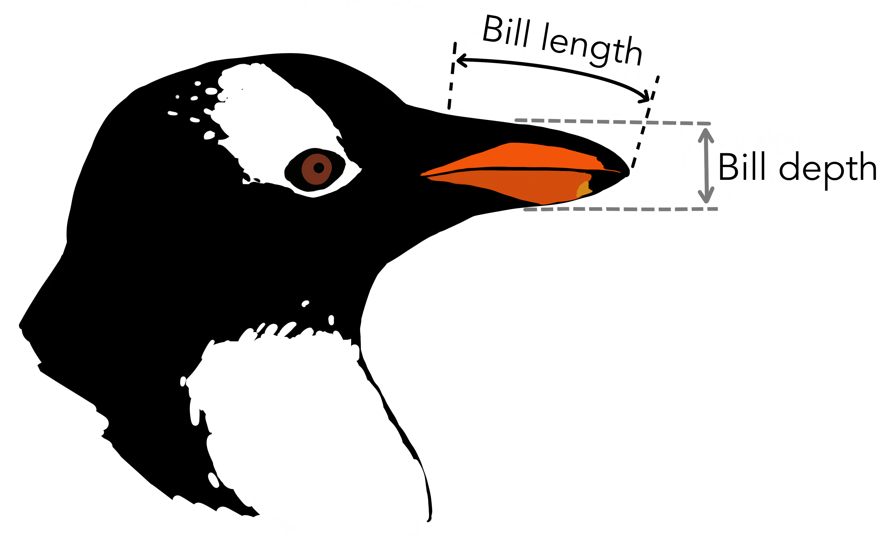

---
jupytext:
  cell_metadata_filter: -all
  formats: md:myst
  text_representation:
    extension: .md
    format_name: myst
    format_version: 0.13
    jupytext_version: 1.16.4
kernelspec:
  display_name: Python 3 (ipykernel)
  language: python
  name: python3
---

# Classification and regression in PyTorch

+++

This section introduces PyTorch so that we can use it for the remainder of the course. Whereas Scikit-Learn gives you a function for just about [every type of machine learning model](https://scikit-learn.org/stable/machine_learning_map.html), PyTorch gives you the pieces and expects you to build it yourself. (The [JAX](https://jax.readthedocs.io/) library is even more extreme in providing only the fundamental pieces. PyTorch's level of abstraction is between JAX and Scikit-Learn.)

I'll use the two types of problems we've seen so far—regression and classification—to show Scikit-Learn and PyTorch side-by-side. First, though, let's get a dataset that will provide us with realistic regression and classification problems.

+++

## Penguins!

```{code-cell} ipython3
import numpy as np
import pandas as pd
import matplotlib.pyplot as plt
```

This is my new favorite dataset: basic measurements of 3 species of penguins. You can get the data as a CSV file from the [original source](https://www.kaggle.com/code/parulpandey/penguin-dataset-the-new-iris) or from this project's GitHub: [deep-learning-intro-for-hep/data/penguins.csv](https://github.com/hsf-training/deep-learning-intro-for-hep/blob/main/deep-learning-intro-for-hep/data/penguins.csv).

{. width="50%"}

Replace `data/penguins.csv` with the file path where you downloaded it.

```{code-cell} ipython3
penguins_df = pd.read_csv("data/penguins.csv")
penguins_df
```

## Numerical and categorical data

+++

This dataset has numerical features, such as `bill_length_mm`, `bill_depth_mm`, `flipper_length_mm`, `body_mass_g` and `year` of data-taking, and it has categorical features like `species`, `island`, and `sex`. Some of the measurements are missing (`NaN`).

Numerical versus categorical may be thought of as data types in a programming language: integers and floating-point types are numerical, booleans and strings are categorical. However, they can also be thought of as [fundamental types of data analysis](https://en.wikipedia.org/wiki/Level_of_measurement), which affects the set of mathematical operations that are meaningful:

| Level | Math | Description | Physics example |
|:--|:--:|:--|:--|
| Nominal category | =, ≠ | categories without order | jet classification, data versus Monte Carlo |
| Ordinal category | >, < | categories that have an order | barrel region, overlap region, endcap region |
| Interval number | +, ‒ | doesn't have an origin | energy, voltage, position, momentum |
| Ratio number | ×, / | has an origin | absolute temperature, mass, opening angle |

Python's `TypeError` won't tell you if you're inappropriately multiplying or dividing an interval number, but it will tell you if you try to subtract strings.

**Regression** problems are ones in which the features and the predictions are both numerical (interval numbers, at least). For instance, given a penguin's flipper length, what's its mass?

```{code-cell} ipython3
regression_features, regression_predictions = penguins_df.dropna()[["flipper_length_mm", "body_mass_g"]].values.T
```

```{code-cell} ipython3
fig, ax = plt.subplots()

def plot_regression_problem(ax, xlow=170, xhigh=235, ylow=2400, yhigh=6500):
    ax.scatter(regression_features, regression_predictions, marker=".")
    ax.set_xlim(xlow, xhigh)
    ax.set_ylim(ylow, yhigh)
    ax.set_xlabel("flipper length (mm)")
    ax.set_ylabel("body mass (g)")

plot_regression_problem(ax)

plt.show()
```

**Categorical** problems involve at least one categorical variable. For instance, given a penguin's bill length and bill depth, what's its species?

We can't fit to a string-valued variable, so we need to convert the strings into numbers. Since these categories are nominal (not ordinal), equality/inequality is the only meaningful operation, so the numbers should only indicate which strings are the same as each other and which are different.

Pandas has a function, [pd.factorize](https://pandas.pydata.org/pandas-docs/stable/reference/api/pandas.factorize.html), to turn unique categories into unique integers and an index to get the original strings back. (You can also use Pandas's [categorical dtype](https://pandas.pydata.org/docs/user_guide/categorical.html).)

```{code-cell} ipython3
categorical_int_df = penguins_df.dropna()[["bill_length_mm", "bill_depth_mm", "species"]]
categorical_int_df["species"], code_to_name = pd.factorize(categorical_int_df["species"].values)
categorical_int_df
```

```{code-cell} ipython3
code_to_name
```

This is called an "integer encoding" or "label encoding."

Pandas also has a function, [pd.get_dummies](https://pandas.pydata.org/docs/reference/api/pandas.get_dummies.html), that turns $n$ unique categories into an $n$-dimensional space of booleans. As training data, these represent the probabilities of each species: `False` is $0$ and `True` is $1$, the given classifications are certain, and $P_A + P_C + P_G = 1$.

```{code-cell} ipython3
categorical_1hot_df = pd.get_dummies(penguins_df.dropna()[["bill_length_mm", "bill_depth_mm", "species"]])
categorical_1hot_df
```

This is called [one-hot encoding](https://en.wikipedia.org/wiki/One-hot) and it's generally more useful than integer encoding, though it takes more memory (especially if you have a lot of distinct categories).

For instance, suppose that the categorical variable is the feature and we're trying to predict something numerical:

```{code-cell} ipython3
fig, ax = plt.subplots()

ax.scatter(categorical_int_df["species"], categorical_int_df["bill_length_mm"])
ax.set_xlabel("species")
ax.set_ylabel("bill length (mm)")

plt.show()
```

If you were to fit a straight line through $x = 0$ and $x = 1$, it would have _some_ meaning: the intersections would be the average bill lengths of Adelie and Gentoo penguins, respectively. But if the fit also includes $x = 2$, it would be meaningless, since it would be using the order of Adelie, Gentoo, and Chinstrap, as well as the equal spacing between them, as relevant for determining the $y$ predictions.

On the other hand, the one-hot encoding is difficult to visualize, but any fits through it are meaningful.

```{code-cell} ipython3
fig = plt.figure(figsize=(8, 8))
ax = fig.add_subplot(projection="3d")

jitter = np.random.normal(0, 0.05, (len(categorical_1hot_df), 3))

vis = ax.scatter(
    categorical_1hot_df["species_Adelie"] + jitter[:, 0],
    categorical_1hot_df["species_Gentoo"] + jitter[:, 1],
    categorical_1hot_df["species_Chinstrap"] + jitter[:, 2],
    marker=".",
    c=categorical_1hot_df["bill_length_mm"],
)
ax.set_xlabel("species is Adelie")
ax.set_ylabel("species is Gentoo")
ax.set_zlabel("species is Chinstrap")

plt.colorbar(vis, ax=ax, label="bill length (mm)", location="top")

plt.show()
```
