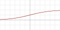

---
jupytext:
  cell_metadata_filter: -all
  formats: md:myst
  text_representation:
    extension: .md
    format_name: myst
    format_version: 0.13
    jupytext_version: 1.16.4
kernelspec:
  display_name: Python 3 (ipykernel)
  language: python
  name: python3
---

# Universal approximators

+++

In this section, we'll look at various ways to fit a non-linear function without knowing its functional form, which will lead us to a simple neural network.

+++

## Sample problem

+++

Suppose you're trying to fit this crazy function:

$$y = \left\{\begin{array}{l l}
\sin(22 x) & \mbox{if } |x - 0.43| < 0.15 \\
-1 + 3.5 x - 2 x^2 & \mbox{otherwise} \\
\end{array}\right.$$

```{code-cell} ipython3
import numpy as np
import matplotlib.pyplot as plt
```

```{code-cell} ipython3
def truth(x):
    return np.where(abs(x - 0.43) < 0.15, np.sin(22*x), -1 + 3.5*x - 2*x**2)

x = np.random.uniform(0, 1, 1000)
y = truth(x) + np.random.normal(0, 0.03, 1000)
```

```{code-cell} ipython3
fig, ax = plt.subplots()

curve_x = np.linspace(0, 1, 1000)
curve_y = truth(curve_x)

ax.scatter(x, y, marker=".", label="data to fit")
ax.plot(curve_x, curve_y, color="magenta", linewidth=3, label="truth")

ax.legend(loc="lower right")

None
```

I don't think I need to demonstrate that a linear fit would be terrible.

We can get a good fit from a theory-driven ansatz, but as I showed in the previous section, it's very sensitive to the initial guess that we give the fitter.

What's next?

+++

## Taylor series

+++

As a physicist, "Taylor series" might have been your first thought!

[Taylor series](https://en.wikipedia.org/wiki/Taylor_series) are used heavily throughout theoretical and experimental physics, as a formally correct infinite series, as a one-term approximation, and everything in between. Even $E = mc^2$ is the first term of a Taylor series:

$$E = mc^2 \, \sqrt{1 + \left(\frac{p}{mc}\right)^2} = mc^2 + \frac{1}{2}mv^2 - \frac{1}{8 c^4}mv^4 + \ldots$$

where the second term is classical kinetic energy.

A Taylor (or Maclaurin) series is a decomposition of a function into infinitely many pieces:

$$f(x) = a_0 + a_1 x + a_2 x^2 + a_3 x^3 + \ldots$$

where each $a_n$ is computed from the $n$<sup>th</sup> derivative of the function, evaluated at zero.

$$a_n = \frac{f^{(n)}(0)}{n!}$$

The function $f$ can be thought of as a single infinite-dimensional vector and we're describing its components with all the $a_n$. These components are "orthonormal," meaning that they're at right angles to each other and have unit length (in a norm defined on functions: $\int f(x)^2 \, dx$). Other (useful) ways to split a function into infinitely many orthonormal pieces include [Jacobi polynomials](https://en.wikipedia.org/wiki/Jacobi_polynomials), [Laguerre polynomials](https://en.wikipedia.org/wiki/Laguerre_polynomials), [Hermite polynomials](https://en.wikipedia.org/wiki/Hermite_polynomials), [Chebyshev polynomials](https://en.wikipedia.org/wiki/Chebyshev_polynomials)...

Since any (infinitely differentiable) function can be described by a Taylor series, we should be able to fit any data with a functional relationship to a series of polynomial terms. The only problem is that we have to pick a _finite_ number of terms.

You could pass something like $a_0 + a_1 x + a_2 x^2 + a_3 x^3$ as an ansatz to Minuit, but orthonormal basis functions have an exact solution. In fact, they're a kind of linear fit—a 4-term polynomial of 1 feature, $x$, is a fit to 4 features: $1$, $x$, $x^2$, and $x^3$. This is sometimes called the "kernel trick," and we'll cover it in a later section.

NumPy has a polynomial fitter built in, so let's see the result.

```{code-cell} ipython3
NUMBER_OF_POLYNOMIAL_TERMS = 15

coefficients = np.polyfit(x, y, NUMBER_OF_POLYNOMIAL_TERMS - 1)[::-1]

model_x = np.linspace(0, 1, 1000)
model_y = sum(c * model_x**i for i, c in enumerate(coefficients))
```

```{code-cell} ipython3
fig, ax = plt.subplots()

ax.scatter(x, y, marker=".")
ax.plot(curve_x, curve_y, color="magenta", linewidth=3)
ax.plot(model_x, model_y, color="orange", linewidth=3)

ax.legend(["measurements", "truth", f"{len(coefficients)} Taylor components"], loc="lower right")

None
```

It's kind of wiggily. It's a relatively good fit on the big oscillation, since that part looks like a polynomial, but it can't dampen the oscillations on the flat parts without a lot more terms.

Increasing the number of terms makes it look better:

```{code-cell} ipython3
NUMBER_OF_POLYNOMIAL_TERMS = 100

coefficients = np.polyfit(x, y, NUMBER_OF_POLYNOMIAL_TERMS - 1)[::-1]

model_x = np.linspace(0, 1, 1000)
model_y = sum(c * model_x**i for i, c in enumerate(coefficients))
```

```{code-cell} ipython3
fig, ax = plt.subplots()

ax.scatter(x, y, marker=".")
ax.plot(curve_x, curve_y, color="magenta", linewidth=3)
ax.plot(model_x, model_y, color="orange", linewidth=3)

ax.legend(["measurements", "truth", f"{len(coefficients)} Taylor components"], loc="lower right")

None
```

But not outside the domain of $x$ values that it was fitted to.

```{code-cell} ipython3
fig, ax = plt.subplots()

model_x_2 = np.linspace(0, 2, 2000)
model_y_2 = sum(c * model_x_2**i for i, c in enumerate(coefficients))

curve_x_2 = np.linspace(0, 2, 2000)
curve_y_2 = truth(curve_x_2)

ax.scatter(x, y, marker=".")
ax.plot(curve_x_2, curve_y_2, color="magenta", linewidth=3)
ax.plot(model_x_2, model_y_2, color="orange", linewidth=3)

ax.legend(["measurements", "truth", f"{len(coefficients)} Taylor components"], loc="upper right")
ax.set_ylim(-1.5, 2.5)

None
```

If our only knowledge of the function comes from its sampled points, there isn't a "correct answer" for what the function should be outside of the sampled domain, but it probably shouldn't shoot off into outer space.

This is a failure to generalize—we want our function approximation to make reasonable predictions outside of its training data. What "reasonable" means depends on the application, but if these were measurements of quantities in nature, unmeasured values at $x > 1$ would probably be about $2 < y < 2$.

+++

## Fourier series

+++

Your next thought, as a physicist, might be "Fourier series."

[Fourier series](https://en.wikipedia.org/wiki/Fourier_series) are also heavily used throughout physics. For instance, did you know that [epicycles in medieval astronomy are the first few terms in a Fourier series](https://doi.org/10.1086/348869)? Discrete Fourier series approximate periodic functions and integral Fourier transforms approximate non-periodic functions. Like Taylor series, Fourier series are a decomposition of a function as an infinite-dimensional vector into infinitely many components, all orthonormal to one another. Instead of polynomial basis vectors, Fourier basis vectors are sine and cosine functions:

$$f(x) = a_0 + a_1 \cos\left(2\pi\frac{1}{P}x\right) + b_1 \sin\left(2\pi\frac{1}{P}x\right) + a_2 \cos\left(2\pi\frac{2}{P}x\right) + b_2 \sin\left(2\pi\frac{2}{P}x\right) + \ldots$$

for some period $P$. The coefficients are computed with integrals:

$$
\begin{align}
a_0 &&=&& \frac{1}{P} \int_P f(x) \, dx \\
a_n &&=&& \frac{2}{P} \int_P f(x) \cos\left(2\pi\frac{n}{P}x\right) \, dx \\
b_n &&=&& \frac{2}{P} \int_P f(x) \sin\left(2\pi\frac{n}{P}x\right) \, dx \\
\end{align}
$$

NumPy has a function for computing integrals using the trapezoidal rule, which I'll use below to fit a Fourier series to the function.

```{code-cell} ipython3
NUMBER_OF_COS_TERMS = 7
NUMBER_OF_SIN_TERMS = 7

sort_index = np.argsort(x)
x_sorted = x[sort_index]
y_sorted = y[sort_index]

constant_term = np.trapz(y_sorted, x_sorted)
cos_terms = [2*np.trapz(y_sorted * np.cos(2*np.pi * (i + 1) * x_sorted), x_sorted) for i in range(NUMBER_OF_COS_TERMS)]
sin_terms = [2*np.trapz(y_sorted * np.sin(2*np.pi * (i + 1) * x_sorted), x_sorted) for i in range(NUMBER_OF_SIN_TERMS)]

model_x = np.linspace(0, 1, 1000)
model_y = (
    constant_term +
    sum(coefficient * np.cos(2*np.pi * (i + 1) * model_x) for i, coefficient in enumerate(cos_terms)) +
    sum(coefficient * np.sin(2*np.pi * (i + 1) * model_x) for i, coefficient in enumerate(sin_terms))
)
```

```{code-cell} ipython3
fig, ax = plt.subplots()

ax.scatter(x, y, marker=".")
ax.plot(curve_x, curve_y, color="magenta", linewidth=3)
ax.plot(model_x, model_y, color="orange", linewidth=3)

ax.legend(["measurements", "truth", f"{1 + len(cos_terms) + len(sin_terms)} Fourier components"])

None
```

Like the Taylor series, this gets the large feature right and misses the edges. In fact, the Fourier model above is constrained to match at $x = 0$ and $x = 1$ because this is a discrete Fourier series and therefore periodic in the training domain.

Both the 15-term Taylor series and the 15-term Fourier series are not good fits to the function. In part, this is because the function is neither polynomial nor trigonometric, but a stitched-together monstrosity of both.

+++

## Adaptive basis functions

+++

The classic methods of universal function approximation—Taylor series, Fourier series, and others—have one thing in common: they all approximate the function with a fixed set of basis functions $\psi_i$ for $i \in [0, N)$.

$$f(x) = \sum_i^N c_i \, \psi_i(x)$$

Thus, you're only allowed to optimize the coefficients $c_i$ in front of each basis function, not the shapes of the basis functions themselves. You're allowed to stack them, but not change them.

Suppose, instead, that we had a set of functions that could also change shape:

$$f(x) = \sum_i^N c_i \, \psi(x; \alpha_i, \beta_i)$$

These are functions of $x$, parameterized by $\alpha_i$ and $\beta_i$. Here's an example set that we can use: [sigmoid functions](https://en.wikipedia.org/wiki/Sigmoid_function) with an adjustable center $\alpha$ and width $\beta$:

$$\psi(x; \alpha, \beta) = \frac{1}{1 + \exp\left((x - \alpha)/\beta\right)}$$

```{code-cell} ipython3
def sigmoid_component(x, center, width):
    # ignore NumPy errors when Minuit explores extreme values
    with np.errstate(over="ignore", divide="ignore"):
        return 1 / (1 + np.exp((x - center) / width))
```

```{code-cell} ipython3
fig, ax = plt.subplots()

sample_x = np.linspace(0, 1, 1000)

ax.plot(model_x, sigmoid_component(sample_x, 0.5, 0.2), label=r"$\alpha = 0.5$, $\beta = 0.2$")
ax.plot(model_x, sigmoid_component(sample_x, 0.5, 0.1), label=r"$\alpha = 0.5$, $\beta = 0.1$")
ax.plot(model_x, sigmoid_component(sample_x, 0.75, -0.01), label=r"$\alpha = 0.75$, $\beta = -0.01$")

ax.legend(loc="lower left", bbox_to_anchor=(0.05, 0.1))

None
```

Fitting with these adaptive sigmoids requires a non-linear parameter search, rather than computing the parameters with an exact formula. In the Taylor and Fourier cases, the fact that all basis functions $\psi_i$ are orthogonal to each other means that you can determine each coefficient $c_i$ in isolation. Since adaptive basis functions don't have that property, you can't.

In fact, this is a harder-than-usual problem for Minuit because the search space has many local minima. To get around this, let's run it 15 times and take the best result.

```{code-cell} ipython3
from iminuit import Minuit
from iminuit.cost import LeastSquares
```

```{code-cell} ipython3
NUMBER_OF_SIGMOIDS = 5

def sigmoid_sum(x, parameters):
    out = np.zeros_like(x)
    for coefficient, center, width in parameters.reshape(-1, 3):
        out += coefficient * sigmoid_component(x, center, width)
    return out

# using Minuit
least_squares = LeastSquares(x, y, 0.03, sigmoid_sum)

# do best of 15 optimizations
best_minimizer = None
for iteration in range(15):

    initial_parameters = np.zeros(5 * 3)
    initial_parameters[0::3] = np.random.normal(0, 1, NUMBER_OF_SIGMOIDS)    # coefficient terms
    initial_parameters[1::3] = np.random.uniform(0, 1, NUMBER_OF_SIGMOIDS)   # center parameters (alpha)
    initial_parameters[2::3] = np.random.normal(0, 0.1, NUMBER_OF_SIGMOIDS)  # width parameters (beta)

    minimizer = Minuit(least_squares, initial_parameters)
    minimizer.migrad()

    if best_minimizer is None or minimizer.fval < best_minimizer.fval:
        best_minimizer = minimizer

model_x = np.linspace(0, 1, 1000)
model_y = sigmoid_sum(model_x, np.array(best_minimizer.values))
```

```{code-cell} ipython3
fig, ax = plt.subplots()

ax.scatter(x, y, marker=".")
ax.plot(curve_x, curve_y, color="magenta", linewidth=3)
ax.plot(model_x, model_y, color="orange", linewidth=3)

ax.legend(["measurements", "truth", f"{len(minimizer.parameters)} sigmoid parameters"])

None
```

```{code-cell} ipython3
assert np.sum((model_y - curve_y)**2) < 10
```

Usually, it's a beautiful fit!

Since you used 5 sigmoids with 3 parameters each (scaling coefficient $c_i$, center $\alpha_i$, and width $\beta_i$), this is 15 parameters, and the result is much better than it is with 15 Taylor components or 15 Fourier components.

Moreover, it generalizes reasonably well:

```{code-cell} ipython3
fig, ax = plt.subplots()

model_x_2 = np.linspace(0, 2, 2000)
model_y_2 = sigmoid_sum(model_x_2, np.array(best_minimizer.values))

ax.scatter(x, y, marker=".")
ax.plot(curve_x_2, curve_y_2, color="magenta", linewidth=3)
ax.plot(model_x_2, model_y_2, color="orange", linewidth=3)

ax.legend(["measurements", "truth", f"{len(minimizer.parameters)} sigmoid parameters"])
ax.set_ylim(-1.5, 1.5)

None
```

We can't expect the fit to know what the true function does outside of the sample points, but it doesn't shoot off into outer space or connect into a periodic function like Taylor or Fourier series do. It assumes that the curve levels off because it's made out of components that level off.

By varying the scale ($c_i$), center ($\alpha_i$), and width ($\beta_i$) of each sigmoid, we can build any sandcastle we want, and they all level off to horizontal lines outside the domain.

```{code-cell} ipython3
fig, ax = plt.subplots()

model_x = np.linspace(0, 1, 1000)

wide_plateau_left = sigmoid_component(model_x, 0.2, 0.005)
wide_plateau_right = sigmoid_component(model_x, 0.9, -0.005)

narrow_peak_left = sigmoid_component(model_x, 0.4, 0.005)
narrow_peak_right = sigmoid_component(model_x, 0.6, -0.005)

ax.plot(model_x, -wide_plateau_left - wide_plateau_right - narrow_peak_left - narrow_peak_right)

None
```

## Adaptive basis functions are a one-layer neural network

+++

It may not look like it, but we've just crossed the (conventional) boundary from basic fitting to neural networks. The fit function

$$y = \sum_i^n c_i \psi(x; \alpha_i, \beta_i) = \sum_i^n c_i \, \frac{1}{1 + \exp\left((x - \alpha_i)/\beta_i\right)}$$

can be written as a linear-transformed $x$ passed into a hard-coded sigmoid. Let's call the hard-coded sigmoid $f$:

$$f(x) = \frac{1}{1 + \exp\left(x\right)}$$

and the linear-transformed $x$ as $x'_i$:

$$x'_i = (x - \alpha_i)/\beta_i$$

Now the full fit function is

$$y = \sum_i^n c_i \, f\left(x'_i\right)$$

We took a 1-dimensional $x$, linear transformed it into an n-dimensional $\vec{x}'$, applied a non-linear function $f$, and then linear-transformed that into a 1-dimensional $y$. Let's draw it (for $n = 5$) like this:

{. width="100%"}

If you've seen diagrams of neural networks before, this should look familiar! The input is on the left as a vertical column of boxes—only one in this case because our input is 1-dimensional—and the linear transformation is represented by arrows to the next vertical column of boxes, our 5-dimensional $\vec{x}'$. The sigmoid $f$ is not shown in diagram, and the next set of arrows represent another linear transformation to the outputs, $y$, which is also 1-dimensional so only one box.

The first linear transform has slopes $1/\beta$ and intercepts $\alpha_i/\beta_i$ and the second linear transformation in our example has only slopes $c_i$, but we could have added another intercept $y_0$ if we wanted to, to let the vertical offset float.

In neural network terminology, the intermediate $\vec{x}_i$ vector is a "hidden layer" between $x$ and $y$. The non-linear function applied at that layer is an "activation function." Generally speaking (if you have enough parameters), the exact shape of the activation function isn't important, but it _cannot_ be linear, or else the two linear transformations would coalesce into one linear transformation. The activation function breaks the linearity that would make the $c_i$ exactly expressible in terms of the $\alpha_i$ and $\beta_i$.

Here are some commonly used activation functions:

| | Name | Function |
|:-:|:-|:-:|
| {. width="100%"} | binary step | $f(x) = \left\{\begin{array}{c l}0 & \mbox{if } x < 0 \\ 1 & \mbox{if } x \ge 0\end{array}\right.$ | 
| {. width="100%"} | sigmoid, logistic, or soft step | $f(x) = \frac{1}{1 + e^{-x}}$ | 
| {. width="100%"} | hyperbolic tangent | $f(x) = \frac{e^x - e^{-x}}{e^x + e^{-x}}$ | 
| {. width="100%"} | rectified linear unit or ReLU | $f(x) = \left\{\begin{array}{c l}0 & \mbox{if } x < 0 \\ x & \mbox{if } x \ge 0\end{array}\right.$ | 
| {. width="100%"} | leaky ReLU | $f(x) = \left\{\begin{array}{c l}\alpha x & \mbox{if } x < 0 \\ x & \mbox{if } x \ge 0\end{array}\right.$ | 
| {. width="100%"} | sigmoid linear unit or swish | $f(x) = \frac{x}{1 + e^{-x}}$ | 

If we had 3-dimensional inputs $\vec{x}$ and 2-dimensional outputs $\vec{y}$, the diagram would look like this:

{. width="100%"}

Now there are 15 arrows between the input layer and the hidden layer, just as there are 15 parameters in a 3×5 matrix, and there are 10 arrows between the hidden layer and the output layer, just as there are 10 parameters in a 5×2 matrix.

+++

## Neural networks

+++

We were led to this formalism because we wanted a universal function approximator that's more well-behaved than the classic Taylor and Fourier series, a fit function that uses fewer parameters and does not explode or wrap-around beyond the training data. This is not at all how neural networks were first developed (or how they're normally presented).

Originally, neural networks were inspired by analogy with neurons in the brain. A neuron (nerve cell) receives n electro-chemical signals at one end and transmits m electro-chemical signals at the other end via some function. This can be modeled as a linear transformation passed through an activation function, since there are enough parameters in the linear transformation to simulate whatever a real neuron does.

{. width="100%"}

$$f\left[\left(\begin{array}{c c c c}
a_{1,1} & a_{1,2} & \cdots & a_{1,10} \\
a_{2,1} & a_{2,2} & \cdots & a_{2,10} \\
a_{3,1} & a_{3,2} & \cdots & a_{3,10} \\
a_{4,1} & a_{4,2} & \cdots & a_{4,10} \\
a_{5,1} & a_{5,2} & \cdots & a_{5,10} \\
\end{array}\right) \cdot \left(\begin{array}{c}
x_1 \\
x_2 \\
\vdots \\
x_{10}
\end{array}\right) + \left(\begin{array}{c}
b_1 \\
b_2 \\
b_3 \\
b_4 \\
b_5 \\
\end{array}\right)\right] = \left(\begin{array}{c}
y_1 \\
y_2 \\
y_3 \\
y_4 \\
y_5 \\
\end{array}\right)$$

or

$$\begin{array}{c}
f\left[a_{1,1}x_1 + a_{1,2}x_2 + \ldots + a_{1,10}x_{10} + b_1\right] = y_1 \\
f\left[a_{2,1}x_1 + a_{2,2}x_2 + \ldots + a_{2,10}x_{10} + b_2\right] = y_2 \\
f\left[a_{3,1}x_1 + a_{3,2}x_2 + \ldots + a_{3,10}x_{10} + b_3\right] = y_3 \\
f\left[a_{4,1}x_1 + a_{4,2}x_2 + \ldots + a_{4,10}x_{10} + b_4\right] = y_4 \\
f\left[a_{5,1}x_1 + a_{5,2}x_2 + \ldots + a_{5,10}x_{10} + b_5\right] = y_5 \\
\end{array}$$

In the original formulation, $\vec{y}$ was a 1-dimensional binary value and the activation function $f$ was a sharp threshold ("binary step" in the table above). Real neurons tend to fire in all-or-nothing pulses. This single-layer neural network was called a perceptron.

Perceptrons can be used to classify linearly separable data into two categories.

```{code-cell} ipython3
blob1 = np.random.normal(0, 1, (1000, 2)) + np.array([[0, 3]])
blob2 = np.random.normal(0, 1, (2000, 2)) + np.array([[3, 0]])

all_data = np.concatenate((blob1, blob2))
targets = np.concatenate((np.zeros(len(blob1)), np.ones(len(blob2))))
```

```{code-cell} ipython3
fig, ax = plt.subplots(figsize=(5, 5))

ax.scatter(blob1[:, 0], blob1[:, 1], marker=".", color="tab:blue")
ax.scatter(blob2[:, 0], blob2[:, 1], marker=".", color="tab:orange")

ax.set_xlim(-4, 7)
ax.set_ylim(-4, 7)

None
```

A perceptron is mathematically equivalent to Scikit-Learn's logistic regression fitter:

```{code-cell} ipython3
from sklearn.linear_model import LogisticRegression
```

```{code-cell} ipython3
best_fit = LogisticRegression(penalty=None).fit(all_data, targets)
```

```{code-cell} ipython3
fig, ax = plt.subplots(figsize=(5, 5))

# Compute the model's orange-vs-blue probability for 100×100 points in the background
background_x, background_y = np.meshgrid(np.linspace(-4, 7, 100), np.linspace(-4, 7, 100))
background_2d = np.column_stack((background_x.ravel(), background_y.ravel()))
probabilities = best_fit.predict_proba(background_2d)

# And draw a line where the probability crosses 0.5
probability_of_0 = probabilities[:, 0].reshape(background_x.shape)
ax.contour(background_x, background_y, probability_of_0, [0.5], linestyles=["--"])
ax.contourf(background_x, background_y, probability_of_0, alpha=0.1)

ax.scatter(blob1[:, 0], blob1[:, 1], marker=".", color="tab:blue")
ax.scatter(blob2[:, 0], blob2[:, 1], marker=".", color="tab:orange")

ax.set_xlim(-4, 7)
ax.set_ylim(-4, 7)

None
```

What a perceptron can't do is classify data that are not linearly separable:

```{code-cell} ipython3
blobs1 = np.concatenate((
    np.random.normal(0, 1, (1000, 2)) + np.array([[0, 0]]),
    np.random.normal(0, 1, (1000, 2)) + np.array([[3, 3]]),
))
blobs2 = np.concatenate((
    np.random.normal(0, 1, (1000, 2)) + np.array([[0, 3]]),
    np.random.normal(0, 1, (1000, 2)) + np.array([[3, 0]]),
))

all_data = np.concatenate((blobs1, blobs2))
targets = np.concatenate((np.zeros(len(blobs1)), np.ones(len(blobs2))))
```

```{code-cell} ipython3
best_fit = LogisticRegression(penalty=None).fit(all_data, targets)
```

```{code-cell} ipython3
fig, ax = plt.subplots(figsize=(5, 5))

# Compute the model's orange-vs-blue probability for 100×100 points in the background
background_x, background_y = np.meshgrid(np.linspace(-4, 7, 100), np.linspace(-4, 7, 100))
background_2d = np.column_stack((background_x.ravel(), background_y.ravel()))
probabilities = best_fit.predict_proba(background_2d)

# And draw a line where the probability crosses 0.5
probability_of_0 = probabilities[:, 0].reshape(background_x.shape)
ax.contour(background_x, background_y, probability_of_0, [0.5], linestyles=["--"])
ax.contourf(background_x, background_y, probability_of_0, alpha=0.1)

ax.scatter(blobs1[:, 0], blobs1[:, 1], marker=".", color="tab:blue")
ax.scatter(blobs2[:, 0], blobs2[:, 1], marker=".", color="tab:orange")

ax.set_xlim(-4, 7)
ax.set_ylim(-4, 7)

None
```

There is no line that will separate the orange points from the blue points.

This limitation led to the first "winter" for connectionist AI, but the fix is (in retrospect) obvious: the brain consists of more than one neuron!

{. width="100%"}

By connecting the output of one perceptron to the input of another, we get the universal approximator described above:

{. width="100%"}

which can solve the above problem:

```{code-cell} ipython3
from sklearn.neural_network import MLPRegressor
```

```{code-cell} ipython3
best_fit = MLPRegressor(
    activation="logistic", hidden_layer_sizes=(5,), max_iter=10000, alpha=0
).fit(all_data, targets)
```

```{code-cell} ipython3
fig, ax = plt.subplots(figsize=(5, 5))

# Compute the model's orange-vs-blue probability for 100×100 points in the background
background_x, background_y = np.meshgrid(np.linspace(-4, 7, 100), np.linspace(-4, 7, 100))
background_2d = np.column_stack((background_x.ravel(), background_y.ravel()))
probabilities = best_fit.predict(background_2d)

# And draw a line where the probability crosses 0.5
probability_of_0 = probabilities.reshape(background_x.shape)
ax.contour(background_x, background_y, probability_of_0, [0.5], linestyles=["--"])
ax.contourf(background_x, background_y, probability_of_0, alpha=0.1)

ax.scatter(blobs1[:, 0], blobs1[:, 1], marker=".", color="tab:blue")
ax.scatter(blobs2[:, 0], blobs2[:, 1], marker=".", color="tab:orange")

ax.set_xlim(-4, 7)
ax.set_ylim(-4, 7)

None
```

## Deep learning

+++

In principle, one hidden layer is enough to approximate any shape: this fact is known as the Universal Approximation Theorem.

However, multiple hidden layers are _better_ at approximating complex shapes.

{. width="100%"}

This is one perceptron fed into another, fed into another, etc. The general adage is that "one layer memorizes, many layers generalize." To get an intuition about this, consider the following:

* Adding one more component to a layer adds one wiggle (sigmoid curve) to the fit function.
* Adding one more layer effectively folds space under the next set of wiggly functions. Instead of fitting individual wiggles, they find symmetries in the data that (probably) correspond to an underlying relationship, rather than noise.

Consider this horseshoe-shaped decision boundary: with two well-chosen folds along the symmetries, it reduces to a simpler curve to fit. Instead of 4 ad-hoc wiggles, it's 2 folds and 1 wiggle.

{. width="100%"}

(from Montúfar, Pascanu, Cho, & Bengio, [On the Number of Linear Regions of Deep Neural Networks](https://arxiv.org/abs/1402.1869) (2014))

You can see this in detail in [Roy Keyes's fantastic demo](https://gist.github.com/jpivarski/f99371614ecaa48ace90a6025d430247). The three categories of data in the spiral arms of the galaxy on the left are fitted with a neural network that transforms the underlying coordinates to the warped mesh shown on the right. Then the three categories are linearly separable.

{. width="100%"}

The recognition that "deep" neural networks with many layers are more powerful than one large hidden layer, as well as the ability to train them, is recent. It's responsible for the resurgence of interest in neural networks around 2015. Here's a plot of Google searches for the words "neural network" and "deep learning" from the past 10 years:

{. width="100%"}

* 2006‒2007: problems that prevented the training of deep learning were solved.
* 2012: AlexNet, a GPU-enabled 8 layer network (with ReLU), won the ImageNet competition.
* 2015: ResNet, a GPU-enabled 152+ layer network (with skip-connections), won the ImageNet competition.

In the next section, you'll use a graphical user interface to a deep neural network to solve classification problems.
