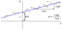

---
jupytext:
  cell_metadata_filter: -all
  formats: md:myst
  text_representation:
    extension: .md
    format_name: myst
    format_version: 0.13
    jupytext_version: 1.16.4
kernelspec:
  display_name: Python 3 (ipykernel)
  language: python
  name: python3
---

# Universal function approximation

+++

In this section, we'll start doing some computations, so get a Python interface (terminal, file, or notebook) handy! I'll start with linear fitting, which I assume you're familiar with, and show how neural networks are a generalization of linear fits.

+++

## Linear fitting

+++

Suppose you're given a dataset in which pairs of values, $x_i$ and $y_i$ (indexes $i \in [0, N)$ for $N$ pairs), have an approximate linear relationship.

```{code-cell} ipython3
import numpy as np
import matplotlib.pyplot as plt
```

```{code-cell} ipython3
# uniformly random x values
x = np.random.uniform(-5, 5, 100)

# linear (2 * x + 3) plus normal-distributed noise
y = (2 * x + 3) + np.random.normal(0, 3, 100)
```

```{code-cell} ipython3
fig, ax = plt.subplots()

ax.scatter(x, y, marker="+", color="tab:orange")

None
```

You can write an equation for an exact linear relationship:

$$a \, x + b = y$$

and express the quality of this model as a fit to the data by how close it gets to the actual points:

$$\chi^2 = \sum_i \left[(a \, x_i + b) - y_i\right]^2$$

If $a$ and $b$ are chosen well, the line will go through the middle of the points, like this:

{. width="75%"}

$\chi^2$ will be small because most $(a \, x_i + b)$ are close to the corresponding $y_i$ and their squared difference will be small. You're not given $a$ and $b$: you have to find $a$ and $b$ values that make $\chi^2$ as small as possible. As it turns out, this problem can be solved with an exact formula:

```{code-cell} ipython3
sum1  = len(x)
sumx  = np.sum(x)
sumy  = np.sum(y)
sumxx = np.sum(x**2)
sumxy = np.sum(x * y)
delta = (sum1*sumxx) - (sumx*sumx)

a = ((sum1*sumxy) - (sumx*sumy))  / delta
b = ((sumxx*sumy) - (sumx*sumxy)) / delta
a, b
```

which should be close to $a = 2$ and $b = 3$, and it depends on the exact values of the noise. Regenerate the data points several times and you should see $a$ jump around $2$ and $b$ jump around $3$.

```{code-cell} ipython3
fig, ax = plt.subplots()

ax.scatter(x, y, marker="+", color="tab:orange")
ax.plot([-5, 5], [a*-5 + b, a*5 + b], color="tab:blue")

None
```

The first thing to notice is that there's a difference between the $x$ dimension and the $y$ dimension: $x$ is presumed to range over all values, potentially from $-\infty$ to $\infty$, and $y$ follows the linear relationship plus some noise. You couldn't, for instance, fit a vertical line: $y$ is supposed to be a _function_ of $x$. In an experiment, you'd use $x$ to denote the variables you can control, such as the voltage you apply to a circuit, and $y$ is the measured response of the system, like a current in that circuit. In ML terminology, $x$ is a "feature" and $y$ is a "prediction," and this whole fitting process is called "regression."

Now suppose you can control two features. The $x$ values are now 2-dimensional vectors and you need a 2-dimensional $a$ parameter to write a linear relationship:

$$\left(\begin{array}{c c}
a^1 & a^2 \\
\end{array}\right) \cdot \left(\begin{array}{c}
x^1 \\
x^2 \\
\end{array}\right) + b = y$$

where $\cdot$ is matrix multiplication. This fits a plane in $x^1$, $x^2$ to 1-dimensional outputs $y$.

{. width="75%"}

Or suppose you have many feature dimensions:

$$\left(\begin{array}{c c c c}
a^1 & a^2 & \cdots & a^n \\
\end{array}\right) \cdot \left(\begin{array}{c}
x^1 \\
x^2 \\
\vdots \\
x^n
\end{array}\right) + b = y$$

and many predicted dimensions:

$$\left(\begin{array}{c c c c}
a^{1,1} & a^{1,2} & \cdots & a^{1,n} \\
a^{2,1} & a^{2,2} & \cdots & a^{2,n} \\
\vdots & \vdots & & \vdots \\
a^{m,1} & a^{m,2} & \cdots & a^{m,n} \\
\end{array}\right) \cdot \left(\begin{array}{c}
x^1 \\
x^2 \\
\vdots \\
x^n
\end{array}\right) + \left(\begin{array}{c}
b^1 \\
b^2 \\
\vdots \\
b^m
\end{array}\right) = \left(\begin{array}{c}
y^1 \\
y^2 \\
\vdots \\
y^m
\end{array}\right)$$

Now you're looking for a best-fit $\hat{a}$ matrix and $\vec{b}$ vector to describe a linear relationship between a set of n-dimensional vectors $\vec{x}_i$ and a set of m-dimensional vectors $\vec{y}_i$.

By the way, it's sometimes convenient to collect all of our free parameters, $\hat{a}$ and $\vec{b}$, into a single matrix $\hat{A}$ by adding a "fake" dimension to the input features:

$$\left(\begin{array}{c c c c c}
a^{1,1} & a^{1,2} & \cdots & a^{1,n} & b^1 \\
a^{2,1} & a^{2,2} & \cdots & a^{2,n} & b^2 \\
\vdots & \vdots & & \vdots & \vdots \\
a^{m,1} & a^{m,2} & \cdots & a^{m,n} & b^m \\
\end{array}\right) \cdot \left(\begin{array}{c}
x^1 \\
x^2 \\
\vdots \\
x^n \\
1
\end{array}\right) = \left(\begin{array}{c}
y^1 \\
y^2 \\
\vdots \\
y^m
\end{array}\right)$$

(This is just a mathematical convenience.)

Since this is still a linear fit and $\chi^2$ is still ordinary least squares:

$$\chi^2 = \sum_i || (\hat{a} \cdot \vec{x}_i + \vec{b}) - \vec{y}_i ||^2$$

the solution is still an exact formula ([see derivation](https://web.stanford.edu/~mrosenfe/soc_meth_proj3/matrix_OLS_NYU_notes.pdf)):

$$\hat{A} = (\hat{X}^T \, \hat{X})^{-1} \, \hat{X}^T \, \hat{Y}$$

where $\hat{X}$ is a matrix of $\vec{x}_i$ features with the "fake" dimension and $\hat{Y}$ is a matrix of $\vec{y}_i$ predictions. In general, you don't need to use this equation directly, since there are libraries that compute linear fits. Scikit-Learn is one:

```{code-cell} ipython3
from sklearn.linear_model import LinearRegression
```

```{code-cell} ipython3
# Scikit-Learn wants an array of vectors, even if they're 1-dimensional
X = x.reshape(len(x), 1)   # or X = x[:, np.newaxis]
y = y

best_fit = LinearRegression().fit(X, y)

(a,) = best_fit.coef_
b = best_fit.intercept_

a, b
```

Or with more dimensions,

```{code-cell} ipython3
# uniformly random 2-D vectors
X = np.random.uniform(-5, 5, (100000, 2))

# true linear relationship (2-D → 3-D)
a_true = np.array([[1.1, 2.2],
                   [3.3, 4.4],
                   [5.5, 6.6]])
b_true = np.array([7.7, 8.8, 9.9])

# linear (a_true · x + b_true) for each x ∈ X plus noise
Y = (X @ a_true.T + b_true) + np.random.normal(0, 1, (100000, 3))
```

```{code-cell} ipython3
best_fit = LinearRegression().fit(X, Y)
```

```{code-cell} ipython3
best_fit.coef_
```

```{code-cell} ipython3
best_fit.intercept_
```

## Non-linear fitting

+++

In physics, we usually try to find a first-principles theory that relates quantities $x$ to measurements $y$. Usually, that theory doesn't predict a _linear_ relationship. For example, the position of a tossed object as a function of time, $y(t)$, is

$$y(t) = y_0 - \frac{1}{\mu} \log \left( \cosh \frac{t - t_0}{t_f} \right)$$

where $y_0$ and $t_0$ are the starting position and time, and $\mu$ and $t_f$ are related to the air resistance.

```{code-cell} ipython3
def y_of_t(t):
    y0, t0, mu, tf = 60, 3, 0.05, 2
    return y0 - (1/mu)*np.log(np.cosh((t - t0)/tf))

def measurement_error(n):
    return np.random.normal(0, 1, n)
```

```{code-cell} ipython3
fig, ax = plt.subplots()

t = np.linspace(0, 10, 50)
y = y_of_t(t) + measurement_error(50)

ax.scatter(t, y, marker=".", color="tab:orange")
ax.errorbar(t, y, 1, fmt="none", color="tab:orange")

ax.set_xlabel("time after release")
ax.set_ylabel("height above ground")

None
```

A linear fit would be a disaster:

```{code-cell} ipython3
best_fit = LinearRegression().fit(t[:, np.newaxis], y)

(linear_slope,) = best_fit.coef_
linear_intercept = best_fit.intercept_
```

```{code-cell} ipython3
fig, ax = plt.subplots()

ax.plot([0, 10], [linear_slope * 0 + linear_intercept, linear_slope * 10 + linear_intercept])

ax.scatter(t, y, marker=".", color="tab:orange")
ax.errorbar(t, y, 1, fmt="none", color="tab:orange")

ax.set_xlabel("time after release")
ax.set_ylabel("height above ground")

None
```

Instead, we use our theoretical knowledge of the shape of the functional form (often called an "ansatz") and consider any unknown magnitudes as free parameters. Unlike a linear fit, there might not be an exact formula to find those parameters—there usually isn't—so we use an algorithm to search the space of free parameters until it minimizes

$$\chi^2 = \sum_i \left[f(x) - y\right]^2$$

In HEP, our favorite search algorithm is implemented in the Minuit library.

```{code-cell} ipython3
from iminuit import Minuit
from iminuit.cost import LeastSquares
```

```{code-cell} ipython3
def ansatz(t, y0, t0, mu, tf):
    return y0 - (1/mu)*np.log(np.cosh((t - t0)/tf))

least_squares = LeastSquares(t, y, 1, ansatz)
minimizer = Minuit(least_squares, y0=100, t0=0, mu=1, tf=5)
minimizer.migrad()

model_y = ansatz(t, **{p.name: p.value for p in minimizer.params})
```

```{code-cell} ipython3
fig, ax = plt.subplots()

ax.plot(t, model_y)

ax.scatter(t, y, marker=".", color="tab:orange")
ax.errorbar(t, y, 1, fmt="none", color="tab:orange")

ax.set_xlabel("time after release")
ax.set_ylabel("height above ground")

None
```
